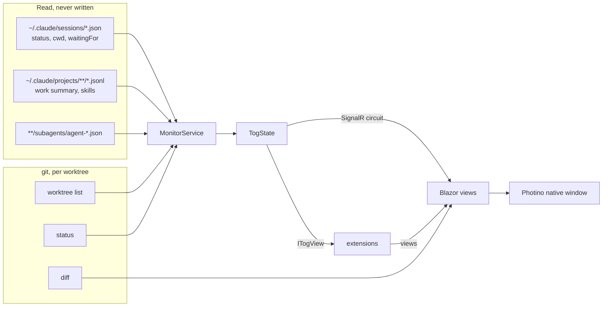
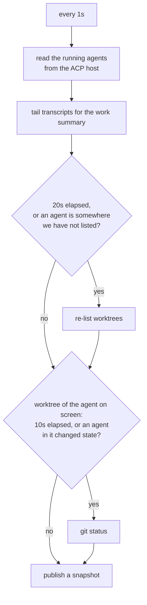

# Contributing to Tog

Thanks for looking under the hood. This file is the map: how to build and test
the app, how it is put together, and where the long explanations live. The
[README](README.md) is the tour for people who just want to run it.

Before changing anything, read [`AGENTS.md`](AGENTS.md). It is short and lists
the things that will bite you (Blazor render modes, static web assets,
`dotnet test` and `--nologo`, the SignalR message cap, `FileSystemWatcher` on
macOS, and more). Agents working in this repository read it too.

## Getting set up

You need:

- the .NET SDK named in [`global.json`](global.json), exactly that one
  (`rollForward` is off, for reproducible builds)
- `git` and Node 22 or newer on `PATH`
- Claude Code, if you want any agents to look at

```bash
git clone https://github.com/BradenTerry/agents-dashboard.git
cd agents-dashboard
dotnet build
dotnet test
dotnet run --project src/Tog.App
```

The first build fetches Monaco, Mermaid, the TextMate grammars and the Claude
ACP bridge with the Node scripts in `tools/`, so it needs no shell and builds
the same on Windows. Restores are locked: the committed `packages.lock.json`
files are what CI restores, and it fails a reference that would resolve
differently.

### Running it

```bash
dotnet run --project src/Tog.App              # native window
dotnet run --project src/Tog.App -- --browser # print a URL, with this start's key, instead
dotnet run --project src/Tog.App -- --port 5000
dotnet run --project src/Tog.App -- --data-dir /tmp/dash # settings kept elsewhere
dotnet run --project src/Tog.App -- --extension ../my-extension
dotnet run --project src/Tog.App -- --no-extensions
```

`--data-dir` is the one to reach for while developing: a second copy of the app
with its own settings, agents and layout, leaving your everyday one alone.

The window is Photino over the platform's own webview (WebView2, WKWebView,
WebKitGTK), with native binaries for Windows, macOS and Linux on both x64 and
arm64. If the window cannot be created the app does not die with it: the host is
already serving, so it prints the URL and carries on. It reopens where it was
and the size it was, from `window.json` in the data folder.

Every page needs the key the app prints on start (`?ui-key=`), so a script or
test that loads a page has to start from the printed address.

### Tests

```bash
dotnet test
```

xUnit v3 on Microsoft.Testing.Platform. Never pass `--nologo`: in MTP mode it is
forwarded to the test application, which rejects it and reports zero tests.

The git layer is tested against the real `git` in throwaway repositories,
because it is a parser over git's own output and a faked process would only
prove the parser agrees with the fake.

CI ([`.github/workflows/ci.yml`](.github/workflows/ci.yml)) restores in locked
mode, builds, and runs the tests on Windows, macOS and Linux for every pull
request and every push to `main`. Every action is pinned to a commit and
Dependabot keeps them current.

### README screenshots

The pictures in the README are taken by a script, never by hand, so they show
the same made-up project (a small store API with three agents) and none of your
own repositories or paths:

```bash
npm ci --prefix tools/screenshots --ignore-scripts
npx --prefix tools/screenshots playwright install chromium
node tools/screenshots/take.mjs
```

It builds the app, writes the sample to `/tmp/tog-sample` (a git
repository, its worktrees, and a Claude config folder with the agents'
transcripts), runs the app against it with `--no-extensions` and
`CLAUDE_CONFIG_DIR` pointing at the sample, and saves each picture in the light
and the dark theme into `assets/screenshots`. The README shows the one matching
the reader's GitHub theme. Dates and times are fixed, so an unchanged app draws
byte-identical files.

Rerun it when a change alters what the README shows. To change what is
pictured, edit `tools/screenshots/sample.mjs` or `take.mjs`.

## Architecture

| Project | What it holds |
| --- | --- |
| `src/Tog.Core` | Everything that is not UI: the ACP agent host, the Claude transcript readers, the git layer and its parsers, the monitor loop, extension discovery. No ASP.NET dependency, so all of it is testable without a host. |
| `src/Tog.App` | The Blazor Server UI and the Photino window. `Program.cs` starts the host on a free loopback port, then opens the window at it. |
| `src/Tog.Extensions` | The extension API (1.x, now 1.12), the one assembly an extension compiles against. No reference to Core. Versioned: 1.x only adds. |
| `templates/extension` | `dotnet new tog-extension`, with an `AGENTS.md` for writing one. |
| `templates/skill` | The skill that teaches an agent to write one, shipped in the app and added from Settings. |
| `tests/*` | xUnit v3 on Microsoft.Testing.Platform, for Core. |
| `tools/` | The Node scripts that vendor Monaco, Mermaid, the TextMate grammars and the ACP bridge, and `tools/screenshots`, which takes the README pictures. |

Blazor Server rather than a hybrid webview because its circuit is the push
channel this app needs: a file watcher on a background thread publishes a
snapshot and every open view re-renders, with no polling from the browser. It
also makes `--browser` free.

### How it finds things

Nothing is installed and nothing is configured to get started. Tog
reads what Claude Code and git already write, and only ever reads: nothing of
its own goes into `~/.claude`.



Repositories are discovered from the working directory of every live Claude
session, resolved to the repository's main working tree so all its worktrees
group together. Add or hide one under **Repositories** in Settings.

### The monitor loop

One loop, three cadences, because the three sources cost wildly different
amounts.



Only the worktree on screen has its git status read; every other worktree
reports none. A failed pass never stops the loop; the next one usually
succeeds, and an app that quietly stopped updating is worse than one that
missed a tick.

### Agents, in process

Agents run over the Agent Client Protocol. `AgentHost` launches the Claude ACP
bridge and every agent is a session on that one process, so closing the app
ends the agents; `agents.json` brings them back as stopped, and a message
resumes them. Tog advertises no `fs` or `terminal` capability, so an
agent uses its own tools; it answers permission requests and form elicitation.
See [docs/agent-control.md](docs/agent-control.md).

## Where the long explanations live

One file per subsystem that is easy to get wrong twice:

| Doc | Covers |
| --- | --- |
| [docs/workbench.md](docs/workbench.md) | The VS Code-style layout, the panels, editor tabs, the shared `ChangesModel`, what is kept per machine |
| [docs/agent-control.md](docs/agent-control.md) | ACP, the host, a turn, permissions, the bridge |
| [docs/agents.md](docs/agents.md) | Work summaries from transcripts, subagents, notification rules |
| [docs/review.md](docs/review.md) | Source control and diffs: which sides each diff tab compares, the model URI query, push and pull counts |
| [docs/staging.md](docs/staging.md) | The two-character status field, unstaging with no HEAD |
| [docs/editor.md](docs/editor.md) | Monaco in the editor, vendoring it, stamp-based saves, images, opening a file from outside the app |
| [docs/syntax.md](docs/syntax.md) | VS Code's TextMate grammars in Monaco, loaded through `textmate.js` |
| [docs/code-intelligence.md](docs/code-intelligence.md) | The `ICodeIntelligence` extension point, the C# extension's Roslyn load, MSBuild in a load context |
| [docs/extensions.md](docs/extensions.md) | Loading, the shared assemblies, reload, consent, secrets, the skill and the MCP tools that let an agent write one |
| [docs/release.md](docs/release.md) | Build from source, no binaries: the version from git tags, the lock files, the pinned actions, what a security review asks |

A change to one of those subsystems belongs in its doc, with at most a line in
the README. Keep the README a landing page.

## What belongs in the app, and what is an extension

The app stays minimal: watching agents, answering them, and reviewing their
work. A feature that is not about agents, such as a tab for one language, a
test runner or a build status, belongs in an extension, which lives outside
this repository. If the extension API cannot express it, the API grows by a
minor version (1.x only adds). Start one with `dotnet new
tog-extension` from [`templates/extension`](templates/extension),
or ask Claude with the skill Settings installs.

## Conventions

- Spaces, not tabs. No em dashes or emojis in UI copy or comments.
- Comments explain why, not what. Prefer a short paragraph on the non-obvious
  decision over a line-by-line narration.
- Nothing Tog or an agent does on its own writes into `~/.claude`;
  the app only reads it. The only changes the app makes to Claude's config are
  the extension skill and the MCP server entry, each from its button in
  Settings.
- Anything that edits the user's repository is offered, never done on its own.
- Secrets never reach an agent: no agent tool serves them and no session's
  environment carries them. See [docs/extensions.md](docs/extensions.md).

## Pull requests

- Branch from `main`, keep a pull request to one change, and make sure
  `dotnet build` and `dotnet test` pass locally.
- If you changed a subsystem with a doc above, update the doc in the same pull
  request.
- UI changes are easier to review with a screenshot. Run a second copy with
  `--data-dir` and `--no-extensions` so it shows the app, not your setup. If the
  change alters what the README shows, retake its screenshots too (see above).
- Versions come from `vMAJOR.MINOR.PATCH` git tags plus the commits since
  (see [docs/release.md](docs/release.md)); there is nothing to bump by hand.
