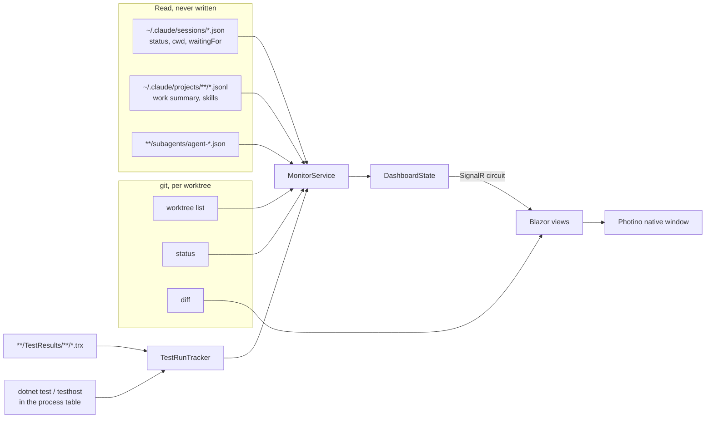
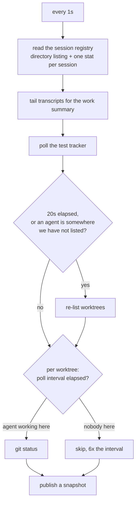

# Agents Dashboard

A cross-platform desktop app for watching the Claude Code agents running across
your git worktrees: which one needs an answer, what its tests are doing, and what
it has changed.

Blazor Server in a native window. One process, no dev server, no browser required
(though `--browser` gives you one, which is how you check on a run from another
device on the network).

```bash
dotnet run --project src/AgentsDashboard.App
```

## What it is for

Running several agents in parallel means several terminals, and the three things
you actually need from them are the three things a terminal is worst at.

| Problem | What the dashboard does |
| --- | --- |
| An agent is blocked and you do not notice | A **Needs you** rail across every repository, longest-blocked first, with the question Claude recorded and a live timer. An OS notification when one starts waiting. |
| A `dotnet test` run scrolls past and you cannot tell what is happening | Live pass/fail counts, a progress bar and failures streaming in **while the run is going**, for runs you start and runs an agent starts. See [docs/test-monitoring.md](docs/test-monitoring.md). |
| Reviewing the agent's work means eyeballing a terminal | A PR-style diff with line comments, submitted in one go as a markdown file the agent can act on, plus staging. See [docs/review.md](docs/review.md) and [docs/staging.md](docs/staging.md). |
| Starting and steering agents means more terminals | Start, message, stop and remove background agents from the worktree they work in. See [docs/agent-control.md](docs/agent-control.md). |
| Reading an agent's code means guessing what a symbol is | Hover, go to definition, find references and call hierarchy for C#, from Roslyn in-process. See [docs/code-intelligence.md](docs/code-intelligence.md). |

## Screens

- **Sidebar** lists every agent, the ones waiting on you first, with **New agent**
  at the top and **Settings** (the gear) at the bottom.
- **Agent** shows where the selected agent works (repository, worktree, branch)
  and has three tabs: **Chat** (its conversation and a box to message it),
  **Changes** (the diff review, changed files as a tree, line and range comments
  handed back to the agent, staging) and **Files** (browse and edit its worktree,
  with hover, go to definition, references and call hierarchy for C#: see
  [docs/code-intelligence.md](docs/code-intelligence.md)). Both are coloured by
  Monaco: see [docs/syntax.md](docs/syntax.md).
- **New agent** starts one in a repository from Settings, in a new worktree or an
  existing one.
- **Settings** holds the repositories New agent offers, and the preferences.
- **Worktree** is still reachable from a file link, with the same tabs plus
  **Agents** and **Tests** (live runs and history).

A file path an agent mentions in a reply, or a test failure points at in its
stack trace, is a link: it opens the file in the **Files** tab at that line, with
a second link beside it that opens the same place in VS Code.

## How it finds things

Nothing is installed and nothing is configured to get started. The dashboard
reads what Claude Code and git already write, and only ever reads: nothing of
its own goes into `~/.claude`.



Repositories are discovered from the working directory of every live Claude
session, resolved to the repository's main working tree so all its worktrees
group together. Add or hide one under **Repositories**.

## Architecture

| Project | What it holds |
| --- | --- |
| `src/AgentsDashboard.Core` | Everything that is not UI: the Claude readers, the git layer and its parsers, the TRX reader, review writing, the monitor loop. No ASP.NET dependency, so all of it is testable without a host. |
| `src/AgentsDashboard.App` | The Blazor Server UI and the Photino window. `Program.cs` starts the host on a free loopback port, then opens the window at it. |
| `tests/AgentsDashboard.Core.Tests` | xUnit v3 on Microsoft.Testing.Platform. Deliberately: its TRX report streams, so the suite is also a live fixture for the test monitor. |

Blazor Server rather than a hybrid webview because its circuit is the push
channel this app needs: a file watcher on a background thread publishes a
snapshot and every open view re-renders, with no polling from the browser. It
also makes `--browser` free.

### The monitor loop

One loop, three cadences, because the three sources cost wildly different
amounts.



A worktree nobody is working in and nobody is looking at is barely polled. A
failed pass never stops the loop; the next one usually succeeds, and a dashboard
that quietly stopped updating is worse than one that missed a tick.

## Running it

```bash
dotnet run --project src/AgentsDashboard.App              # native window
dotnet run --project src/AgentsDashboard.App -- --browser # print a URL instead
dotnet run --project src/AgentsDashboard.App -- --port 5000
dotnet run --project src/AgentsDashboard.App -- --data-dir /tmp/dash # settings kept elsewhere
```

The window is Photino over the platform's own webview (WebView2, WKWebView,
WebKitGTK), with native binaries for Windows, macOS and Linux on both x64 and
arm64. If the window cannot be created the app does not die with it: the host is
already serving, so it prints the URL and carries on.

Requirements: the .NET 10 SDK, `git` on `PATH`, and Claude Code if you want any
agents to look at.

## Tests

```bash
dotnet test
```

The git layer is tested against the real `git` in throwaway repositories, because
it is a parser over git's own output and a faked process would only prove the
parser agrees with the fake. The TRX reader is tested against reports that are
half-written, since that is the state it spends most of a run reading.

To watch the test monitor work on its own suite: start the dashboard, open the
**Tests** tab for this repository, and run `dotnet test` in another terminal.
