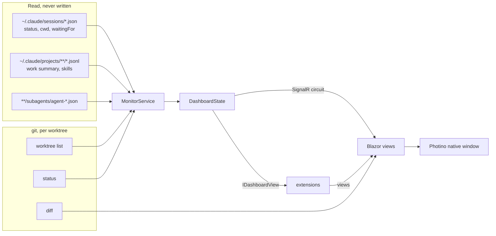
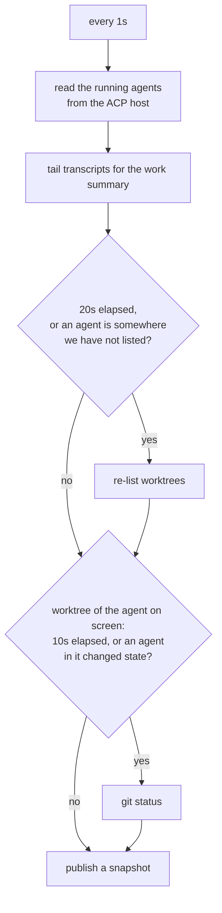

# Agents Dashboard

A cross-platform desktop app for watching the Claude Code agents running across
your git worktrees: which one needs an answer and what it has changed. Anything
else, such as following its test runs, is an extension.

Blazor Server in a native window. One process, no dev server, no browser required
(though `--browser` gives you one, which is how you check on a run from another
device on the network).

```bash
dotnet run --project src/AgentsDashboard.App
```

## What it is for

Running several agents in parallel means several terminals, and the three things
you actually need from them are the three things a terminal is worst at.

| Problem | What the dashboard does |
| --- | --- |
| An agent is blocked and you do not notice | Agents waiting on you sort to the top of the agent list, longest-blocked first, with the question Claude recorded. An OS notification when one starts waiting. |
| Reviewing the agent's work means eyeballing a terminal | A PR-style diff with line comments, submitted in one go as a markdown file the agent can act on, plus staging. See [docs/review.md](docs/review.md) and [docs/staging.md](docs/staging.md). |
| Starting and steering agents means more terminals | Agents run in the dashboard over the Agent Client Protocol: replies stream in live, and permission prompts are answered in the app. See [docs/agent-control.md](docs/agent-control.md). |
| Reading an agent's code means guessing what a symbol is | Hover, go to definition, find references and call hierarchy for C#, from Roslyn in-process. See [docs/code-intelligence.md](docs/code-intelligence.md). |
| You want a view the app does not have | Write an extension: a small Razor project, usually by asking Claude, linked in Settings and reloaded on every build. See [docs/extensions.md](docs/extensions.md). |

## Screens

The window is laid out like VS Code, and every panel follows the agent you
picked. See [docs/workbench.md](docs/workbench.md).

- **Title bar** shows who is waiting on you, three buttons that fold the left,
  bottom and right panels, and the gear, which opens **Settings** as a tab in the
  editor.
- **Status bar** along the bottom labels where the selected agent works: its
  directory, worktree and branch.
- **Left panel: Files**, the agent's worktree as a tree. A click opens a file in
  the editor as a preview tab; a double click keeps it.
- **Editor** in the middle: a tab per open file, pinnable, each a Monaco editor
  with hover, go to definition, references and call hierarchy for C# (see
  [docs/code-intelligence.md](docs/code-intelligence.md)), plus diffs: a changed
  file's own, or every change in one, with line and range comments handed back
  to the agent.
  Both are coloured by Monaco: see [docs/syntax.md](docs/syntax.md).
- **Right panel: Source control**, what to diff against, the changed files split
  into staged and pending (a click opens that file's diff), staging, and the
  review to send. It follows the agent's edits as they land, as do open files.
- **Bottom panel: Chat**, under the editor: the conversation and a box to
  message the agent, with the list of **Agents** down its right side, the ones
  waiting on you first, and **New agent**, which opens as a dialog.
- Extensions add tabs to any of the three panels, the right one by default.
- **New agent** starts one in a repository from Settings, in a new worktree or an
  existing one.
- **Settings** holds the repositories New agent offers, the preferences, and the
  extensions.
- The mouse's back and forward buttons (or Ctrl+- and Ctrl+Shift+-) walk back and
  forth through the jumps go to definition and references have made.

A file path an agent mentions in a reply is a link: it opens the file in the editor at that line, with
a second link beside it that opens the same place in VS Code.

## How it finds things

Nothing is installed and nothing is configured to get started. The dashboard
reads what Claude Code and git already write, and only ever reads: nothing of
its own goes into `~/.claude`.



Repositories are discovered from the working directory of every live Claude
session, resolved to the repository's main working tree so all its worktrees
group together. Add or hide one under **Repositories**.

## Architecture

| Project | What it holds |
| --- | --- |
| `src/AgentsDashboard.Core` | Everything that is not UI: the ACP agent host, the Claude transcript readers, the git layer and its parsers, review writing, the monitor loop, extension discovery. No ASP.NET dependency, so all of it is testable without a host. |
| `src/AgentsDashboard.App` | The Blazor Server UI and the Photino window. `Program.cs` starts the host on a free loopback port, then opens the window at it. |
| `src/AgentsDashboard.Extensions` | The extension API (1.0), the one assembly an extension compiles against. No reference to Core. |
| `extensions/DotnetTests` | The Tests tab, as an extension. Not shipped with the app; link it in Settings. |
| `templates/extension` | `dotnet new agents-dashboard-extension`, with an `AGENTS.md` for writing one. |
| `tests/*` | xUnit v3 on Microsoft.Testing.Platform, for Core and for the Tests extension. |

Blazor Server rather than a hybrid webview because its circuit is the push
channel this app needs: a file watcher on a background thread publishes a
snapshot and every open view re-renders, with no polling from the browser. It
also makes `--browser` free.

### The monitor loop

One loop, three cadences, because the three sources cost wildly different
amounts.



Only the worktree on screen has its git status read; every other worktree
reports none. A
failed pass never stops the loop; the next one usually succeeds, and a dashboard
that quietly stopped updating is worse than one that missed a tick.

## Running it

```bash
dotnet run --project src/AgentsDashboard.App              # native window
dotnet run --project src/AgentsDashboard.App -- --browser # print a URL instead
dotnet run --project src/AgentsDashboard.App -- --port 5000
dotnet run --project src/AgentsDashboard.App -- --data-dir /tmp/dash # settings kept elsewhere
dotnet run --project src/AgentsDashboard.App -- --extension "$PWD/extensions/DotnetTests"
dotnet run --project src/AgentsDashboard.App -- --no-extensions
```

The window is Photino over the platform's own webview (WebView2, WKWebView,
WebKitGTK), with native binaries for Windows, macOS and Linux on both x64 and
arm64. If the window cannot be created the app does not die with it: the host is
already serving, so it prints the URL and carries on.

Requirements: the .NET 10 SDK, `git` on `PATH`, and Claude Code if you want any
agents to look at.

## Tests

```bash
dotnet test
```

The git layer is tested against the real `git` in throwaway repositories, because
it is a parser over git's own output and a faked process would only prove the
parser agrees with the fake. The Tests extension's TRX reader is tested against
reports that are half-written, since that is the state it spends most of a run
reading.

To watch the Tests extension follow its own suite: start the dashboard with
`--extension` pointing at `extensions/DotnetTests`, open **Tests** for this
repository, and run `dotnet test` in another terminal.
