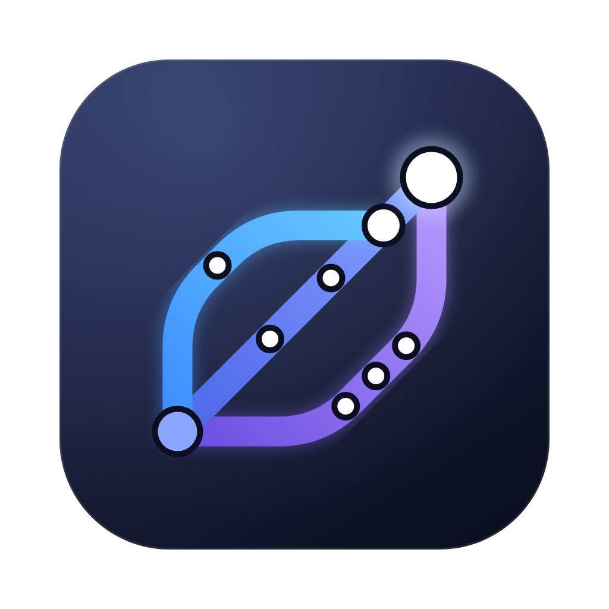
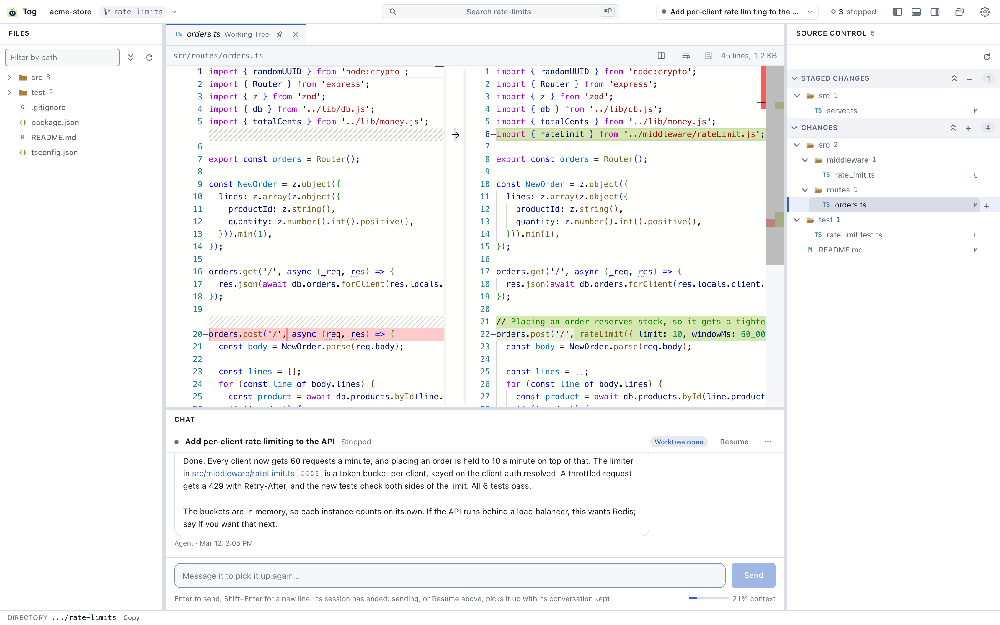
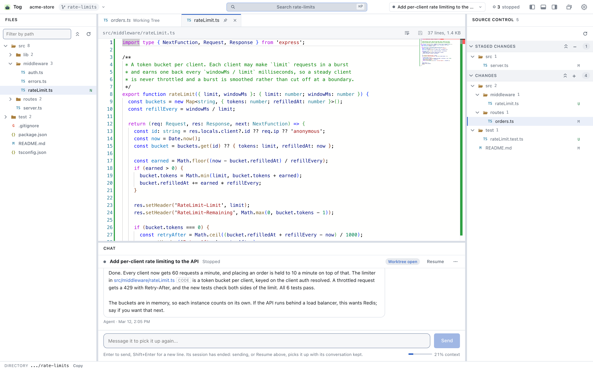
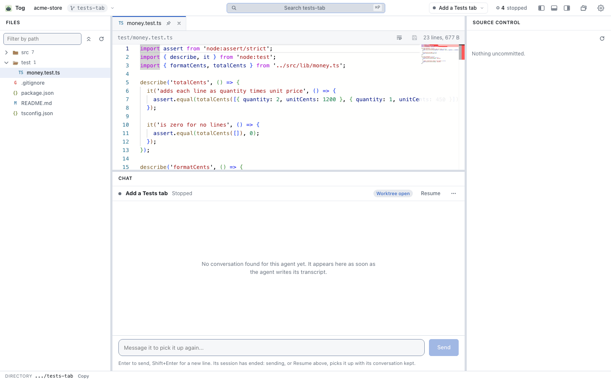

<p align="center">
  
</p>

<h1 align="center">Tog</h1>

<p align="center">
  <strong>One window for every Claude Code agent you have running.</strong><br>
  See who is waiting on you, answer them, and review what they changed,
  across all your git worktrees.
</p>

<p align="center">
  <a href="https://github.com/BradenTerry/tog/actions/workflows/ci.yml"></a>
  
  
  
  
  
</p>

<p align="center">
  <picture>
    <source media="(prefers-color-scheme: dark)" srcset="assets/screenshots/overview-dark.png">
    
  </picture>
</p>

## Why

Running several agents in parallel means several terminals, and the things you
actually need from them are the things a terminal is worst at:

- **Noticing an agent is blocked.** Agents waiting on you sort to the top,
  longest-blocked first, with the question they asked, and you get an OS
  notification the moment one starts waiting.
- **Reviewing its work.** VS Code's Source Control view over the agent's
  worktree: its uncommitted files, staged and unstaged, each opening in a side
  by side diff you can edit in.
- **Starting and steering agents.** Agents run inside Tog over the
  Agent Client Protocol. Replies stream in live, and permission prompts and
  questions are answered right on the card.

It is a native desktop app on macOS, Windows and Linux. Nothing to configure:
it reads what Claude Code and git already write.

## Get started

You need the .NET SDK named in [`global.json`](global.json), `git`, Node 22 or
newer, and [Claude Code](https://claude.com/claude-code).

```bash
git clone https://github.com/BradenTerry/tog.git
cd tog
dotnet run --project src/Tog.App
```

That is the whole install. The first build fetches the editor and the Claude
ACP bridge for you. Then press **New agent**, pick a repository and a worktree,
and give it a prompt.

Want it on another device? `--browser` prints an address you can open anywhere
on your network instead of opening a window. There are no prebuilt binaries by
design: you build what you run. See [docs/release.md](docs/release.md).

## A tour

The window is laid out like VS Code, and every panel follows the agent you
picked.

- **Agents and chat** along the bottom: the conversation, a box to message the
  agent, and the list of agents down the side, the ones waiting on you first.
- **Source control** on the right: Staged Changes and Changes, staging, and
  push and pull counts, updating as the agent's edits land.
- **Editor** in the middle: Monaco with VS Code's own TextMate grammars, a tab
  per file, and diffs side by side or inline.
- **Files** on the left: the agent's worktree as a tree.
- **Go to File** with Cmd+P or Ctrl+P, and every shortcut can be rebound.
- **Links everywhere.** A file path an agent mentions in a reply opens that line
  in the editor, or in VS Code.
- **Images open as pictures**, so an agent can show you a screenshot with its
  `tog_open_file` tool.
- **Any tab can move.** Drag it to another panel or split it into a section of
  its own, and the arrangement is kept.

<p align="center">
  <picture>
    <source media="(prefers-color-scheme: dark)" srcset="assets/screenshots/editor-dark.png">
    
  </picture>
</p>

## Make it yours with extensions

The app stays small on purpose: watching agents, answering them, and reviewing
their work. Everything else is an extension, a small Razor project the app
loads at runtime and reloads on every build.

- Add a tab to any panel, an indicator to the title bar, a background worker,
  or code intelligence for a language (hover, go to definition, references and
  call hierarchy; a C# one runs Roslyn in-process).
- Give agents new tools: whatever an extension adds with `AddAgentTool` is
  served to every agent over Tog's own MCP server.
- Ask for secrets such as a GitHub or Jira token by name. You approve each
  extension, values stay in the OS keychain, and no agent ever sees them.

The easiest way to write one is to ask Claude: **Settings** installs a skill
that teaches it how, and an agent Tog runs can ask you to add what it built.
Nothing loads until you accept. Or start from the template with
`dotnet new tog-extension`, or from the example in
[examples/NodeTests](examples/NodeTests). See
[docs/extensions.md](docs/extensions.md).

<p align="center">
  <picture>
    <source media="(prefers-color-scheme: dark)" srcset="assets/screenshots/extension-dark.gif">
    
  </picture>
</p>

## Learn more

- [docs/workbench.md](docs/workbench.md) the layout, panels and tabs
- [docs/agent-control.md](docs/agent-control.md) how agents run over ACP
- [docs/review.md](docs/review.md) and [docs/staging.md](docs/staging.md)
  reviewing and staging changes
- [docs/extensions.md](docs/extensions.md) writing and loading extensions
- [docs/release.md](docs/release.md) versions and building from source

## Contributing

Issues and pull requests are welcome. [CONTRIBUTING.md](CONTRIBUTING.md) covers
building and testing, the architecture, and where each subsystem's rationale
lives.
