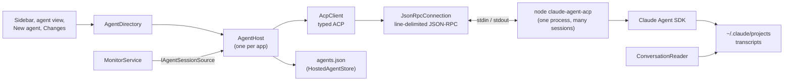
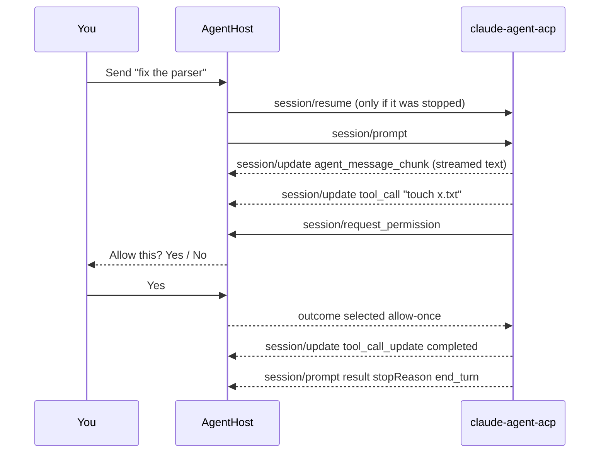

# Running agents over ACP

The dashboard runs its agents itself, over the
[Agent Client Protocol](https://agentclientprotocol.com) (ACP): JSON-RPC, one
message per line, on the agent process's standard input and output. It is the
same protocol editors such as Zed use for external agents, which is what lets
another agent be added later as a second backend rather than a second app.

Claude does not speak ACP natively. The official bridge,
`@agentclientprotocol/claude-agent-acp`, wraps the Claude Agent SDK and does.
`tools/vendor-acp.sh` installs a pinned version into `src/AgentsDashboard.App/acp/`
on the first build (git ignores it, like Monaco), and the app runs it with
`node`, so Node 22 or newer has to be on `PATH`. Without either, the app opens
and says why when you start an agent.

## The pieces

- **`AgentBackend`** describes an agent: a name and the command that starts it.
  Claude is one (`AgentBackends.Claude`). Another agent that speaks ACP is
  another definition; nothing above it changes.
- **`AgentHost`** owns the agent process and every session on it. One process
  hosts all sessions: ACP is built for many sessions per connection, and a Node
  process per agent would cost memory for nothing. It is started on first use and
  again after it dies.
- **`HostedAgentStore`** is the list of agents in the sidebar, kept in
  `~/.agents-dashboard/agents.json` so they come back after a restart.

## The app is the host

Agents run inside the dashboard, so closing it ends them, like local agents in an
editor. Nothing is lost: the SDK saves every conversation to the same transcripts
the Claude CLI uses, and the sidebar lists the agents again on the next start as
**Stopped**. Sending one a message resumes it with `session/resume` and then
prompts it. A turn in progress when the app closed is the only thing that stops.

A background host that outlives the window could replace this later without the
UI noticing: the UI only talks to `AgentHost`.

## A turn

What the UI shows comes from two places:

- **Live, from ACP:** the state (working, waiting on you, idle, stopped, failed),
  the text of the reply being written, the tool call in progress, and any
  permission prompt. Streamed text arrives a few tokens at a time, so the host
  raises its change event at most ten times a second.
- **History, from the transcript:** `ConversationReader` reads the conversation
  from the transcript file as before. The live text since the last tool call is
  shown under it until the transcript has it; a tool call is where the agent's
  previous message is finished and written, so the live text restarts there.

The bridge names a conversation when its first turn ends: it asks the CLI to
generate a title and sends it as `session_info_update`. That title is kept in
`agents.json`. Until then the label is the first prompt, set in italics so it
does not pass for a name the agent chose, and the prompt is stored separately
from the title (`Prompt` in `agents.json`) so it never becomes one. When
generation fails the bridge falls back to the SDK's session summary, which for a
session it drives is just the first prompt, flattened and cut at 256 characters
with an ellipsis. `AgentHost.IsPromptEcho` recognises that and refuses it.

How full the context window is shows under the message box as a percentage,
amber from 70% and red from 85%. It comes from the bridge's `usage_update`:
`used` is the last request's input tokens, cached or not, and `size` is the
model's window as the SDK reports it, so a 1M model reads against 1M. The bridge
only sends it when a turn ends and after a compaction, so the figure is as of
the last turn, not live. It is kept in `agents.json` so a stopped agent still
shows it.

While an agent works, its status line says "Working" with animated dots rather
than the tool it is in. The tool changes every second or two, so a status that
names it keeps rewriting itself; the tool is in the tooltip and the transcript.

## Permissions

The client advertises no file system and no terminal capability, so the agent
uses its own tools for both, exactly as in a terminal: the dashboard watches the
work, it does not perform it. When a tool call needs your approval, the agent
sends `session/request_permission`; the agent view shows the call's title and
description with the options the agent offered (typically Yes and No), and the
sidebar marks the agent as waiting on you. **Stop turn** declines an open prompt
and cancels the turn.

Which calls ask is the permission mode, set per agent when it starts (Manual,
Accept edits, Plan, Auto, Bypass permissions), plus your own Claude settings: a
command your settings already allow is not asked about.

Starting the first agent in a repository asks you to confirm that Claude may read
and change every file in it. The answer is kept in the dashboard's own settings
(`TrustedRoots`), never in Claude's config.

## Controls

- **New agent** starts a session in an existing worktree, or first creates a new
  one with `git worktree add` under `.claude/worktrees/<name>`, the same layout
  `claude --worktree` uses. By default the new worktree gets a new branch
  `worktree-<name>` from the current HEAD. The Branch picker can instead put it on
  an existing branch: local branches no worktree has checked out (git refuses one
  branch in two worktrees), and remote branches with no local namesake. A remote
  branch is checked out as a new local branch of the same name tracking it
  (`worktree add --track -b`), since the remote ref alone would leave the agent
  on a detached HEAD. Left blank, the worktree name comes from the branch.
  Remote branches are as fresh as the last fetch; "Fetch remote branches" runs
  `git fetch --all --prune`, only when clicked.
- **Resume** under New agent lists the folder's past conversations, including
  ones started in a terminal, and reopens one under ACP. A conversation still
  running in a terminal or under `claude --bg` should be stopped there first:
  two processes on one conversation will both write to it.
- **Model, Effort, Permission mode** are ACP config options. The lists shown are
  the ones the agent reported for its last session, and a value is matched to
  the agent's own name for it ("opus" finds "opus[1m]"); one it does not offer is
  left out rather than failing the start.
- **Stop turn** sends `session/cancel`. **End session** closes it
  (`session/close`) and marks it stopped. **Remove** takes it off the list; the
  conversation stays saved and can be resumed.
- A message sent while the agent is working does not interrupt it. The CLI
  queues it and hands it to the agent between two steps of the running turn.
  The transcript records that as a `queued_command` attachment rather than a
  user message, so `ConversationReader` reads those too. Without them the chat's
  "Sent." bubble never finds its message and sits below the agent's reply as if
  it were ignored.

## When the agent process dies

Every session it held stops. One that was mid-turn is marked failed, with the last
line the bridge wrote to its error stream; the others become stopped. The next
message starts the process again and resumes the session.
