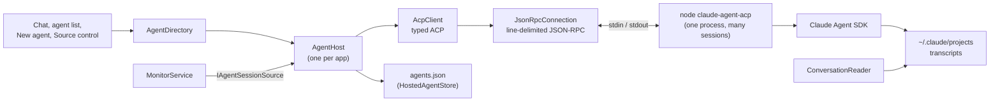
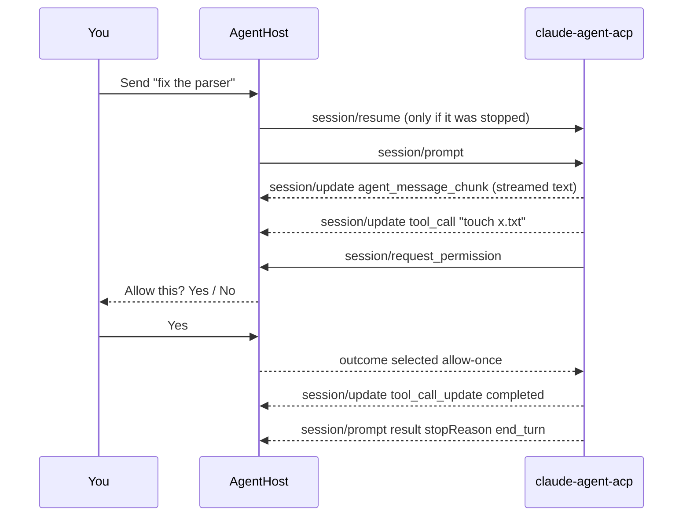
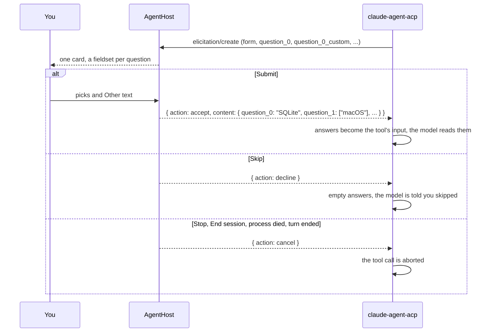

# Running agents over ACP

Tog runs its agents itself, over the
[Agent Client Protocol](https://agentclientprotocol.com) (ACP): JSON-RPC, one
message per line, on the agent process's standard input and output. It is the
same protocol editors such as Zed use for external agents, which is what lets
another agent be added later as a second backend rather than a second app.

Claude does not speak ACP natively. The official bridge,
`@agentclientprotocol/claude-agent-acp`, wraps the Claude Agent SDK and does.
`tools/vendor-acp.mjs` installs it into `src/Tog.App/acp/` on the
first build with `npm ci` from the lockfile in `tools/vendor/acp`, install
scripts off (git ignores it, like Monaco), and the app runs it with
`node`, so Node 22 or newer has to be on `PATH`. Without either, the app opens
and says why when you start an agent.

## The pieces

- **`AgentBackend`** describes an agent: a name and the command that starts it.
  Claude is one (`AgentBackends.Claude`). Another agent that speaks ACP is
  another definition; nothing above it changes.
- **`AgentHost`** owns the agent process and every session on it. One process
  hosts all sessions: ACP is built for many sessions per connection, and a Node
  process per agent would cost memory for nothing. It is started on first use and
  again after it dies.
- **`HostedAgentStore`** is the list of agents in the agent list, kept in
  `~/.tog/agents.json` so they come back after a restart.

## The app is the host

Agents run inside Tog, so closing it ends them, like local agents in an
editor. Nothing is lost: the SDK saves every conversation to the same transcripts
the Claude CLI uses, and the agent list shows the agents again on the next start as
**Stopped**. Sending one a message resumes it with `session/resume` and then
prompts it. **Resume** in the chat header (`AgentHost.WakeAsync`) sends only
`session/resume`, which starts no turn, so the agent's commands and settings are
live before you decide what to send. A turn in progress when the app closed is
the only thing that stops.

Closing ends the app's own processes, but not what they leave running. A
`dotnet build` keeps its compiler server and MSBuild nodes alive for the next
build, ten minutes or more, and macOS counts anything started under the app as
the app, so the Dock would keep showing it as Running in Background. `Program.cs`
sets `MSBUILDDISABLENODEREUSE=1`, `DOTNET_CLI_USE_MSBUILD_SERVER=0` and
`UseSharedCompilation=false` for everything the app starts, unless already set.
An agent's build is a second or two slower (1.3s to 2.8s for an edit to Core
here) and leaves nothing behind.

A conversation can only be resumed in the folder it started in: the transcript
lives under a directory named after that path, and the agent refuses a `cwd` that
does not exist. When a worktree is removed with its agent still on the list, the
agent reports `FolderGone`, `AgentHost` refuses to resume it (without marking it
failed, since nothing ran), and the chat says so and offers Remove. Recreating the
worktree at the same path brings it back.

A background host that outlives the window could replace this later without the
UI noticing: the UI only talks to `AgentHost`.

## A turn

What the UI shows comes from two places:

- **Live, from ACP:** the state (working, waiting on you, idle, stopped, failed),
  the text of the reply being written, the tool call in progress, and any
  permission prompt or open questions. Streamed text arrives a few tokens at a time, so the host
  raises its change event at most ten times a second.
- **History, from the transcript:** `ConversationReader` reads the conversation
  from the transcript file as before. The live text since the last tool call is
  shown under it until the transcript has it; a tool call is where the agent's
  previous message is finished and written, so the live text restarts there.

The bridge names a conversation when its first turn ends: it asks the CLI to
generate a title and sends it as `session_info_update`. That title is kept in
`agents.json`. Until then the label is the first prompt, set in italics so it
does not pass for a name the agent chose, and the prompt is stored separately
from the title (`Prompt` in `agents.json`) so it never becomes one. When
generation fails the bridge falls back to the SDK's session summary, which for a
session it drives is just the first prompt, flattened and cut at 256 characters
with an ellipsis. `AgentHost.IsPromptEcho` recognises that and refuses it.

How full the context window is shows under the message box as a percentage,
amber from 70% and red from 85%. It comes from the bridge's `usage_update`:
`used` is the last request's input tokens, cached or not, and `size` is the
model's window as the SDK reports it, so a 1M model reads against 1M. The bridge
only sends it when a turn ends and after a compaction, so the figure is as of
the last turn, not live. It is kept in `agents.json` so a stopped agent still
shows it.

The same `usage_update` can carry the subscription plan's rate limits, under
`_meta["_claude/rateLimit"]`: the SDK's `rate_limit_event`, which the bridge
passes along. `PlanLimit.Read` takes the headline limit (`rateLimitType`, with
its `status`, `utilization` and `resetsAt`) and, when present, `unifiedWindows`,
which has the 5-hour and weekly windows side by side. Shares are fractions and
times Unix seconds. The status bar shows them on the right, amber from 75% or on
a warning and red once Claude refuses, each as the share used next to the share
of its window gone by, since one means little without the other. Only the reset
is reported, so a window's start is the reset less its length (5 hours, or 7 days
for the weekly ones); `overage` has no length and shows no time. Clicking them
opens the details: time to the reset and where the current rate lands. Three
things to know about the figures:
the SDK only sends them when they change, so they are as of the last hosted turn
that reported them; agents run in a terminal never feed them; and an API-key
login has no plan, so nothing shows. They are kept in `plan-usage.json` so the
weekly figure survives a restart, and a reading is dropped once its window's
reset time has passed.

While an agent works, its status line says "Working" with animated dots rather
than the tool it is in. The tool changes every second or two, so a status that
names it keeps rewriting itself; the tool is in the tooltip and the transcript.

## Permissions

The client advertises no file system and no terminal capability, so the agent
uses its own tools for both, exactly as in a terminal: Tog watches the
work, it does not perform it. When a tool call needs your approval, the agent
sends `session/request_permission`; the chat shows the call's title and
description with the options the agent offered (typically Yes and No), and the
agent list marks the agent as waiting on you. **Stop** declines an open prompt
and cancels the turn.

Every session is also given Tog's own MCP server, when the agent
says it can reach one over HTTP (`mcpCapabilities.http`): the tools extensions
add with `AddAgentTool`. See [extensions.md](extensions.md#agent-tools).

Which calls ask is the permission mode, set per agent when it starts (Manual,
Accept edits, Plan, Auto, Bypass permissions), plus your own Claude settings: a
command your settings already allow is not asked about.

Starting the first agent in a repository asks you to confirm that Claude may read
and change every file in it. The answer is kept in Tog's own settings
(`TrustedRoots`), never in Claude's config.

## Questions (form elicitation)

Claude has a built-in tool, AskUserQuestion, for asking you several questions
at once, each with a few options. The bridge only lets the agent use it when
the client advertises form elicitation; otherwise it disallows the tool and the
agent falls back to writing its questions out in prose. So `initialize` sends
`clientCapabilities.elicitation = { form: {} }`, and nothing else new.

Advertising it routes three things through `elicitation/create`, all in form
mode, all answered by the same card:

- **AskUserQuestion.** The bridge sees the call in `canUseTool` and sends a
  form instead of a permission request. Each question is a field
  `question_<n>`: a string with `oneOf` for pick-one, an array with
  `items.anyOf` for pick-many, each option a `{ const, title, description }`
  whose `const` is the label. After each is an optional `question_<n>_custom`
  string, the "Other" box, marked `_meta._askUserQuestionCustomAnswer` with the
  question it belongs to. With several questions each field's `title` is the
  short header and `description` the question; with one, the question is the
  form's `message`.
- **MCP server elicitations**, passed through with the server's own schema:
  flat fields of string (free, `enum` or `oneOf`), number, integer, boolean, or
  an array of picks.
- **The refusal fallback.** When a model declines a request and another could
  take it, the CLI asks before switching: one `oneOf` field, retry on the other
  model or keep the refusal.

URL mode is not advertised. It would route MCP OAuth sign-ins through Tog to open in a browser, and the bridge declines those on its own
without it. A url-mode request that arrives anyway is declined.

`QuestionForm.Parse` turns the schema into questions, folding each "Other" box
into the question it belongs to. A field of a kind it does not know is left out
when optional; when required, the form is declined at once, since it cannot be
answered honestly. The host puts the form on the agent (`HostedAgent.Questions`),
which is then waiting on you exactly as with a permission: amber in the agent
list, counted in the title bar, "N questions for you" as what it waits for.
Answered outside a turn (an MCP server can ask after its turn has ended), the
agent goes back to idle rather than staying on waiting.

### Who is asking

An MCP server is a third party, and its form would otherwise look exactly like
Claude asking: a server could ask "Paste your GitHub token to continue" with a
text box. So every form records its source (`QuestionForm.Source`), told apart
by what the bridge sends:

| Source | How it is recognised | Card heading |
| --- | --- | --- |
| Agent (AskUserQuestion) | carries `toolCallId`, which the bridge sets only for the tool | "Questions from the agent" |
| Bridge (refusal fallback) | no `toolCallId`, one `choice` field between `retry_fallback` and `cancelled` | "Claude Code is asking" |
| MCP server | anything else | "An MCP server the agent uses is asking" |

A server's form is headed in Tog's words, its message is shown below
as "The server says:", the card is edged red, and every free-text box on it has
"Only answer if you trust this server. Do not paste passwords or tokens." beside
it. What the agent waits for, in the agent list and the OS notification, is the
same fixed "An MCP server the agent uses is asking", never the server's message.
A server can copy the refusal fallback's shape, but then all it can get back is
one of those two fixed values.

### Size caps

The chat redraws every second, and a form of thousands of fields would stall the
circuit. A form with more than 20 questions (40 fields, counting "Other" boxes)
or a question with more than 50 options is declined unseen. Titles,
descriptions, labels and the message are cut to 2000 characters; option values
go back to the agent as sent.

Only what was answered goes back: a pick-one as its value, a pick-many as an
array in the listed order, an "Other" box under its own key when it has text,
numbers as numbers, a yes/no as a boolean. For AskUserQuestion the bridge turns
that into the tool's `answers` by question text: the Other text joins a
pick-many's picks, answers a pick-one when nothing was picked, and rides along
as a note when something was.

The chat redraws every second, so the card keeps nothing in its markup: picks
and typed text go into a `QuestionDraft` held in `ChatDrafts`, one per agent,
and a text box's value is only written when the card is built. A half-answered
form survives switching agents. Enter in a text box moves to the next question
and Ctrl or Cmd+Enter submits.

Afterwards the transcript has the call and its result. `ConversationReader`
shows the questions as something the agent said and the answers, by header, as
something you said, or a notice when they were skipped.

## Controls

- **New agent** starts a session in an existing worktree, or first creates a new
  one with `git worktree add` under `.claude/worktrees/<name>`, the same layout
  `claude --worktree` uses. By default the new worktree gets a new branch
  `worktree-<name>` from the current HEAD. The Branch picker can instead put it on
  an existing branch: local branches no worktree has checked out (git refuses one
  branch in two worktrees), and remote branches with no local namesake. A remote
  branch is checked out as a new local branch of the same name tracking it
  (`worktree add --track -b`), since the remote ref alone would leave the agent
  on a detached HEAD. Left blank, the worktree name comes from the branch.
  Remote branches are as fresh as the last fetch; "Fetch remote branches" runs
  `git fetch --all --prune`, only when clicked.
- **Resume** under New agent lists the folder's past conversations, including
  ones started in a terminal, and reopens one under ACP. A conversation still
  running in a terminal or under `claude --bg` should be stopped there first:
  two processes on one conversation will both write to it.
- **Model, Effort, Permission mode** are ACP config options. The lists shown are
  the ones the agent reported for its last session, and a value is matched to
  the agent's own name for it ("opus" finds "opus[1m]"); one it does not offer is
  left out rather than failing the start.
- **Stop**, beside Send while a turn runs, sends `session/cancel`. **End
  session**, in the header's menu, closes it (`session/close`) and marks it
  stopped. **Remove from list**, in the same menu, takes it off the list; the
  conversation stays saved and can be resumed.
- A message sent while the agent is working does not interrupt it. The CLI
  queues it and hands it to the agent between two steps of the running turn.
  The transcript records that as a `queued_command` attachment rather than a
  user message, so `ConversationReader` reads those too. Without them the chat's
  "Sent." bubble never finds its message and sits below the agent's reply as if
  it were ignored.
- **Slash commands** go to the agent as plain prompt text (`/review high`); the
  bridge runs skills, custom commands and its own. What it takes arrives as an
  `available_commands_update` once a session runs, and the composer lists those
  as you type a slash at the start of any word. Only one that starts the
  message runs as a command; further in it is text the agent reads, which is how
  a skill is asked for mid-sentence. A stopped agent has not listed any, and it
  is the message being typed that resumes it, so it is offered the list it gave
  last, or failing that the last list any session gave. Each agent's list is
  saved in `agents.json` with it; kept only in memory, every agent came back
  from a restart with none, since no session has run yet to list them.
  The menu lives in `app.js`, not on the circuit, so it keeps up with typing.

## When the agent process dies

Every session it held stops. One that was mid-turn is marked failed, with the last
line the bridge wrote to its error stream; the others become stopped. The next
message starts the process again and resumes the session.
