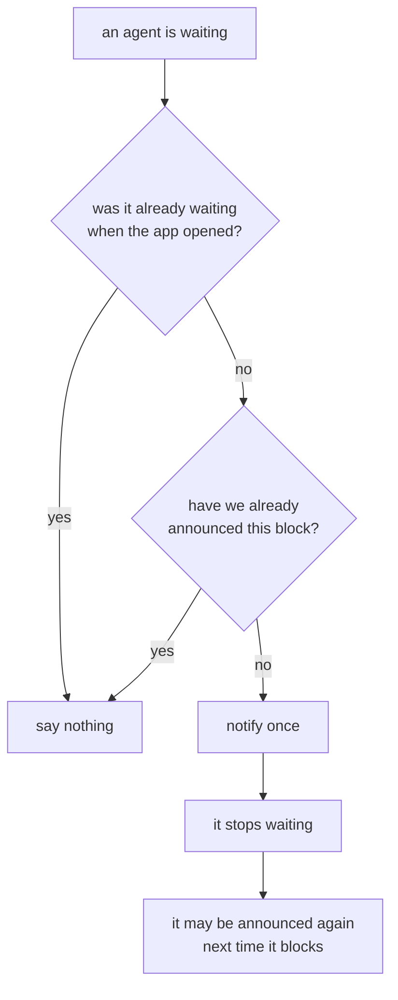

# Where the agent data comes from

Nothing is installed, no hooks are added, and no settings file of yours is
edited. Claude Code already writes everything the dashboard shows, and the
dashboard only reads it.

## Which agents there are

The agents are the ones the dashboard runs itself over ACP (see
`agent-control.md`). `AgentHost` knows their state as it changes, and hands the
monitor the running ones through `IAgentSessionSource`, which is how they land
in worktrees in the snapshot, count towards "waiting on you", and raise
notifications. Sessions started in a terminal are not listed; they can be picked
up under New agent, Resume.

## The work summary

The row label is Claude's own generated title, read from the tail of the
session's transcript at `<config>/projects/<slug>/<sessionId>.jsonl`, where the
record looks like `{"type":"ai-title","aiTitle":"Estimate Azure hosting costs"}`.
Skills used come from the same file.

A transcript is append-only and can reach tens of megabytes, so it is read
forward from a per-session cursor: the first read scans, every read after it sees
only what was appended. Whole lines only, so a record still being written is
picked up next time rather than parsed half-formed.

The slug is derived from the working directory, but that is Claude's private
convention, so it is used as a fast path only; a miss falls back to scanning the
projects directory. A transcript we cannot find costs a work summary, never an
agent.

## The conversation

`ConversationReader` reads the same transcript as a chat. Tool calls between two
things said fold into one "Ran 2 commands, read a file" line. File changes made
with Edit, MultiEdit and Write are pulled out of that fold into a "Files changed"
fold of their own, with a count, and each file in it opens to its diff. The first
diff is made from the call's input, which has no line numbers. The tool's result,
a record or two later, carries a `toolUseResult.structuredPatch` with line
numbers and context, and replaces it. A failed edit is marked failed.

This only sees changes made with the edit tools. A file changed by a shell
command (`sed`, a script) shows as the command, the same as in the terminal.

## Subagents

Subagents run inside the parent agent's process and have no session of their own.
Claude writes one small file per subagent beside the transcript and removes it
when the subagent finishes, which makes the directory listing an answer to "what
is running right now" rather than a tally of everything that ever ran.

## Background work

A subagent, or a shell command started with `run_in_background`, keeps going
after the turn that started it ends, so an idle agent is not necessarily done.
The chat lists that work in a strip above the message box, and the agent picker
says "2 running in background" under the agent.

Subagents come from the files above. Background commands come from the
transcript (`TranscriptReader`): the Bash call carries `run_in_background: true`,
its result carries a `backgroundTaskId`, and when the command ends a
`<task-notification>` record names the call (`<tool-use-id>`) or the task
(`<task-id>`). The notice arrives as a user message when the agent is idle and
as a queued attachment mid-turn, so it is read from the raw line.

Background work dies with the agent process and nothing records that: no notice
for a command, a leftover file for a subagent. So the monitor ignores anything
that started before the current agent process did (`ProcessStartedAt`), and
nothing is listed for a stopped agent.

## Notifications

Every other signal the dashboard has terminates inside its own window: the
waiting rail, the counts, the pulsing dot, the window title. None of them reach
you once the window is behind your editor, which is exactly when an agent sitting
on a question costs the most. An OS notification is the only channel that does,
which is also why the rules about raising one are strict:

Opening the dashboard onto three blocked agents should show you three blocked
agents, not fire three notifications about a state you are already looking at.
