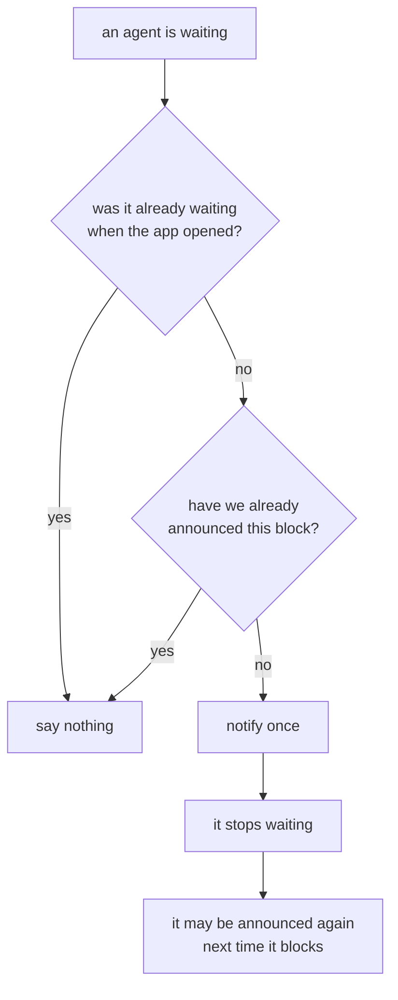

# Where the agent data comes from

Nothing is installed, no hooks are added, and no settings file of yours is
edited. Claude Code already writes everything the dashboard shows, and the
dashboard only reads it.

## The session registry

Claude writes one file per live session at `<config>/sessions/<pid>.json` and
rewrites it on every status transition:

```json
{
  "pid": 5795,
  "sessionId": "044e6e8e-...",
  "cwd": "/Users/you/Projects/thing",
  "status": "waiting",
  "waitingFor": "Approve running the migration?",
  "startedAt": 1788582486151,
  "kind": "interactive",
  "messagingSocketPath": "/tmp/cc-socks/5795.sock"
}
```

`CLAUDE_CONFIG_DIR` relocates the whole tree, so nothing hardcodes `~/.claude`.

Claude's statuses map onto the three the dashboard shows:

| Claude says | Shown as | Why |
| --- | --- | --- |
| `busy`, `shell` | active | A shell command is not an LLM turn, but it is work in progress as far as you are concerned. |
| `waiting` | waiting | Blocked on you. |
| `idle` | idle | Started, or finished responding. |
| anything else, or nothing | idle | A status we do not recognize is shown as idle rather than asserted to be something it is not. |

Two things the registry cannot tell us on its own:

- **Whether the process is still there.** A session killed with its terminal
  never gets to remove its own file, so every pid is probed before its agent is
  shown.
- **When the status last changed.** The file is rewritten for other reasons too,
  so transitions are tracked in memory. That is what makes a waiting agent's
  "blocked for 4m 12s" honest instead of resetting on every write.

## The work summary

The row label is Claude's own generated title, read from the tail of the
session's transcript at `<config>/projects/<slug>/<sessionId>.jsonl`, where the
record looks like `{"type":"ai-title","aiTitle":"Estimate Azure hosting costs"}`.
Skills used come from the same file.

A transcript is append-only and can reach tens of megabytes, so it is read
forward from a per-session cursor: the first read scans, every read after it sees
only what was appended. Whole lines only, so a record still being written is
picked up next time rather than parsed half-formed.

The slug is derived from the working directory, but that is Claude's private
convention, so it is used as a fast path only; a miss falls back to scanning the
projects directory. A transcript we cannot find costs a work summary, never an
agent.

## Subagents

Subagents run inside the parent Claude process, so they have no registry entry.
Claude writes one small file per subagent beside the transcript and removes it
when the subagent finishes, which makes the directory listing an answer to "what
is running right now" rather than a tally of everything that ever ran.

## Notifications

Every other signal the dashboard has terminates inside its own window: the
waiting rail, the counts, the pulsing dot, the window title. None of them reach
you once the window is behind your editor, which is exactly when an agent sitting
on a question costs the most. An OS notification is the only channel that does,
which is also why the rules about raising one are strict:



Opening the dashboard onto three blocked agents should show you three blocked
agents, not fire three notifications about a state you are already looking at.
