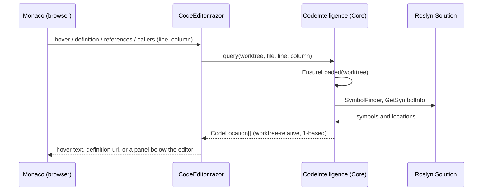
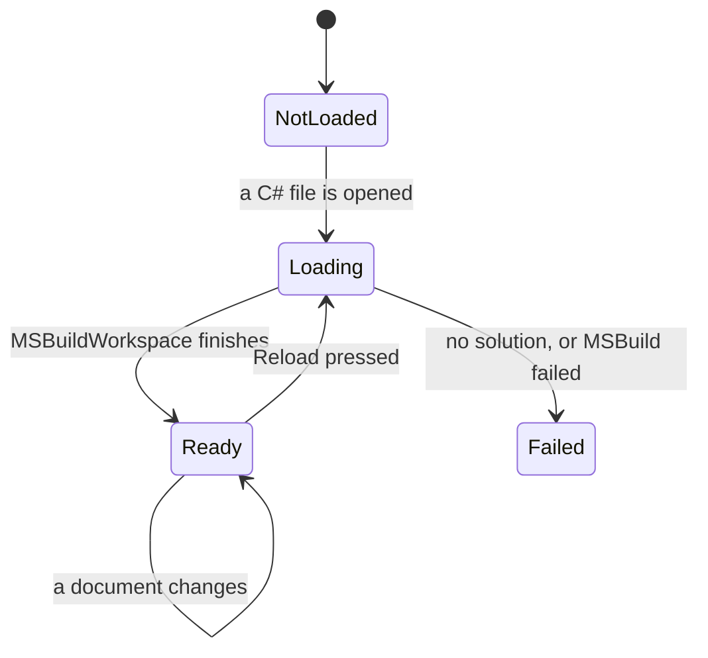

# Code intelligence

The Files tab shows what a symbol is, where it is defined, where it is used and
who calls it. VS Code gets that from a language server running beside the
editor. The dashboard is already a .NET process, so it gets it from Roslyn
in-process instead, which means no second process to install, start or keep
alive.

C# only. Other languages keep what Monaco does on its own, which is colouring
and, for TypeScript and JavaScript, symbols within the open file. The "Open in
VS Code" link is the fallback for everything else.

## How a query travels

One answer does not stay relative: a definition is handed to Monaco, which
addresses files by URI, so `CodeEditor` resolves those paths against the worktree
and returns them absolute. Each editor's model is created with
`monaco.Uri.file(absolutePath)` for the same reason, since a jump can only be
expressed as a URI and an unnamed model has none to match.

Every position that crosses the boundary is one-based in both line and column,
which is what Monaco uses. Roslyn's `LinePosition` is zero-based, and the
conversion lives in Core in exactly one place, because an off-by-one here shows
up as "go to definition lands on the line above" and nowhere else.

## Loading a solution

- A solution is loaded **on demand** the first time a C# file is opened in a
  worktree, never for every worktree the dashboard watches. Loading takes a few
  seconds and a few hundred megabytes, and most worktrees on screen are never
  browsed.
- What gets loaded: the `.slnx` or `.sln` at the worktree root, else every
  `.csproj` found there. One workspace per worktree, kept warm.
- `MSBuildWorkspace` needs the SDK's MSBuild registered through
  `Microsoft.Build.Locator` before any `Microsoft.Build` type is loaded into the
  process. That registration is lazy and lives in a method of its own, with
  nothing from MSBuild referenced outside it, so the web host starting first
  cannot spoil it.
- Editor text that has not been saved is pushed into the workspace as you type
  (debounced), so references reflect the buffer, not the disk. A save from the
  editor or a change an agent makes on disk re-reads that document; the rest of
  the solution stays as it was. Reload rebuilds everything, for when a project
  file changed.

## What the editor offers

| Gesture | Does | Backed by |
| --- | --- | --- |
| Hover | Signature and doc summary | `GetSymbolInfo`, `ToDisplayString`, XML doc summary |
| F12, Cmd+click | Go to definition, across files | `SymbolFinder.FindSourceDefinitionAsync` |
| Shift+F12 | Find all references, in a panel under the editor | `SymbolFinder.FindReferencesAsync` |
| Shift+Alt+H | Callers and callees of the method under the caret | `SymbolFinder.FindCallersAsync`; callees by walking the body's invocations |

The Files tab header carries a chip for the worktree's solution, showing not
loaded, what the load is doing, "ready" with the project count, or failed with
the reason in its tooltip, and a Reload beside it.

References and callers go to a **panel under the editor** rather than Monaco's
peek widgets. The peek widgets want a text model for every file they show, which
means loading every referenced file into the browser; the panel shows the line
of code from the server and opens the file only when you click it. A row opens
its file in the tab that is already there rather than navigating, so a list of
results can be walked without losing the panel or the tree.

The row marks the symbol inside that line, and it has to guess where: the preview
arrives trimmed, so the column no longer indexes into it. What survives the trim
is the length of the span and the fact that indentation only shifts it left, so
the mark goes on the identifier of that length nearest the column from below, and
on nothing at all when no identifier of that length fits.

Definition targets in other files go through Monaco's editor opener, which the
dashboard handles by opening that file in the Files tab at that line, exactly
as a clicked reference would.

## What is deliberately not here

- **Completions and diagnostics.** They are the expensive, always-on half of a
  language server, and the editor here is for reading and small fixes. An agent
  writes the code; the dashboard is where you check it.
- **Rename and other refactorings.** Anything that edits files the user did not
  open is out of scope for a dashboard that offers changes rather than makes
  them.
- **Other languages.** A general language server bridge is a different project.
