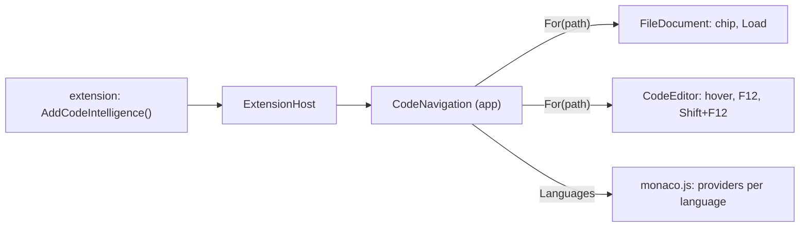
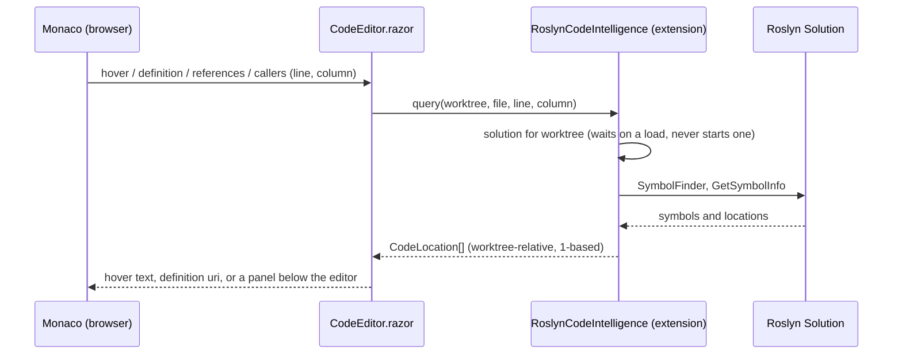
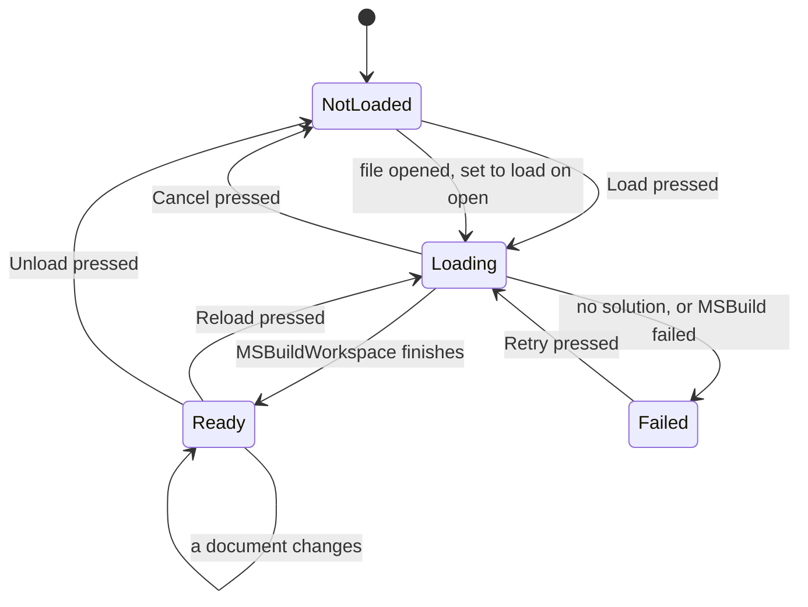

# Code intelligence

The editor can colour what each name is, and show what a symbol is, where it is
defined, where it is used and who calls it. VS Code gets that from a language
server running beside the editor. Here it comes from an extension, one per
language, through `ICodeIntelligence`; the app itself has no language support
beyond Monaco's colouring, and carries no Roslyn or MSBuild.

The one that exists is C#, kept outside this repository in the user's
extension folder (`togue-extensions/CSharpCode`, with its tests in
`CSharpCode.Tests` beside it), built against the SDK like any other
extension. Togue is already
a .NET process, so it runs Roslyn in-process, which means no second process to
install, start or keep alive. Other languages keep what Monaco does on its own,
which is colouring and, for TypeScript and JavaScript, symbols within the open
file. The "Open in VS Code" link is the fallback for everything else.

## The extension point

- `CodeNavigation` asks the loaded extensions which one `Handles` a file, each
  time rather than once, because a provider goes when its extension reloads.
  With none, the file's bar has no chip and every query answers with nothing.
- Monaco's providers are registered per language id, once for the page, for
  the languages the loaded providers name. A language that arrives with an
  extension loaded later is registered then; one whose extension goes stays
  registered and is answered with nothing.
- A provider is extension code on the circuit, so the app catches whatever it
  throws: an exception out of a JSInvokable ends the circuit.

## How a query travels

One answer does not stay relative: a definition is handed to Monaco, which
addresses files by URI, so `CodeEditor` resolves those paths against the worktree
and returns them absolute. Each editor's model is created with
`monaco.Uri.file(absolutePath)` for the same reason, since a jump can only be
expressed as a URI and an unnamed model has none to match.

Every position that crosses the boundary is one-based in both line and column,
which is what Monaco uses. Roslyn's `LinePosition` is zero-based, and the
conversion lives in the extension's `CodeQueries` in exactly one place, because
an off-by-one here shows up as "go to definition lands on the line above" and
nowhere else.

### Off the window's thread

A component's thread is the Blazor circuit's synchronization context, and a
desktop window has exactly one circuit, so anything synchronous a provider does
on it freezes every panel. The host therefore never calls a provider there.
`CodeNavigation.Run` hands each query to the thread pool with a 10 second
deadline linked to the editor's token, and a timeout or an exception answers
with nothing rather than leaving Monaco waiting or ending the circuit.
`Start` and `Post` do the same for loads, reloads, unloads and document
updates, queued in order so a buffer pushed while typing cannot land after the
re-read that follows its save. `For` caches `Handles` per path because it is
asked on every render. `Status` and `Name` stay synchronous: the contract says
to answer them from memory. `StatusChanged` fires on pool threads, so its
handlers reach the UI through `InvokeAsync`.

Inside a provider, `await Task.Yield()` does not leave the caller's thread: it
posts the continuation back to the captured context, which is the circuit. The
C# extension starts its load with `Task.Run` and begins each query with
`ConfigureAwaitOptions.ForceYielding`, since with a ready solution every await
in a query can complete synchronously.

## Loading a solution

- Roslyn is **off until asked for**. Opening a C# file only reads it; the Load
  button on the file's bar loads that worktree's solution. Loading takes a few
  seconds and a few hundred megabytes, and navigation is only wanted when an
  agent's changes need tracing, not for every worktree glanced at. Hover,
  definition, references and colouring answer with nothing until then, and
  none of them starts a load.
- **Unless the user says otherwise.** The extension's one setting, "Load a
  worktree's solution" in Settings, Extensions, is "When I press Load" by
  default and can be "When a C# file opens". The provider says which through
  `ICodeIntelligence.LoadsOnOpen` (API 1.9, false unless implemented), and
  `FileDocument` asks it when the file opens and when a provider arrives, and
  starts the load itself if the worktree is not loaded. A query still never
  loads. A worktree the user unloaded answers false until Load is pressed
  there again, so Unload is not undone by opening the next file.
- A load belongs to the worktree, not to the tab that asked for it. It runs on
  its own cancellation token, which only Reload, Unload and Cancel trip; a
  caller's token only stops that caller waiting. When it was the first
  caller's, closing that tab (which switching agents does) cancelled the shared
  load, left it failed, and the next visit started MSBuild from nothing. A load
  that finishes after it was superseded is discarded rather than written back.
- Once loaded, a solution stays warm for the life of the app, so switching
  agents and back costs nothing. Unload hands the memory back.
- What gets loaded: the `.slnx` or `.sln` at the worktree root, else every
  `.csproj` found there. One workspace per worktree, kept warm.
- `MSBuildWorkspace` needs the SDK's MSBuild registered through
  `Microsoft.Build.Locator` before any `Microsoft.Build` type is loaded into the
  process. That registration is lazy and lives in a method of its own, with
  nothing from MSBuild referenced outside it, so the web host starting first
  cannot spoil it.
- Editor text that has not been saved is pushed into the workspace as you type
  (debounced), so references reflect the buffer, not the disk. A save from the
  editor or a change an agent makes on disk re-reads that document; the rest of
  the solution stays as it was. Reload rebuilds everything, for when a project
  file changed.

## What the editor offers

| Gesture | Does | Backed by |
| --- | --- | --- |
| Hover | Signature and doc summary | `GetSymbolInfo`, `ToDisplayString`, XML doc summary |
| F12, Cmd+click | Go to definition, across files | `SymbolFinder.FindSourceDefinitionAsync` |
| Shift+F12 | Find all references, in a panel under the editor | `SymbolFinder.FindReferencesAsync` |
| Shift+Alt+H | Callers and callees of the method under the caret | `SymbolFinder.FindCallersAsync`; callees by walking the body's invocations |

A C# file's bar carries a chip for the worktree's solution, showing off, what
the load is doing, "ready" with the project count, or failed with the reason in
its tooltip, and beside it whichever of Load, Cancel, Reload and Unload, or
Retry applies.

References and callers go to a **panel under the editor** rather than Monaco's
peek widgets. The peek widgets want a text model for every file they show, which
means loading every referenced file into the browser; the panel shows the line
of code from the server and opens the file only when you click it. A row opens
its file in a tab of its own, or moves the caret when it is the file already in
front, so a list of results can be walked without losing the panel.

The row marks the symbol inside that line, and it has to guess where: the preview
arrives trimmed, so the column no longer indexes into it. What survives the trim
is the length of the span and the fact that indentation only shifts it left, so
the mark goes on the identifier of that length nearest the column from below, and
on nothing at all when no identifier of that length fits.

Definition targets in other files go through Monaco's editor opener, which Togue handles by opening that file in its own tab at that line, exactly
as a clicked reference would.

## MSBuild inside an extension

The C# extension is loaded into a collectible `ExtensionLoadContext` like any
other, which MSBuild does not expect, and two things follow from it.

- `Microsoft.Build.Locator` hooks the *default* load context, so MSBuild's
  assemblies land there, outside the extension, whatever copy asked. That is
  what makes them agree with the out-of-process build host.
- MSBuild can be registered once per process, and the locator throws if its
  assemblies are already loaded. When the extension is rebuilt and reloaded,
  the new copy finds MSBuild already there from the old one and uses it as it
  is, and a copy that registered unregisters when it is disposed, so its hook
  on the default context does not keep the old copy alive.

Roslyn's `System.Composition` is a package, not part of the shared framework,
so the load context takes it from the extension's own folder; see
[extensions.md](extensions.md).

## What is deliberately not here

- **Completions and diagnostics.** They are the expensive, always-on half of a
  language server, and the editor here is for reading and small fixes. An agent
  writes the code; Togue is where you check it.
- **Rename and other refactorings.** Anything that edits files the user did not
  open is out of scope for an app that offers changes rather than makes
  them.
- **Other languages.** A general language server bridge is a different project.

## Colouring names

Monaco's C# grammar colours keywords, strings, numbers and comments as you type,
but it cannot tell a type from a method from a local, which is most of what
makes C# read differently in VS Code. VS Code gets that from its language server
as semantic tokens, and the editor does the same from Roslyn: a
`DocumentSemanticTokensProvider` for C# asks `CodeEditor.Classify`, which runs
`Classifier.GetClassifiedSpansAsync` over the document and keeps only the spans
that name a symbol (`CodeQueries.ClassifyAsync`). Keywords and literals stay
with the grammar, so they are coloured at once and never wait on the server.

- The colours are Dark+ and Light+, in two themes `monaco.js` defines over
  Monaco's own (`agents-dark`, `agents-light`). The built-in themes have no rules
  for semantic token types, so without them nothing would change colour. The
  app's theme picks between the two by its `color-scheme`, and one that sets
  `--editor-bg` also gives the editor that background.
- An edit still waiting on the typing pause is pushed to the solution before
  asking, so the answer is for the text on screen. An answer that comes back
  after another edit is dropped rather than painted onto moved lines.
- Until the solution is loaded, names are plain. Loading or unloading fires the
  provider's `onDidChange` (`agentsEditor.refreshSemantics`), so every open C#
  editor asks again and colours without being reopened.

