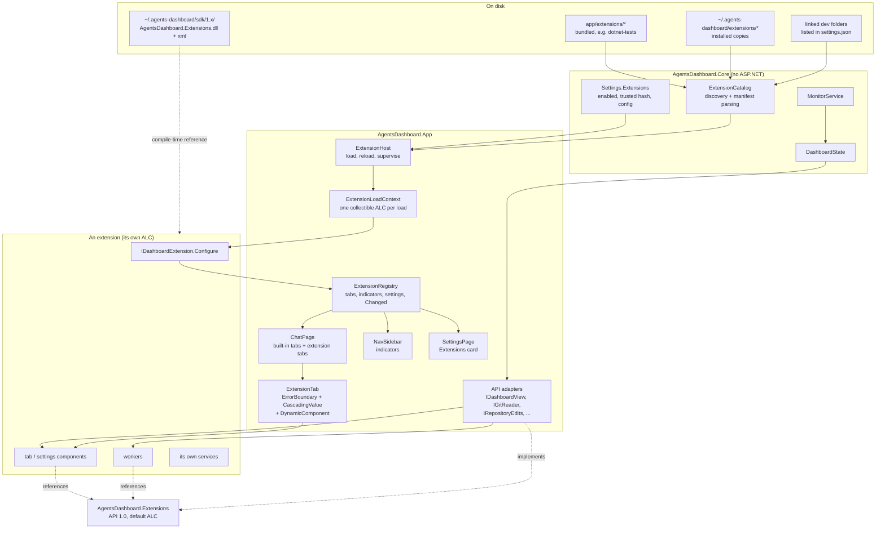
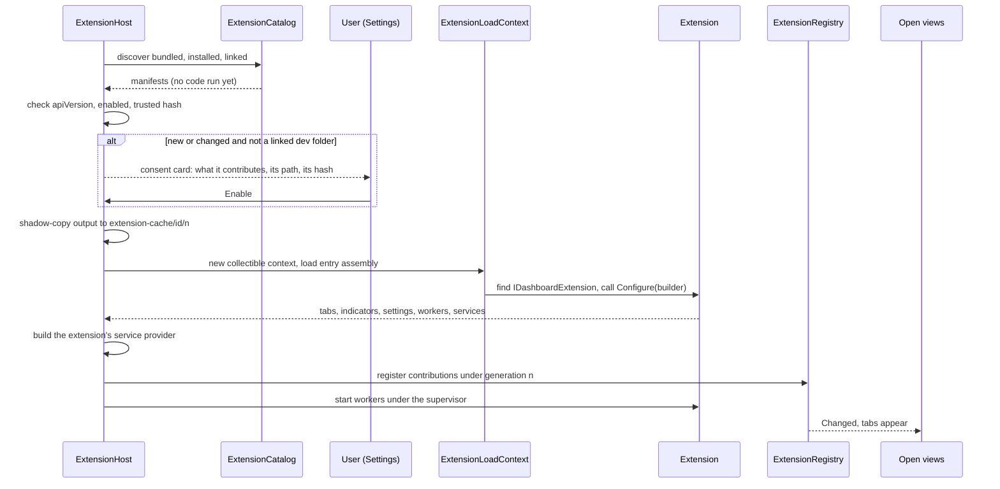
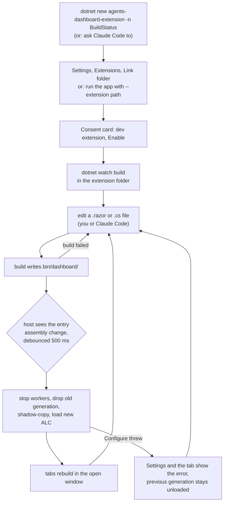

# Extensions

Status: phase 1 is implemented, with the differences below. What exists is
described in [../extensions.md](../extensions.md); this is the rationale.

Where the implementation differs from this design:

- Tests is **not bundled**. It lives outside this repository (now the test
  explorer in `agents-dashboard-extensions`) and is linked like anyone else's,
  so the published app carries no test code.
- `AddAgentTab` became `AddView(id, title, defaultLocation, ...)` with a
  `ViewLocation` enum, so side and bottom panels can be added without breaking
  extensions. The location is a default; placement is meant to be the user's.
- Reload on build (phase 2 here) is in, since writing an extension with Claude
  depends on it. Extension CSS is in too, from an `assets` folder rather than
  `wwwroot`.
- Not yet: settings sections, `IRepositoryEdits`, `INotifications`,
  `IWorktreeState`, `IExtensionSettings`, `IGitReader`, sidebar indicators,
  Install, New extension in Settings.

The goal: the Tests tab stops being a fixed part of every agent view and becomes
an extension, and anyone (usually with Claude Code doing the typing) can write
their own extension on their own machine and plug it into the dashboard with
little ceremony.

> "if I'm working with Claude, running this app on my work computer, I just want
> to be able to create an extension then tie it into the application."

That sentence is the acceptance test for this design. Everything below is judged
by how few steps it takes to get from "I want a tab that shows X for each agent"
to seeing that tab, and how quickly the second, third and tenth edit show up.

## Summary of the recommendation

- An extension is a **Razor class library** with an `extension.json` manifest,
  loaded **in process** into its own **collectible `AssemblyLoadContext`**.
- It contributes through a small, versioned API assembly,
  `AgentsDashboard.Extensions` (API 1.0): **agent tabs**, a **settings
  section**, **agent indicators** (tab count and sidebar badge) and
  **background workers**.
- The host renders extension components with **`DynamicComponent` inside an
  `ErrorBoundary`**, never through the router, so nothing depends on
  `AdditionalAssemblies` or on the build-time static asset manifest.
- The developer loop is `dotnet new agents-dashboard-extension`, **Link folder**
  in Settings, then `dotnet watch build`: every build is picked up and the
  extension is reloaded in the running app.
- Tests becomes the first, bundled extension, loaded through exactly the same
  path as a user's own.
- Out-of-process extensions (any language, iframe plus a JSON API) are a later
  phase that reuses the same manifest, discovery and consent, not a competing
  design.

## 1. What an extension can contribute

### Extension points (API 1.0)

| Contribution | Where it appears | Example |
| --- | --- | --- |
| Agent tab | A tab in the agent view next to Chat, Changes, Files | Tests |
| Agent indicator | A count on its tab, optionally a chip on the agent's sidebar row | "3" in red for failing tests |
| Settings section | A card of its own on the Settings page, under an Extensions heading | "Stall timeout" for Tests |
| Background worker | Nothing on screen; runs while the extension is enabled | The TRX tracker and process scanner |

Deliberately not in 1.0: top-level pages with their own routes, sidebar
sections, extra columns in the Changes tab, contributions to the chat composer,
and sending messages to agents. Each is plausible; none is needed to make Tests
an extension, and each is cheaper to add as a minor API version than to get
wrong now. Messaging agents in particular waits for the agent backend
abstraction (see section 8).

Two rules follow from how the agent view works today:

- **A tab can say it does not apply.** `AppliesTo(agent)` hides the tab for an
  agent it has nothing for. Tests uses this to disappear in repositories with
  no .NET test project, which is half of what "shouldn't always be shown" means.
  The other half is that the whole extension can be turned off.
- **Tabs stay built.** `ChatPage` keeps every opened tab built and hides the
  ones behind with CSS. Extension tabs get the same treatment, which means they
  also get re-rendered every second, because the page does. An expensive tab has
  to override `ShouldRender`, as `ChangesTab` does, and the template says so.

### What an extension is given

Everything reaches an extension through interfaces in the API assembly, never
through the app's own types. The app's internal types (`AgentSession`,
`ChatTarget`, `WorktreeView`, `ClaudeCli`) are free to change; the API is not.

| Service | What it gives | Backed by today |
| --- | --- | --- |
| `AgentContext` (parameter) | The agent the tab is for: id, label, backend, state, its worktree | `ChatTarget`, `WorktreeView` |
| `IDashboardView` | The current snapshot as API records, and a `Changed` event every tick | `DashboardState` |
| `IGitReader` | Read-only git: status, diff against a base, file at a ref, worktree list | `StatusReader`, `DiffReader`, `WorktreeLister` |
| `IRepositoryEdits` | Offer an edit to the user's repository; the host writes it only on a click | new, generalises the Tests telemetry banner |
| `INotifications` | An in-app toast, or an OS notification that respects the user's setting | `OsNotifier` |
| `INavigation` | Open a file at a line in the agent's Files tab, switch to another tab | `Urls.AgentFile` |
| `IWorktreeState` | Memory-only state per worktree, per extension | the pattern in `WorktreeViews` |
| `IExtensionSettings<T>` | Typed settings stored in `settings.json` under the extension's id | `SettingsStore` |
| `IExtensionStorage` | A data folder of its own: `~/.agents-dashboard/extension-data/<id>/` | `AppPaths` |
| `ILogger<T>` | Logging into the host's log | ASP.NET logging |

The API assembly is itself a Razor class library, so it can also carry a few
host components extensions are expected to reuse, starting with `FileLinks`
(stack traces and paths become links into the Files tab). The look comes from
the app's existing CSS vocabulary (`card`, `banner`, `row`, `chip`, `faint`,
`mono`), which the template's `AGENTS.md` lists so extensions look native
without shipping any CSS.

### What an extension must not do

Both are existing project rules, and they apply to extensions exactly as to the
app's own code:

- **Nothing is ever written into `~/.claude`.** The API gives no writable path
  under it.
- **Anything that edits the user's repository is offered, never done on its
  own.** `IRepositoryEdits.OfferAsync` shows the user the file and the change,
  and the host writes it only when they accept. `IGitReader` has no write
  operations at all.

An in-process extension runs with the app's full permissions, so the host can
make the right thing the easy thing but cannot enforce it. Section 5 is honest
about that.

## 2. Packaging and loading: the options

### (a) .NET assemblies loaded in process

A Razor class library, built by the developer, loaded at runtime from a folder
through `AssemblyLoadContext`.

What works, and why:

- **Rendering components from a runtime-loaded assembly.** Blazor Server
  renders any `Type` that implements `IComponent`, wherever it was loaded from.
  `DynamicComponent` takes a `Type` and a parameter dictionary, so the host can
  render `extension.TabType` with no compile-time reference. Interactivity
  comes from the enclosing `<Routes @rendermode=...>`, which extension
  components inherit like any other child.
- **Routing is avoided on purpose.** Routable pages from another assembly need
  `Router.AdditionalAssemblies` and, since .NET 8,
  `MapRazorComponents<App>().AddAdditionalAssemblies(...)`, both fixed at
  startup. Extension tabs are not pages: the agent view's existing route
  `/chat/{SessionId}/{Tab}` carries the tab id (for example
  `dotnet-tests.tests`) and `ChatPage` picks the component from the extension
  registry. If extensions later need pages, one host route
  `/ext/{id}/{page}` rendering through `DynamicComponent` avoids the router
  again.
- **Isolation of dependencies.** Each extension gets its own collectible
  `AssemblyLoadContext` with an `AssemblyDependencyResolver` over its
  `.deps.json`, so two extensions can carry different versions of the same
  library. The context returns `null` from `Load` for the shared set
  (the framework, `Microsoft.AspNetCore.*`, `Microsoft.Extensions.*`, and
  `AgentsDashboard.Extensions`) so those resolve from the default context and
  their types are the same types the host uses. Without that, the host's
  `IComponent` and the extension's would be different types and nothing would
  cast. This is the standard plugin pattern in the .NET docs.

What does not work out of the box:

- **Static web assets.** An RCL's `wwwroot` is normally served at
  `_content/{PackageId}/...` from the manifest the app's build produces. The
  app already had to call `UseStaticWebAssets()` and `MapStaticAssets()`
  explicitly for its own and the framework's files; neither knows about an
  assembly that was not referenced at build time, so an extension's CSS, JS
  and scoped-CSS bundle are simply not served. The fix is the host's: each
  extension's output `wwwroot` is served under `/_ext/{id}/` with a
  `PhysicalFileProvider`, and the host adds a `<link>` to the extension's
  stylesheet when it loads. The template copies the scoped-CSS bundle into
  `wwwroot` at build time so CSS isolation keeps working. Phase 1 does not need
  any of this (Tests uses the app's classes); it is phase 2.
- **Dependency injection.** The host's `IServiceProvider` is built once at
  startup and cannot take new registrations. Each extension gets its own
  `ServiceCollection`, built into a provider when it loads, that falls back to
  a fixed set of host services (the table above). A component's `@inject`
  resolves from the circuit's provider, which is the host's, so `@inject` works
  for the API services and not for the extension's own classes. Extension
  components get their own services through a cascading `ExtensionContext`
  (`Context.Get<TestRunStore>()`), and the template's base component hides that.
- **Unloading.** Collectible contexts unload cooperatively: only once nothing
  outside holds a type, an instance or a running method from them. Blazor keeps
  static per-type caches (component activation and property setters) that the
  framework only clears for its own hot reload, and a rendered component type
  lands in them. Expect an extension that has rendered a component to **not
  actually unload**. The design treats reload as "load the new copy alongside,
  stop using the old one": the old copy's memory is reclaimed at the next
  restart. A development session of a few hundred rebuilds costs some tens of
  megabytes, and Settings shows how many stale copies are held. This is to be
  confirmed in the phase 1 spike, and the design does not depend on unload
  succeeding.
- **File locks.** On Windows a loaded assembly locks its file, which would stop
  the next build. The host copies the output folder to a shadow directory
  (`~/.agents-dashboard/extension-cache/<id>/<n>/`) and loads from there, so
  the build output is never held open.
- **Crash containment.** `ErrorBoundary` in an interactive component catches
  exceptions from rendering, lifecycle methods and event handlers of what it
  wraps, so a throwing tab shows "Tests failed: <message>, Retry" and the
  window survives. Without it, Blazor treats an unhandled exception as fatal to
  the circuit, which in a one-window app is everything. What no boundary
  catches: an exception on a thread the extension started (`async void`, a
  `Timer` callback, a raw `Thread`) kills the process, and so do stack
  overflows, `Environment.Exit` and infinite loops on the circuit. The host
  runs workers under its own supervisor with `try`/`catch` and backoff, and
  starts with `--no-extensions` for the case where one breaks startup.
- **The MSBuild locator.** The C# navigation extension registers MSBuild into
  the process through `Microsoft.Build.Locator`, and MSBuild can be registered
  only once per process. Another extension that registers it would collide.
  The template's notes say not to.

Scaffolding with Claude Code: very good. It is the same language, framework and
component model as the app itself, so an extension reads like a file from
`Components/Shared`, and Claude Code can read the dashboard's own tabs as
worked examples.

### (b) Out of process

The extension is a program in any language. The host starts it with a port and
a token, reverse-proxies `/ext/{id}/` to it so it is same-origin (and works
under `--browser`), and shows its pages in an `<iframe>` in the tab. The
extension reads the dashboard through a small HTTP API (`/api/ext/v1/...`:
snapshot, git reads, offers, notifications) and gets pushes over server-sent
events.

- **Isolation:** real. A crash, a hang or a memory leak is the extension's
  process, and the host restarts or disables it.
- **Reload:** trivial. Restart the process.
- **Any language:** a Python or TypeScript user is not asked to learn Blazor.
- **Costs:** everything the Blazor circuit gives for free has to be rebuilt: a
  versioned HTTP API and its auth, process lifecycle, a proxy, `postMessage`
  for navigation and sizing, and a published theme stylesheet so it does not
  look foreign. Each tab is a second document with its own scroll and focus,
  and a second process per extension. The Tests extension would be a rewrite
  rather than a move.
- **Security:** no better in the way that matters. It still runs as the user,
  with the user's files and network.

### (c) Hybrid

In-process .NET extensions as the primary model, and one host-provided adapter
that runs out-of-process extensions (manifest `"kind": "web"`) through the same
contribution types: the adapter registers an agent tab whose component is an
iframe host. Manifest, discovery, consent, enable/disable and indicators are
shared.

### Recommendation

**(a) now, designed so (c) is an addition later.** The user story is a
developer on their own machine, working with Claude Code, in a .NET app they
already have open. In-process Razor gets from zero to a working tab with the
least new machinery, moves Tests with almost no rewriting, and gives the fastest
edit loop. Its two real weaknesses, no hard crash isolation and no true unload,
are acceptable for extensions the user wrote or chose, and are mitigated by the
error boundary, the worker supervisor, shadow copies and `--no-extensions`.
The manifest carries `kind` from day one so out-of-process extensions slot in
without a format change.

## 3. Architecture



Where things live: manifest parsing, discovery and the settings shape go in
Core, which keeps them testable without a host. The load context, the registry
and the adapters go in App, because the API references
`Microsoft.AspNetCore.Components` and Core must not.

### Loading one extension



Reload is the same sequence with a stop in front: cancel the old generation's
workers and wait for them (with a timeout), dispose its service provider,
remove its contributions (the `@key` on each tab includes the generation, so
the old component is torn down rather than handed new parameters), drop the
host's references to the old context and call `Unload`. `IWorktreeState` for
that extension is cleared, because it holds instances of the old copy's types;
a restored value of an old type would fail to cast in the new copy. Anything
that must survive a reload is stored as JSON through `IExtensionSettings` or
`IExtensionStorage`.

## 4. The API and the manifest

### Manifest: `extension.json`

Read before any code is loaded, so Settings can show what an extension does
before the user enables it.

```json
{
  "id": "dotnet-tests",
  "name": "Tests (.NET)",
  "version": "1.0.0",
  "apiVersion": "1.0",
  "kind": "dotnet",
  "entry": "AgentsDashboard.Extensions.DotnetTests.dll",
  "author": "Agents Dashboard",
  "description": "Live pass/fail for dotnet test runs in each agent's worktree.",
  "contributes": {
    "agentTabs": [ { "id": "tests", "title": "Tests" } ],
    "indicators": [ "failing-tests" ],
    "settings": true,
    "workers": [ "test-tracker" ]
  },
  "declares": [ "runs-processes", "offers-repository-edits" ]
}
```

- `id` is lowercase letters, digits and dashes, unique, and namespaces
  everything: tab ids in URLs, settings keys, data folders.
- `apiVersion` is `major.minor`. The host loads an extension whose major equals
  its own and whose minor is not greater than its own. A minor version only
  adds; a major version may break, and the host names the mismatch in Settings
  instead of loading.
- `contributes` must match what `Configure` registers. The host ignores, and
  reports, anything registered but not declared, so the consent card cannot
  understate what an extension adds.
- `declares` is informational: it is shown to the user and not enforced (see
  section 5).
- `kind` is `dotnet` in 1.0; `web` is reserved for out-of-process extensions.

### API surface (sketch)

```csharp
namespace AgentsDashboard.Extensions;   // API 1.0

public interface IDashboardExtension
{
    void Configure(IExtensionBuilder builder);
}

public interface IExtensionBuilder
{
    ExtensionInfo Info { get; }                       // from the manifest
    IServiceCollection Services { get; }              // the extension's own container

    void AddAgentTab<TComponent>(string id, string title, int order = 100,
        Func<AgentContext, bool>? appliesTo = null)
        where TComponent : IComponent;

    void AddSettingsSection<TComponent>() where TComponent : IComponent;

    void AddIndicator<TProvider>(string id) where TProvider : class, IAgentIndicator;

    void AddWorker<TWorker>(string id) where TWorker : class, IExtensionWorker;
}

// Called for every agent on every render of the sidebar and agent view, so it
// must answer from memory: no IO, no git, no waiting.
public interface IAgentIndicator
{
    Indicator? For(AgentContext agent);
}

public sealed record Indicator(string Text, Tone Tone, string? Tooltip = null,
    string? TabId = null, bool InSidebar = false);

public enum Tone { Neutral, Info, Success, Warning, Danger }

// Supervised: an exception is logged and the worker restarted with backoff;
// after five failures in ten minutes the extension is marked failed in Settings.
public interface IExtensionWorker
{
    Task RunAsync(CancellationToken stopping);
}

// Backend-neutral on purpose: "claude" today, other ACP agents later.
public sealed record AgentContext(
    string AgentId, string Label, string Backend, AgentState State,
    WorktreeContext? Worktree);

public enum AgentState { Active, Idle, Waiting, Parked, Failed }

public sealed record WorktreeContext(
    string Path, string Name, string? Branch, bool IsPrimary,
    string RepoRoot, string RepoName, GitSummary? Status);

public sealed record GitSummary(int Changed, int Staged, int Untracked, int Ahead, int Behind);

public interface IDashboardView
{
    DashboardViewSnapshot Current { get; }            // agents and worktrees, as the records above
    event Action? Changed;                            // every monitor tick, on the monitor's thread
}

public interface IGitReader
{
    Task<GitSummary?> StatusAsync(string worktreePath, CancellationToken ct = default);
    Task<string> DiffAsync(string worktreePath, string? baseRef = null, CancellationToken ct = default);
    Task<string?> ReadFileAtAsync(string worktreePath, string gitRef, string relativePath, CancellationToken ct = default);
}

public interface IRepositoryEdits
{
    // Shows the proposed content (or the diff against what is there) and writes
    // only if the user accepts. Returns what happened.
    Task<OfferOutcome> OfferAsync(RepositoryEditOffer offer, CancellationToken ct = default);
}

public sealed record RepositoryEditOffer(
    string RepoRoot, string RelativePath, string ProposedContent, string Why);

public enum OfferOutcome { Written, Declined, Failed }

public interface INotifications { void Toast(string text, Tone tone = Tone.Info); void Os(string title, string body); }
public interface INavigation { void OpenFile(string agentId, string relativePath, int? line = null); void OpenTab(string agentId, string tabId); }
public interface IWorktreeState { T For<T>(string worktreePath) where T : class, new(); }
public interface IExtensionSettings<T> where T : class, new() { T Value { get; } void Save(T value); event Action? Changed; }
public interface IExtensionStorage { string DataDirectory { get; } }

// Cascaded to every component the extension contributes.
public sealed class ExtensionContext
{
    public required ExtensionInfo Info { get; init; }
    public T Get<T>() where T : notnull;              // from the extension's own container
}

// A tab component receives these parameters.
public abstract class AgentTabBase : ComponentBase
{
    [Parameter, EditorRequired] public AgentContext Agent { get; set; } = default!;
    [Parameter] public bool IsVisible { get; set; }   // false while another tab is in front
    [CascadingParameter] public ExtensionContext Context { get; set; } = default!;
}
```

The API assembly is the only thing an extension compiles against. The host
publishes it (with its XML documentation, which is what IntelliSense and Claude
Code read) into `~/.agents-dashboard/sdk/<major.minor>/` on startup, and the
template references it from there with `Private="false"`, so it is never copied
into the extension's output and always resolves to the host's copy at runtime.
No NuGet feed is needed. The assembly version is fixed at `1.0.0.0` for the
whole of major version 1.

## 5. Security and trust

An enabled extension is code running inside the dashboard, as you, on your work
computer. It can read and write any file you can, start any process, and reach
the network. The dashboard cannot sandbox in-process .NET code: .NET has no
code access security any more, and a separate load context is for dependency
isolation, not a security boundary.

What the app does:

- **Nothing runs without an explicit Enable.** Discovered extensions start
  disabled. Enabling shows a consent card built from the manifest alone, before
  any of its code is loaded: name, author, version, the folder it loads from,
  what it contributes, what it declares (runs processes, offers repository
  edits, uses the network), and a SHA-256 of its entry assembly.
- **A change to an installed extension asks again.** The trusted hash is stored
  in `settings.json`; if an installed extension's entry assembly changes, it is
  not loaded until the user re-enables it. A linked development folder is the
  exception: you linked it, you are editing it, and prompting on every build
  would defeat the dev loop. It is labelled "dev" everywhere it appears.
- **The API makes the project rules the easy path.** No writable path into
  `~/.claude`, no git write operations, and a repository edit is an offer the
  user sees and accepts.
- **One broken extension does not take the window down** in the common cases
  (render and handler exceptions, worker exceptions), and `--no-extensions`
  starts the app with none loaded.
- **Only local folders.** No download, no marketplace, no auto-update. Installing
  from elsewhere means you put the files there.

What the app does not protect against: an extension that means harm, or one
that ignores the API and writes files, deletes things, runs `git push` or sends
your code somewhere. `declares` is a description, not a permission. The honest
guidance on the consent card is the same as for any VS Code extension or NuGet
package: enable only code you wrote or trust.

On a managed work machine, application control policies (AppLocker, WDAC,
endpoint protection) may refuse to load unsigned assemblies from the user
profile. The host reports a load failure with the OS's message rather than a
generic error; there is nothing else it can or should do about it.

## 6. The developer loop



### Creating one

A `dotnet new` template ships in the repository under `templates/extension`
and is installed once with `dotnet new install <repo>/templates/extension`.
Settings also has **New extension...**, which asks for a folder and a name,
runs the template there and links the result, for people who would rather
click. The template produces:

```
BuildStatus/
  BuildStatus.csproj        Razor SDK, net10.0, references the SDK folder,
                            output to bin/dashboard/, copies extension.json
  extension.json            manifest with the id and one tab declared
  BuildStatusExtension.cs   IDashboardExtension with one AddAgentTab call
  BuildStatusTab.razor      inherits AgentTabBase, shows the agent's worktree
  _Imports.razor
  AGENTS.md                 the API in one page, the two project rules,
                            the CSS vocabulary, the ShouldRender warning,
                            and "run dotnet watch build; the app reloads"
  CLAUDE.md                 "@AGENTS.md", so Claude reads it in any folder
```

The `AGENTS.md` is the part that makes "I just want Claude to create it" work:
Claude Code opens the folder, reads it, and has everything it needs without
reading the dashboard's source. Pointing it at the dashboard repo as well gives
it the built-in tabs as examples.

### Where extensions live

| Location | What | Loaded when |
| --- | --- | --- |
| `<app output>/extensions/<id>/` | Bundled with the app (Tests) | Enabled in Settings |
| `~/.agents-dashboard/extensions/<id>/` | Installed: a copy of a build output | Enabled and hash trusted |
| Any folder, listed in `settings.json` | Linked for development | Enabled; reloaded on every build |
| `--extension <path>` | This run only, not saved | Always, marked dev |

The `~/.agents-dashboard` locations come from `AppPaths`, so `--data-dir`
moves them with everything else. **Install** on a linked extension copies its
current build output into the installed folder and records the hash, for when
you are done iterating and want a stable copy. If an id appears in more than
one place, linked wins over installed wins over bundled, and Settings says
which one is active.

### Settings

`Settings` gains one property:

```csharp
public IReadOnlyDictionary<string, ExtensionEntry> Extensions { get; init; }

public sealed record ExtensionEntry
{
    public bool Enabled { get; init; }
    public string? TrustedHash { get; init; }
    public string? LinkedPath { get; init; }
    public JsonElement? Config { get; init; }     // what IExtensionSettings<T> reads and writes
}
```

The Settings page gains an **Extensions** card listing every discovered
extension with its source (bundled, installed, dev), version, state (enabled,
disabled, failed with the message, API mismatch) and buttons: Enable or
Disable, Reload, Install (for dev), Unlink, Open folder. Each enabled
extension's own settings section renders below it, inside its own
`ErrorBoundary`.

## 7. Worked example: Tests becomes the first extension

Tests is a good first case because it touches every extension point: a tab, an
indicator (the failing count on the tab), a worker (the tracker), and an edit
it must offer rather than make (the telemetry installer).

### What moves

| From | To |
| --- | --- |
| `App/Components/Shared/TestsTab.razor`, `TestSummary.razor` | `extensions/AgentsDashboard.Extensions.DotnetTests/` |
| `App/Services/TelemetryCache.cs` | the extension, registered in its own container |
| `Core/Testing/*` (tracker, TRX parser and scanner, locator, process scanner, project probe, runner, installer) | the extension |
| `Core/Model/Tests.cs` | the extension |
| `tests/.../TrxParserTests.cs`, `TestRunTrackerTests.cs`, `TelemetryTests.cs`, `TestingSupportTests.cs` | `tests/AgentsDashboard.Extensions.DotnetTests.Tests/` |
| `docs/test-monitoring.md` | stays in `docs/`, with a line saying it describes the bundled extension |

### What changes in the app

- `MonitorService` loses `TestRunTracker` and `ITestProcessScanner`, the
  `SetWorktrees`/`Poll` calls and the tracker's disposal. The loop gets
  slightly cheaper for anyone with the extension off.
- `WorktreeView` loses `TestRuns` and `LatestRun`. Test state is no longer part
  of the snapshot; it lives in the extension's `TestRunStore`.
- `Program.cs` loses the four Tests registrations and gains
  `AddExtensions(options)` and `app.MapExtensionAssets()` (the latter phase 2).
- `ChatPage` loses the hard-coded Tests tab, the Tests badge and `"tests"` in
  `CurrentTab`, and gains a loop over the registry's tabs that renders
  `ExtensionTab` for each. Chat, Changes and Files stay built in.
- `_Imports.razor` loses `AgentsDashboard.Core.Testing`.
- The app's build copies the extension's output to `extensions/dotnet-tests/`
  so it ships with the app and loads through the same code path as anyone
  else's, which is the best test the loader will get.

### What stays in Core

Everything the extension reads through the API: the monitor, the snapshot,
the git layer, settings, `AppPaths`. Nothing test-specific.

### The extension itself

```csharp
public sealed class DotnetTestsExtension : IDashboardExtension
{
    public void Configure(IExtensionBuilder b)
    {
        b.Services.AddSingleton<ITestProcessScanner, TestProcessScanner>();
        b.Services.AddSingleton<TestRunTracker>();
        b.Services.AddSingleton<TestRunStore>();       // runs per worktree, with Changed
        b.Services.AddSingleton<TestRunner>();
        b.Services.AddSingleton<TelemetryCache>();

        b.AddWorker<TrackerWorker>("test-tracker");
        b.AddAgentTab<TestsTab>("tests", "Tests", order: 40,
            appliesTo: a => a.Worktree is not null);   // refined by the probe, cached
        b.AddIndicator<FailingTestsIndicator>("failing-tests");
        b.AddSettingsSection<TestsSettings>();
    }
}
```

- `TrackerWorker` subscribes to `IDashboardView.Changed`, passes the current
  worktree paths to the tracker and polls it, which is exactly what
  `MonitorService` did on its tick. It publishes to `TestRunStore`.
- `TestsTab` reads runs from `TestRunStore` instead of `View.TestRuns`, and
  `FileLinks` from the API assembly instead of the app.
- `FailingTestsIndicator` returns the latest run's failed count as a danger
  indicator on the `tests` tab, from the store's memory.
- The **Enable test telemetry** button calls `IRepositoryEdits.OfferAsync`
  with the `Directory.Build.targets` content. The tab already shows what it
  would write; the host's offer UI replaces that and becomes the one way any
  extension edits a repository.

## 8. Relation to the agent backend abstraction

The agent backend is about to be abstracted along the lines of the Agent Client
Protocol so agents other than Claude Code can be added. That is a different
extension point and this design stays out of its way:

- The extension API never exposes `ClaudeCli`, `AgentSession` or anything read
  from `~/.claude`. Agents appear as `AgentContext` with a `Backend` string, so
  an extension written today works unchanged for an ACP agent tomorrow.
- Extensions cannot send messages to agents in 1.0. When the backend
  abstraction exists, an `IAgentMessaging` service over it is a minor version
  (1.1), with the same "offered, never done on its own" rule for anything that
  would interrupt a working agent.
- Could the same mechanism host backends? Partly. ACP agents are separate
  processes speaking JSON-RPC over stdio, so a backend is mostly a command line
  plus a name. The manifest, discovery, consent and Settings card fit that
  well (`"contributes": { "agentBackends": [{ "id", "name", "command", "args" }] }`),
  with no in-process code at all. The in-process contribution API does not need
  to be involved, and should not be until the backend interface has settled.

## 9. Phases

**Phase 1: Tests is an extension.**
The API assembly at 1.0 (tabs, indicators, settings sections, workers, the host
services listed above); manifest parsing and discovery in Core with tests;
the load context with shadow copying and the shared-assembly list; the
registry, `ExtensionTab` with `ErrorBoundary`, the worker supervisor; the
Extensions card with enable, disable, consent and error display; linked folders
and `--extension`, `--no-extensions`; reload on demand (a button); the Tests
move described above; the template with its `AGENTS.md`. Starts with a
half-day spike to confirm the two unknowns: that a component type from a
collectible context renders and re-renders correctly under `DynamicComponent`,
and how much a non-unloading reload actually leaks.

**Phase 2: a comfortable loop.**
Automatic reload when a linked extension's build output changes; Install for
linked extensions; per-extension static assets and scoped CSS under
`/_ext/{id}/`; a per-extension log view in Settings; **New extension...** in
Settings; stale-generation count and a "restart to reclaim" hint.

**Phase 3: beyond .NET, and beyond the tab.**
Out-of-process `web` extensions through the hybrid adapter; agent messaging
over the backend abstraction; agent backends declared in manifests; routable
extension pages through a host route, if anything has asked for them.

## 10. Open questions

1. **Should Tests be on by default?** Recommended: bundled but off on a fresh
   data folder, and on for an existing `settings.json` that predates
   extensions, so nobody loses a tab they use on upgrade. When on, it still
   hides for worktrees with no .NET test projects.
2. **Is a reload that leaks until restart acceptable?** Recommended: yes. A
   true unload is not reliably achievable with Blazor's type caches, and a
   restart is cheap. The alternative is out-of-process for everything, which
   costs far more.
3. **Do you want non-.NET extensions soon?** Recommended: not in phases 1 and
   2. Keep `kind` in the manifest and build the `web` adapter only when there
   is an extension that needs it.
4. **Where should the SDK come from?** Recommended: the local
   `~/.agents-dashboard/sdk/` folder the app fills on startup, over a NuGet
   package. Nothing to publish, and it always matches the running app.
5. **Should a changed installed extension ask for consent again?**
   Recommended: yes for installed, never for linked dev folders.
6. **Should extensions get their own pages or sidebar sections in 1.0?**
   Recommended: no. Agent tabs and the settings section cover the stated need;
   pages go in a minor version through a host route, not the router.
7. **Should extensions be able to message or steer agents?** Recommended: wait
   for the ACP-style backend interface and add it as API 1.1, rather than
   binding extensions to the Claude CLI now.
8. **Is your work machine under an application control policy?** If assemblies
   from the user profile are blocked, extensions would need to live in a
   location the policy allows, and the linked-folder model should be checked
   against it before phase 1 starts.

## Sources

- [Handle errors in ASP.NET Core Blazor apps: error boundaries, circuit termination](https://learn.microsoft.com/en-us/aspnet/core/blazor/fundamentals/handle-errors?view=aspnetcore-10.0)
- [How to use and debug assembly unloadability in .NET](https://learn.microsoft.com/en-us/dotnet/standard/assembly/unloadability)
- [Create a .NET application with plugins (AssemblyDependencyResolver, shared types)](https://learn.microsoft.com/en-us/dotnet/core/tutorials/creating-app-with-plugin-support)
- [Consume Razor components from a Razor class library (static assets under `_content/`)](https://learn.microsoft.com/en-us/aspnet/core/blazor/components/class-libraries?view=aspnetcore-10.0)
- [ASP.NET Core Blazor static files (MapStaticAssets and the build-time manifest)](https://learn.microsoft.com/en-us/aspnet/core/blazor/fundamentals/static-files?view=aspnetcore-10.0)
- [Loading an RCL at runtime as a plugin: static files are not served](https://learn.microsoft.com/en-us/answers/questions/641973/how-to-load-razor-class-library-at-runtime-(as-plu)
- [Routing: `AdditionalAssemblies` and `AddAdditionalAssemblies`](https://learn.microsoft.com/en-us/aspnet/core/blazor/fundamentals/routing?view=aspnetcore-10.0)
- [Agent Client Protocol](https://agentclientprotocol.com)
