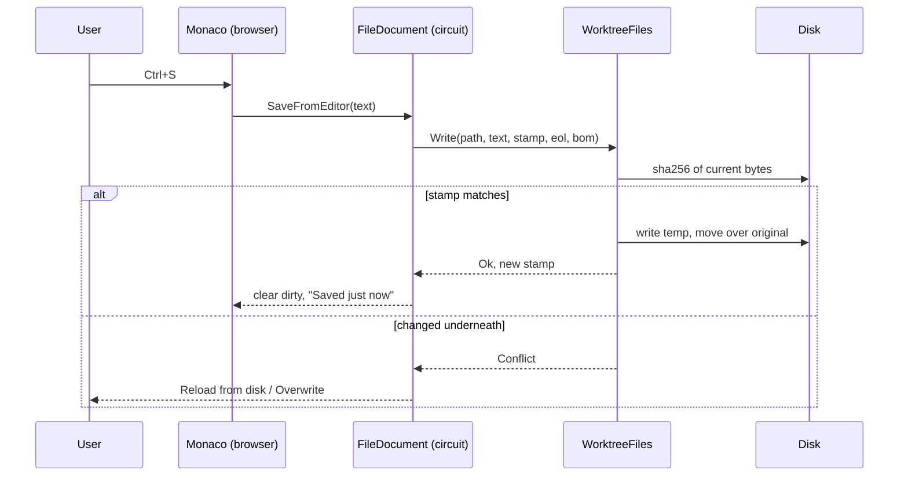

# The file editor

The editor in the middle of the window edits files, it does not just show them.
Files open in it from the Files tree on the left, a tab per file (see
[workbench.md](workbench.md) for the tabs). An agent leaves a worktree in a state
you want to nudge rather than rewrite: a wrong constant, a stray line, a comment
that is now a lie. Opening VS Code for that is a context switch away from the
dashboard you are watching. So the editor edits in place, and keeps a VS Code
link for the times a real editor is the right tool.

## Monaco, and why it is not committed

The editor is Monaco, the one VS Code itself uses, at a pinned version. That
buys real syntax colouring for every language this repository contains, plus
find, multi-cursor and a minimap, for no code here.

The cost is size: the AMD build is 24 MB across 150 files. It is a dependency
rather than source, so it is not in the repository. `tools/vendor-monaco.mjs`
fetches it with `npm install` into a scratch folder, copies `min/vs` into
`wwwroot/monaco/vs`, and writes a `VERSION` marker beside it. An MSBuild target
in the App project runs the script when `wwwroot/monaco/vs/loader.js` is
missing, so a fresh clone needs nothing but `dotnet build`.

The `VERSION` marker is the part that is easy to get wrong. `loader.js` exists
after *any* version has been vendored, so a check for the file alone would pin
whatever version a machine fetched first, forever. The script compares the
marker and re-fetches when it disagrees.

Two consequences worth knowing:

- **The vendored files are added as Content by the target itself.** The
  `wwwroot` Content glob is evaluated before any target runs, so files that
  appear during the build are invisible to the static web assets pipeline
  unless something adds them. The `VendorMonaco` target runs before
  `ResolveCurrentProjectStaticWebAssetsInputs` and adds `wwwroot/monaco/**`
  with a project-relative identity, which is the only shape that pipeline
  keeps. That is what makes the first build on a fresh clone serve the editor
  rather than only the second.
- **Nothing is fetched until an editor is created.** `monaco.js` is a small
  shim that registers `window.agentsEditor`; it injects Monaco's AMD loader on
  the first `create()` and memoises the promise. Until a file is opened, or a
  diff needs colouring, the app pays nothing for it.

Monaco 0.56's `editor.main.js` installs its own `MonacoEnvironment.getWorker`
and injects its own stylesheet, and both resolve next to the bundle. Since the
bundle is served from the app's own origin there is nothing to override, which
is why there is no `getWorkerUrl` here. The loader's `paths` are made absolute
from `document.baseURI` rather than left relative, because an agent's page lives
at `/chat/<session>` and a relative `monaco/vs` would be looked for under that
segment.

## Saving

Saving is stamp-based, not lock-based. `WorktreeFiles.ReadText` returns the
SHA-256 of the bytes it read, and `Write` re-hashes the file on disk and refuses
when the two disagree. That matters here more than in a normal editor: the agent
whose work you are reading is usually still writing in the same worktree, and a
blind save would silently undo whatever it did while the file was open.

A conflict is offered as a choice rather than resolved: **Reload from disk**
re-reads and throws the editor's text away, **Overwrite** writes anyway. There
is no merge, because the other writer is an agent that can be asked to redo its
change far more cheaply than a three-way merge can be got right.

The write itself goes to a temp file in the same directory and is moved over the
original, so an interrupted save leaves the old file rather than half of a new
one. The line ending and BOM the file was read with are carried back into the
write: normalising them would turn a one line edit into a whole-file diff.



## Undo survives a save

A save comes back with a new stamp, and a new stamp sends the text back into
the editor. Monaco's `setValue` resets the undo stack, so doing that after every
save meant Ctrl+Z stopped working the moment you saved. `setText` in `monaco.js`
only swaps the model when the file itself changes. For the same file it leaves a
buffer that already holds the saved text alone, and puts different text (a
reload after a conflict) in as one undoable edit. Undoing past the save point
makes the file dirty again, and it saves like any other change.

## The size limit that bites

The saved text travels from the browser to the server over the Blazor circuit,
and SignalR caps a client-to-server message at 32 KB by default. Most source
files are over that, and the failure is not a friendly error: the hub tears the
circuit down. `Program.cs` therefore sets `MaximumReceiveMessageSize` to 4 MB,
which is `WorktreeFiles.MaxBytes` (2 MB) with room for the interop envelope and
UTF-8 growth. Anything larger than `MaxBytes` comes back marked truncated and is
shown read-only, so it never reaches the hub at all.

Only the text crosses on a save. Typing does not: the browser compares the
buffer against its own baseline and sends a single boolean when the dirty flag
flips, so a keystroke costs nothing on the circuit.

## Deep links

`Urls.AgentFile(session, file, line)` builds
`chat/<session>/files?file=<rel>&line=N`: a path an agent mentions opens in that
agent's own editor, so following it never leaves the agent. `ChatPage` opens the
file as a kept tab, or brings forward the tab it already has and moves its caret
to the line, then drops the query from the address so the same link works again.
A file that is already open is never reread to follow a link: that would throw
away whatever is being edited in it.

`CodeEditor` renders its host `div` once and returns `false` from `ShouldRender`
forever after, for the same reason `DiffDocument` guards its own rendering: the
layout re-renders every second because the monitor publishes a snapshot that
often, and the host is full of children Blazor did not create.

## Images

A file whose extension `ImageTypes` knows (png, jpeg, gif, webp, avif, bmp,
ico, svg) opens as a picture, in `ImageDocument`, rather than in Monaco, which
would only say "binary". It is fitted to the tab until **Actual size** is
pressed, over a checkerboard so a transparent image reads as one.

The picture is not sent over the circuit. A screenshot is megabytes, and the
layout re-renders every second, so a data URI in the page is the wrong shape.
`ImageViews` gives each image a random token and the page loads it from
`/_image/<token>/<name>?v=<write time>`: the browser fetches it once, and a file
written again gets a new `v` and shows again. The route knows only the tokens
components asked for and serves only image types, so it cannot be used to read
anything else off the disk. An SVG goes out with a `sandbox` content security
policy, since opening its URL directly would otherwise run its script on the
app's origin.

## Opening a file from outside

Anything on the machine can ask the running dashboard to show a file by
dropping a request into `~/.agents-dashboard/open/` (under `--data-dir` when one
is given):

```sh
f=~/.agents-dashboard/open/$(uuidgen)
printf '{"path": "%s"}' /tmp/shot.png > "$f.tmp" && mv "$f.tmp" "$f.json"
```

`{"path": "/abs/file", "line": 12}`; the path has to be absolute. Written under
another name and renamed, so a half-written request is never read. This is how
an agent in a terminal shows you a screenshot it took: see the
`open-in-dashboard` skill.

A folder rather than an HTTP route because the port changes on every start,
and because a route on the loopback host is reachable from any page open in
any browser, where a file in the user's home can only come from the user's own
processes.

An agent the dashboard runs has a better route: the `dashboard_open_file` tool
on the dashboard's own MCP server (`OpenFileTool`). It takes a path relative to
the agent's folder as well as an absolute one, refuses a file that is not
there, and answers whether a window took it or it is held for the first,
where a dropped request can only be checked by watching the folder empty. It
hands the request to `OpenRequests.Open`, the same delivery as the folder's,
minus the folder.

`OpenRequests` watches the folder, reads each request, deletes it, and hands it
to every open window. A request older than two minutes is dropped, so one left
while the app was closed does not surface the next day, and one that beats the
first window is held for it. Each window opens the file among the tabs of what
it is looking at (`Workbench.OpenExternal`): a file inside that worktree opens
as the worktree's own; anywhere else it opens as an `External` document, a
picture if it is an image and text otherwise.

An external text file is edited like any other, in Monaco, and saved the same
way (`WorktreeFiles.WriteOutside`): only on the user's own Save, with the stamp
check that refuses to overwrite a change made since it was read, and the same
Reload and Overwrite when it does. This is how you edit your own
`~/.claude/settings.json` or `CLAUDE.md` from the dashboard. It has no code
intelligence, whose providers answer for a worktree's files, and a file too
large or binary is shown read-only as in a worktree. Asking for the file again
while it has unsaved changes brings the tab forward without reading it again.

Both readers and the writer follow a symbolic link to the file it points at.
A `CLAUDE.md` kept in a dotfiles repository and linked into `~/.claude` is read
whole (a `FileInfo` on the link reports the link's own length, which cut the
read short) and saved into the repository, with the link left in place rather
than replaced by the temp file moved over it.

## Change marks

The editor marks lines that differ from the diff base the way VS Code does: a
green bar for added lines, blue for modified, a red wedge at the foot of the line
above a deletion, and matching ticks in the scrollbar and the minimap. The base is
the one Source control last compared against, kept per worktree in
`WorktreeViews`, so the editor and the diff never disagree about what changed;
switching the base in Source control re-marks every open file.

`DiffReader.ReadFileAsync` diffs the one file with `-U0`, so every hunk is exactly
one change, and `ChangeMarks.From` turns hunks into marks: only additions is
added, only removals is a deletion, a mix marks every added line modified. An
untracked file has no diff and comes back as one hunk adding every line. Marks
are read against the disk, so they are refreshed on open, save and reload;
between those, Monaco's decorations move with edits and stay on their lines.

A link into a file with no line in it lands on the first change, since that is
almost always what the agent was pointing at.

## Coming back to a file

Every open file is its own `FileDocument` with its own Monaco editor, and the
ones not in front stay built, hidden with `visibility`, not `display`. So each
keeps its undo stack, its scroll and anything unsaved, and switching tabs costs
nothing. A `display: none` box loses both its scroll position and Monaco's size.
Switching agents swaps the editor's tabs for that agent's, and switching back
rebuilds them.

What should survive a rebuild lives outside the document. `Workbench` keeps the
open tabs per worktree, and `WorktreeViews` keeps the Files tree's folded
directories and whether Markdown shows as a preview. The tree starts fully
folded the first time, apart from the path to the open file. `monaco.js` keeps
each file's view state (scroll and caret) by model URI for the life of the page.
`keepScroll` in `app.js` keeps the tree's scroll position, retrying the restore
as content arrives until it lands or you scroll yourself.

## Text size

Ctrl+= and Ctrl+- (Cmd on macOS) grow and shrink the text in every open editor,
Ctrl+0 puts it back to 13px. The size is kept in `localStorage`, so it is per
machine and survives a restart. The keys are caught by a capture listener on the
editor's host rather than bound as a Monaco command, because with focus in the
find widget or the minimap a command never sees them and the webview zooms the
whole page instead.

Alt+Z, the wrap button in the file's toolbar, or Toggle Word Wrap in the context
menu wraps long lines at the edge of the editor, as in VS Code. Like the text
size it applies to every open editor at once and is kept in `localStorage`. It is a plain Monaco action: Alt+Z means
nothing to the webview, so there is no page-level default to get ahead of. The
setting lives in the browser, so `monaco.js` tells every editor's .NET side when
it flips (`WordWrapChanged`), and each tab's button shows the current state.
