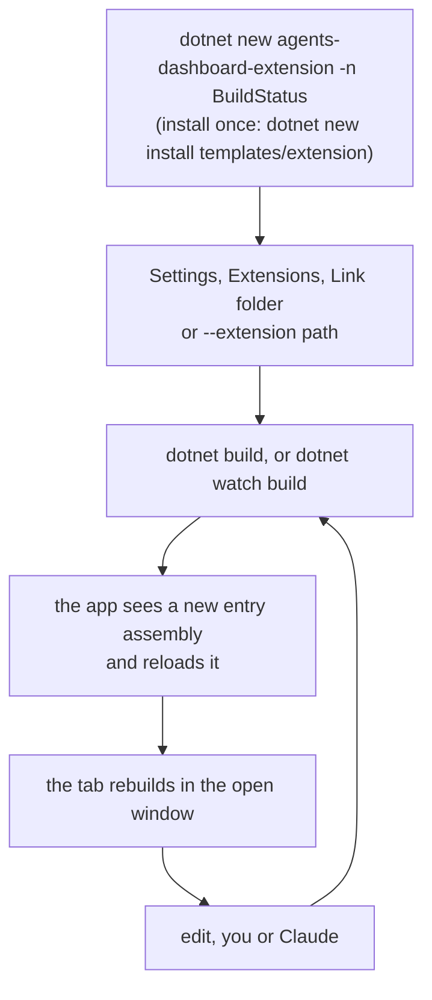
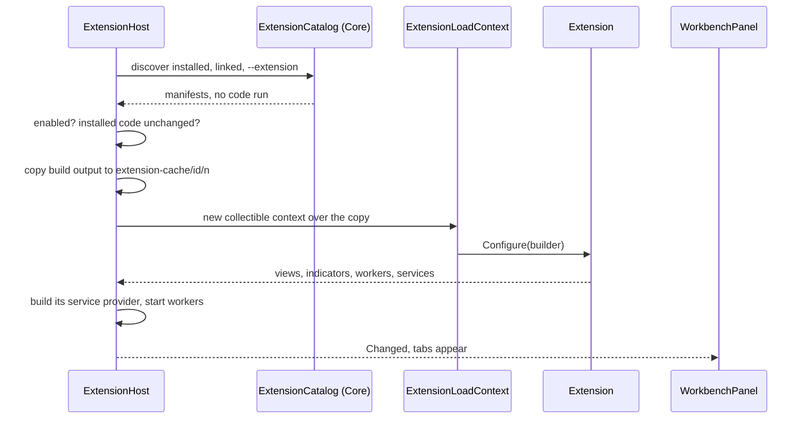

# Extensions

The app keeps to what is about agents: the conversation, the diff, the files.
Anything else, such as following a language's test runs, is an extension: a
small Razor project, built on its own, that the running app loads and adds a tab
for. The Tests tab is one, in `extensions/DotnetTests`, and it is not shipped
with the app.

The design and its rationale are in [design/extensions.md](design/extensions.md).
This file is what exists and what is easy to get wrong.

## Writing one



The template's `AGENTS.md` is the whole API on one page, so Claude can write an
extension from inside its folder without reading this repository. Its
`CLAUDE.md` is one line, `@AGENTS.md`: Claude Code skips every `AGENTS.md` once
it finds a `CLAUDE.md` in the folder or above it, which is the usual case for an
extension created inside a repository that already has one. The project
compiles against `~/.agents-dashboard/sdk/1.0/AgentsDashboard.Extensions.dll`,
which the app copies there, with its XML docs, every time it starts. No NuGet
feed, and it always matches the app that will run it.

## What an extension is

A folder with an `extension.json`:

```json
{
  "id": "dotnet-tests",
  "name": "Tests (.NET)",
  "version": "1.0.0",
  "apiVersion": "1.0",
  "entry": "AgentsDashboard.Extensions.DotnetTests.dll",
  "output": "bin/dashboard"
}
```

`output` is where the entry assembly is, relative to the manifest, so a project
folder can be linked as it is. The manifest is read before any code runs, so
Settings can list an extension that does not load and say why. An extension
built for API 1.x loads when x is not newer than the app's; a different major
does not load.

`IDashboardExtension.Configure` registers:

| Call | Adds |
| --- | --- |
| `AddView<T>(id, title, defaultLocation, order, appliesTo)` | A tab in one of the three panels, after the app's own |
| `AddIndicator<T>(viewId)` | A short count on that tab, such as failing tests |
| `AddWorker<T>(id)` | Background work while loaded, restarted with backoff if it throws |
| `Services` | The extension's own DI container |

`ViewLocation` says which panel the view is a tab in (see
[workbench.md](workbench.md)):

| Value | Where | Since |
| --- | --- | --- |
| `RightPanel` | After Source control. The default | 1.1 |
| `LeftPanel` | After Files | 1.1 |
| `BottomPanel` | After Chat, beside the agent list | 1.1 |
| `AgentTab` | The 1.0 agent view's tab strip, which is gone. Drawn in the right panel | 1.0 |

An extension that names one of the panels needs `"apiVersion": "1.1"` in its
manifest; one built against 1.0 still loads and lands on the right. Views are
written against `AgentViewBase` and nothing about where they are drawn, so
moving one to another panel needs no change to it.

## Where they come from

| Source | Where | Runs when |
| --- | --- | --- |
| Installed | `~/.agents-dashboard/extensions/<id>/` | Enabled, and its code unchanged since |
| Linked | Any folder, listed in `settings.json` | Enabled. Reloaded on every build |
| This run | `--extension <path>` | Always, not saved |

An id in more than one place: this run wins over linked, which wins over
installed. `--no-extensions` loads none, for when one breaks startup.

## Loading



**Shared assemblies come from the app.** `ExtensionLoadContext` returns null
for `AgentsDashboard.Extensions`, `Microsoft.AspNetCore.*`,
`Microsoft.Extensions.*`, `Microsoft.JSInterop` and `System.*`, so they resolve
from the default context. Anything else resolves from the extension's own
`.deps.json`, so two extensions can carry different versions of a library.
A second copy of a shared assembly would make the extension's `IComponent` a
different type from the app's, and nothing would cast. That is also why an
extension references the API with `Private="false"`: it must never ship it.

**Always from a copy.** The build output is copied to
`~/.agents-dashboard/extension-cache/<id>/<generation>/` and loaded from there,
so the next build can overwrite the original while this copy runs (on Windows a
loaded assembly is locked). The cache is cleared at startup, when nothing is
loaded.

**Rendered through `DynamicComponent`, never the router.** Routes are fixed when
the app starts. An extension's tab is `<id>.<view>`, and `/chat/<agent>/<id>.<view>`
brings it up. `WorkbenchPanel` looks the view up and draws it in `ExtensionViewHost`, which wraps it
in an `ErrorBoundary`. A view that throws shows its error and Retry; without the
boundary the exception would end the circuit, which in a one-window app is
everything. What no boundary catches: an exception on a thread the extension
started itself, which ends the process. Workers run under a supervisor for that
reason.

**Two containers.** The app's container is fixed once it starts, so each load
builds the extension its own, holding what it registered plus the API services
(`IDashboardView`, `INavigation`, `ITextLinker`, `IExtensionStorage`,
`ILogger<T>`). A component's `@inject` resolves from the *app's* container,
where only the API services are, so an extension's own services are reached
with `Context.Get<T>()`.

## Reloading

A linked or command-line extension is watched. When its entry assembly changes,
the app waits for half a second of quiet, then stops the old copy's workers,
disposes its services, asks its load context to unload, and loads the new one.
File events come more than once per build on macOS, and for files that did not
change, so a reload only happens when the assembly's write time or size differ
from the copy that is running.

Each tab is keyed by the extension's generation, so a reloaded view is built
fresh from the new type rather than handed new parameters.

Unloading is best effort. Blazor keeps per-type caches that can hold a rendered
component's type, so an old copy may stay in memory until the app restarts.
Nothing depends on it going.

## Trust

An enabled extension is code running inside the app, as you. .NET cannot
sandbox it, and a load context is not a security boundary. So:

- Found extensions start off. Nothing runs until you enable it.
- Enabling an installed one shows its author and a fingerprint of its code, and
  that SHA-256 is what is trusted. If the file changes, it is not loaded until
  you enable it again.
- A folder you linked, or passed with `--extension`, is code you are writing.
  It is not asked about again on every build.
- Extensions come only from local folders. No download, no marketplace.

The project's rules apply to extensions as to the app: nothing is written into
`~/.claude`, and anything that changes the user's repository is a button they
click. The API gives an extension no way to break either, but it cannot stop
code that ignores the API.

## Assets

The Razor SDK's `wwwroot` is served from a manifest the app's own build writes,
and an extension loaded at runtime is not in it. So an extension ships an
`assets` folder in its build output instead, served at `/_ext/<id>/`, and an
`assets/extension.css` is linked into the page while it is loaded, with the
generation in the address so a rebuild is fetched again.

## Not yet

Against the design: other view locations and dragging views between them;
settings sections; the repository-edit offer service; notifications and
per-worktree state services; Install (copying a linked build into the installed
folder); anything not written in .NET.
