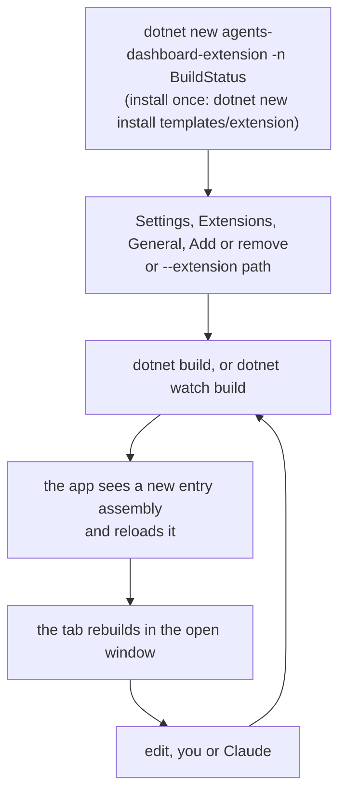
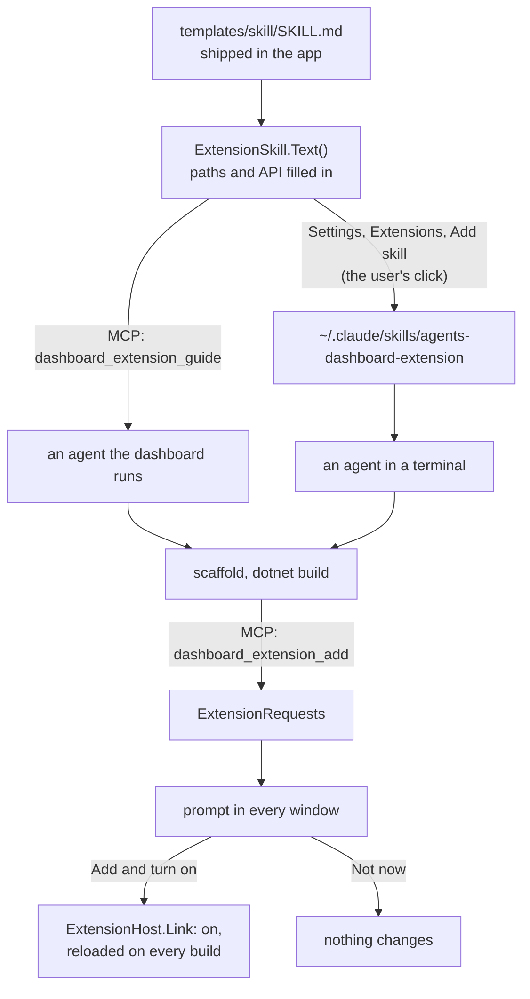
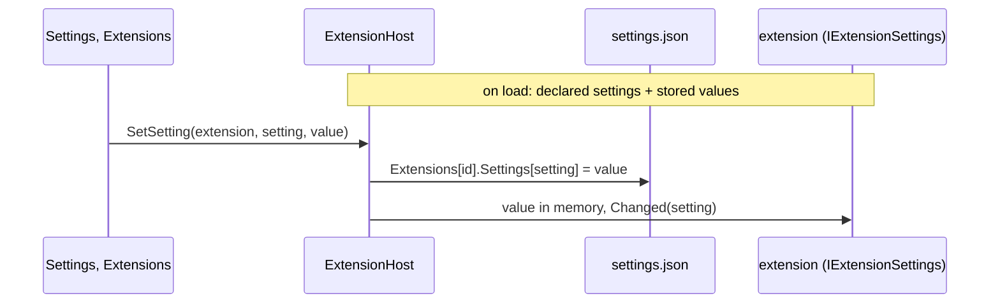
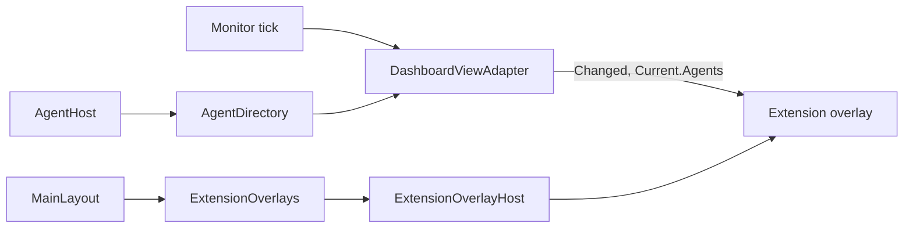
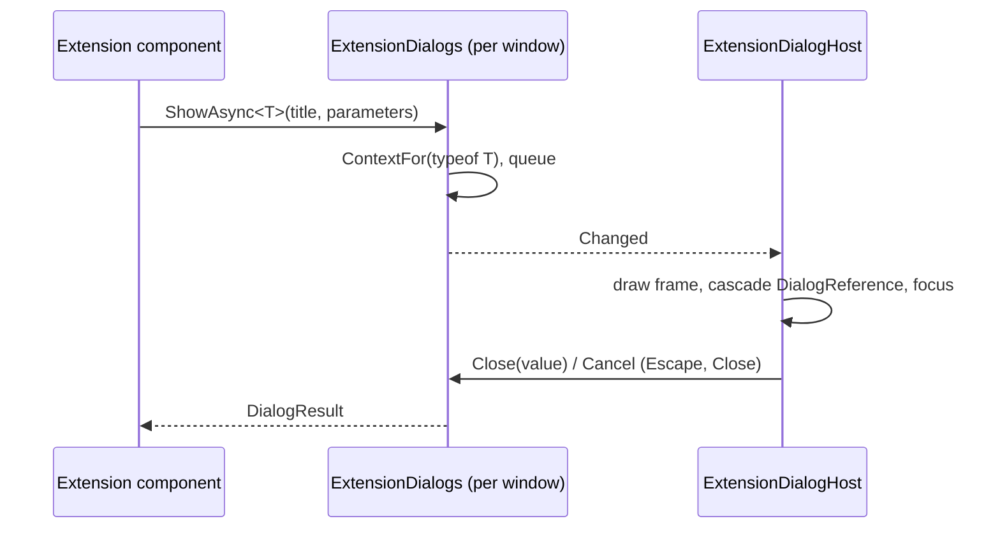
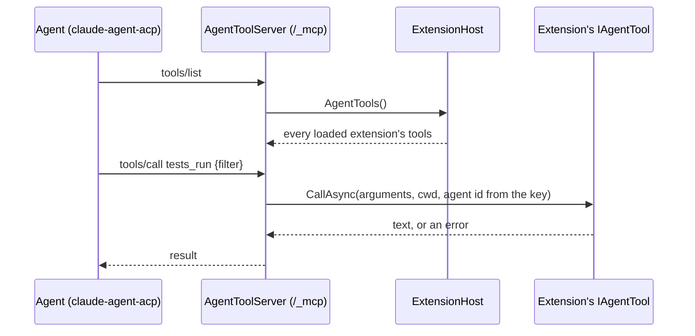
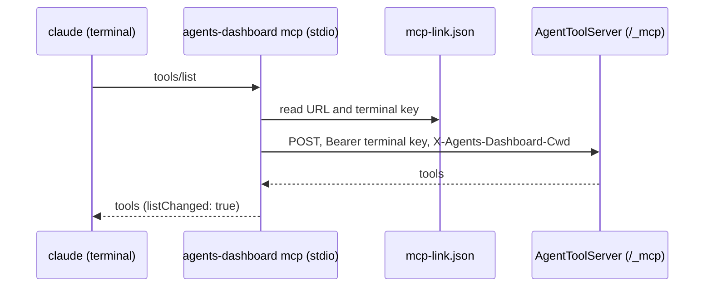
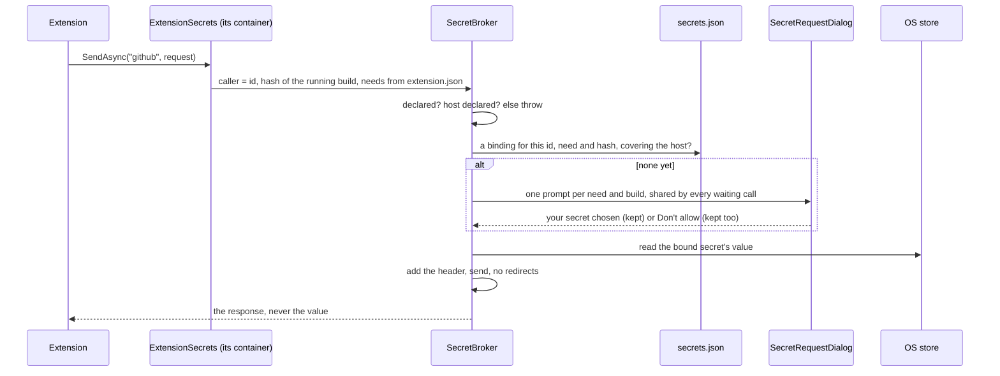
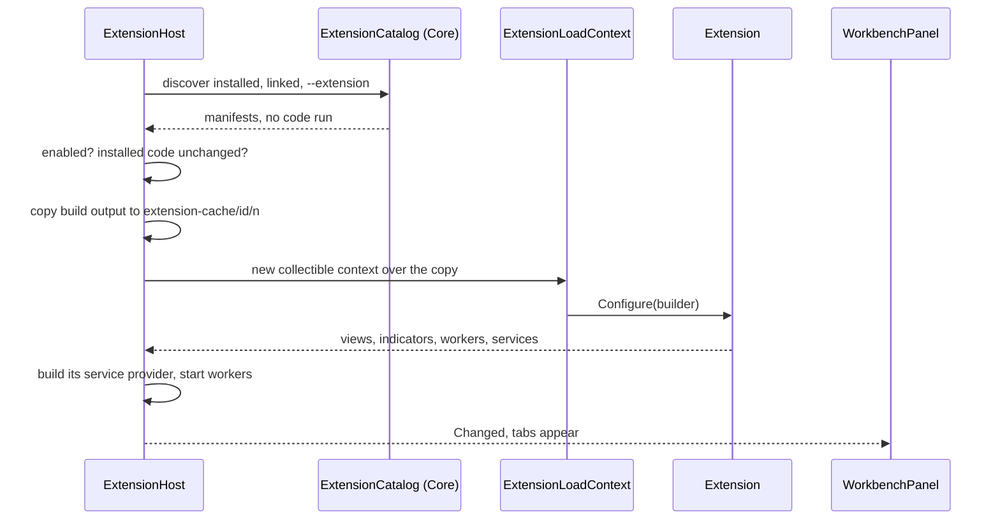

# Extensions

The app keeps to what is about agents: the conversation, the diff, the files.
Anything else, such as following a language's test runs, is an extension: a
small Razor project, built on its own, that the running app loads and adds a tab
for. The test explorer and C# navigation in the editor are two, kept outside
this repository in the user's extension folder
(`agents-dashboard-extensions/DotnetTestExplorer` and `CSharpCode`). None is
shipped with the app.

The design and its rationale are in [design/extensions.md](design/extensions.md).
This file is what exists and what is easy to get wrong.

## Writing one



The template's `AGENTS.md` is the whole API on one page, so Claude can write an
extension from inside its folder without reading this repository. Its
`CLAUDE.md` is one line, `@AGENTS.md`: Claude Code skips every `AGENTS.md` once
it finds a `CLAUDE.md` in the folder or above it, which is the usual case for an
extension created inside a repository that already has one. The project
compiles against `~/.agents-dashboard/sdk/1.0/AgentsDashboard.Extensions.dll`,
which the app copies there, with its XML docs, every time it starts. No NuGet
feed, and it always matches the app that will run it.

### Asking an agent to write one

Outside this repository an agent has neither the template nor these docs, so
the app carries both. `ExtensionSkill` publishes the template to
`~/.agents-dashboard/sdk/<major>.<minor>/template/` beside the API assembly on
every start, and holds a skill (`templates/skill/SKILL.md`) whose placeholders
it fills with those paths and the API version. It reaches the agent two ways:



- **The skill.** Settings, Extensions, General, *Write one with an agent* writes it for
  each agent that has a skills folder (`ExtensionSkill.Targets`: Claude Code
  today, when its config folder exists; another agent is another target). It
  is the one file the app writes into `~/.claude`, and only from that button.
  The installed copy names absolute paths and an API version, so any
  difference from this build's text shows as *out of date*, with Update.
- **The guide tool.** Agents the dashboard runs need no skill: the MCP tool
  `dashboard_extension_guide` returns the same text.
- **The add tool.** `dashboard_extension_add` never links anything. It checks
  the folder has a manifest and a built entry assembly, queues an
  `ExtensionRequest`, and returns. `ExtensionRequestDialog` shows it in every
  window until the user answers in one; only *Add and turn on* links the
  folder. Since a linked folder reloads on every build without asking, the
  prompt says so: accepting trusts what the agent writes there next, too.
  Requests live in memory and go with the app.

## What an extension is

A folder with an `extension.json`:

```json
{
  "id": "dotnet-test-explorer",
  "name": "Test explorer (.NET)",
  "version": "0.1.0",
  "apiVersion": "1.4",
  "entry": "DotnetTestExplorer.dll",
  "output": "bin/dashboard"
}
```

`output` is where the entry assembly is, relative to the manifest, so a project
folder can be linked as it is. `secrets` (API 1.12) lists the secrets it needs;
see Secrets below. The manifest is read before any code runs, so
Settings can list an extension that does not load and say why. An extension
built for API 1.x loads when x is not newer than the app's; a different major
does not load.

`IDashboardExtension.Configure` registers:

| Call | Adds |
| --- | --- |
| `AddView<T>(id, title, defaultLocation, order, appliesTo)` | A tab in one of the three panels, after the app's own |
| `AddWorktreeView<T>(id, title, defaultLocation, order, appliesTo)` | The same, about the worktree in view rather than an agent. Since 1.4; see below |
| `AddIndicator<T>(viewId)` | A short count on that tab, such as failing tests |
| `AddWorktreeIndicator<T>(viewId)` | The same, worked out from a worktree. Since 1.4 |
| `AddWorker<T>(id)` | Background work while loaded, restarted with backoff if it throws |
| `AddCodeIntelligence<T>()` | Navigation for a language in the editor: hover, definition, references, callers, colouring. See [code-intelligence.md](code-intelligence.md) |
| `AddAgentTool<T>()` | A tool the agents the dashboard runs can call. Since 1.2; see below |
| `AddSetting(setting)` | A setting shown on the extension's own page in Settings, Extensions. Since 1.9; see below |
| `AddOverlay<T>(id)` | A component drawn once per window over everything. Since 1.10; see below |
| `Services` | The extension's own DI container |

`ViewLocation` says which panel the view is a tab in (see
[workbench.md](workbench.md)):

| Value | Where | Since |
| --- | --- | --- |
| `RightPanel` | After Source control. The default | 1.1 |
| `LeftPanel` | After Files | 1.1 |
| `BottomPanel` | After Chat | 1.1 |
| `AgentTab` | The 1.0 agent view's tab strip, which is gone. Drawn in the right panel | 1.0 |

An extension that names one of the panels needs `"apiVersion": "1.1"` in its
manifest; one built against 1.0 still loads and lands on the right. Views are
written against `AgentViewBase` and nothing about where they are drawn, so
moving one to another panel needs no change to it. `DefaultLocation` is only
where a view starts: the person using the app can drag it to any panel or
section, and that choice wins (see [workbench.md](workbench.md#arranging-the-panels)).

`IEditorTabs` (API 1.3) opens a file as a tab in the window's editor, including
one outside the worktree, such as a report the extension wrote to its data
folder, which the user can then edit and save like any other. It is scoped to the window, so a view `@inject`s it; the
extension's own services are shared by every window and cannot. It shipped in
the app's 1.2 at first and moved to 1.3, since a 1.2 app without it accepted
extensions that injected it; declare `"apiVersion": "1.3"` to use it.

`IAgentOffers` (API 1.5) offers the user a new agent: `Offer(AgentOffer)`
opens the window's New agent dialog filled in with a repository, an existing
worktree or a name for a new one, and a prompt, so a view listing tickets can
have a button that sets up an agent on one. It is scoped to the window like
`IEditorTabs`, so only a view has it, and it never starts anything: the user
checks the dialog and presses Start, and the trust card still asks before the
first agent in a repository. An agent can read and change the whole
repository, and the API cannot tell a click from a worker calling on a timer,
so starting one is always the user's press. A second offer replaces the first,
even with the dialog open. Relative folders are dropped, since they would
resolve against the app's working directory.

`OfferAsync` (API 1.7) does the same and says how it ended: the started
agent's session id once the user presses Start, or null when the dialog is
closed, another offer replaces it, or the window goes away. The Ideas extension
uses it to take an idea off its list once an agent is working on it. The task
can wait as long as the dialog stays open, so do not hold anything on it that
the view needs meanwhile.

## Settings

An extension declares its settings in `Configure` with `AddSetting` (API 1.9),
each an on/off switch (`ExtensionSetting.Toggle`) or one value out of a few
(`ExtensionSetting.Choice`), and Settings draws them on the extension's own
page. Extensions in the Settings list unfolds into General, where extensions
are listed, added and removed, and a page per extension with its switch, its
settings and where it came from. The app draws them so every extension's settings look and
behave the same, and so the user finds them in one place rather than in
whichever view the extension happened to put a gear in.



- The declarations live in the extension's code, so they are only drawn while
  it is loaded. The values are kept in `settings.json` under the extension's
  id, with its enabled flag, and survive reloads, rebuilds and turning it off.
- Values are strings. A stored value the setting no longer accepts, such as a
  choice that was renamed, reads as the default, so an extension never sees a
  value it did not declare.
- `IExtensionSettings` is a singleton in the extension's own container: a
  service takes it in its constructor, a view calls
  `Context.Get<IExtensionSettings>()`. It answers from memory, so it is safe on
  every render and from a code intelligence provider on the window's thread.
- `Changed` fires on the pool thread that saved the change. Whatever the
  handler throws is logged, not shown.

The C# extension uses one to choose when a worktree's solution is loaded; see
[code-intelligence.md](code-intelligence.md#loading-a-solution).

## Agent views and worktree views

An `AddView` view is about an agent: it is only listed while an agent is
picked, and gets that agent's `AgentContext`. A worktree outlasts its agents
and can be opened from the title bar with none picked, so a view about what is
on disk (a test explorer) is added with `AddWorktreeView` (API 1.4) instead and
written against `WorktreeViewBase`. It is listed whenever a worktree is in
view, gets that `WorktreeContext`, and follows a worktree picked in the title
bar rather than the agent's. Its `Agent` is the agent on screen only when that
agent works in the same worktree, and null otherwise. `appliesTo` and
`IWorktreeIndicator` are asked about the worktree. `LinkedText` takes a
`Worktree` in place of an `Agent`; its links then open the file in the
window's editor, since there is no agent page to link to.

These are separate calls rather than a flag on `AddView` because an extension
built against 1.0 binds to `AddView`'s exact signature, and because an
agent view handed a stand-in agent with no id would build links to an agent
that does not exist.

## Overlays and every agent

A view is drawn in a panel for the agent or worktree in view, which is the
wrong shape for news about any agent, such as a celebration when one finishes.
API 1.10 adds both halves of that:

- `IDashboardView.Current.Agents` is every agent the dashboard runs, as
  `AgentContext`, taken with the snapshot, so it is up to a tick old.
  `AgentContext.TurnEndedAt` says when each last finished a turn. Watch it
  rather than `State`: a turn that starts and ends between two snapshots never
  shows as `Active`.
- `AddOverlay<T>(id)` draws `T` (written against `OverlayBase`) once per
  window, in `ExtensionOverlays`, a fixed layer over the whole layout.



The layer has `pointer-events: none`, so an overlay that draws nothing, or
confetti, never takes a click meant for the app. An element that should be
clickable sets `pointer-events: auto` itself. The layer sits under the
dialogs, so nothing an extension draws there can cover the app's own prompts
or pass for one; a dialog goes through `IDialogs`, below. The layer takes no parameters, so the layout's once-a-second render
passes it by and an overlay renders only when it calls `StateHasChanged`,
usually from `IDashboardView.Changed`. Each overlay has its own error boundary,
drawn clickable so its Retry works through the layer.

## Dialogs

`IDialogs` (API 1.10) shows a component of the extension's as a dialog:
`ShowAsync<T>(title, parameters)` returns a `DialogResult` when it closes. The
component inherits `DialogBase`, draws its body and buttons (the app's
`modal-body` and `modal-foot` classes lay them out like its own dialogs), and
ends the dialog with `Dialog.Close(value)` or `Dialog.Cancel()`. It is scoped
to the window like `IEditorTabs`, so a view or an overlay `@inject`s it and a
worker cannot.

The app draws the frame, in `ExtensionDialogHost`, the same way for every
extension: the title, a chip naming the extension, Close, focus on open and
Escape to cancel. A click on the backdrop does nothing, so a half-filled form
is not lost to a stray click. The extension's name comes from the load
context of the component's type (`ExtensionHost.ContextFor`), not from
anything the extension passes, so it cannot put another's name on a dialog.



One dialog shows at a time per window and the rest wait, with the count in
the header. A dialog is cancelled when its window goes, and when its extension
reloads or unloads, since its component type belongs to a copy no longer
running. The host is placed before the app's own prompts in the layout and
shares their layer, so an agent's request to add an extension, or a secret
request, lands on top of an extension's dialog rather than under it.

## Editor tabs, diffs and messages to an agent

API 1.11 adds three things for a view the width of the editor rather than a
panel, such as a review of every change in a worktree (the PR Review
extension, in the extension folder, is built on them).

**`IEditorTabs.OpenView<T>(title, parameters, id)`** opens a component of the
extension's as a tab among the worktree's documents (`DocKind.ExtensionView`).
The component inherits `EditorViewBase` and gets `Worktree`, `Agent` (only
when the agent on screen works there), `IsVisible` and `Context`, plus the
parameters it was opened with. Opening the same component with the same `id`
again brings the tab to the front with the new title and parameters, which is
how a panel's "open at this file" works.

- **The tab names a type, not a `Type`.** `ExtensionTab` keeps the extension's
  id and the type's full name, and `ExtensionEditorView` looks the type up in
  the loaded copy on every render (`ExtensionHost.LiveComponent`), keyed by
  generation. A rebuild draws the tab from the new copy with the same
  parameters; an extension turned off leaves a tab that says so. That is why
  parameters should be plain values: an extension's own record belongs to the
  copy that made it.
- **Which extension it is** comes from the component's load context, as a
  dialog's does, so one extension cannot open a tab as another.
- It re-renders with the snapshot, like a panel view, and stays built while
  another tab is in front, so a heavy view overrides `ShouldRender`.

**`DiffView`** is a component in the API assembly that draws two texts with
the editor's own diff and colouring. It holds no logic: it hands itself, as
`Source`, to whatever `IDiffViewHost.Component` the app registers
(`DiffViewEditor`), so the app's diff can change without breaking an extension
built against it.

```mermaid
flowchart LR
    X[extension view] --> DV["DiffView (API)"]
    DV -->|DynamicComponent, Source = itself| DE["DiffViewEditor (app)"]
    DE -->|createDiffView / updateDiffView| M["monaco.js diffViews"]
    M -->|Comment(side, start, end)| DE -->|OnComment| X
```

- **As tall as its content.** Monaco's diff is sized from its editors'
  content height, with its own vertical scrollbar off and the wheel passed on,
  so a page of them scrolls as one. `CollapseUnchanged` (on by default) is
  Monaco's `hideUnchangedRegions`, whose hidden areas already leave the
  content height.
- **Built only near the screen.** A review can hold hundreds of them, and an
  editor for each, with both texts sent over the circuit, made a large one
  crawl. `watchDiffView` puts an `IntersectionObserver` on the host, rooted at
  the nearest scrolling ancestor with a 1500px margin, and `DiffViewEditor`
  builds the Monaco diff when it reports `Near(true)` and disposes it on
  `Near(false)`. Before the first build the host gets a guessed height from
  line counts (both sides, and added and removed lines matched as a bag); torn
  down, it keeps the height it last had, so the page keeps its length. A
  `Reveal` builds the view wherever it is. WebKit, the window on macOS, has no
  scroll anchoring, so there a height change wholly above the screen moves the
  scroll by the difference; Chromium and Firefox do that themselves.
- **Read-only, anonymous models.** They are not named after the file, unlike a
  file tab's (see `AGENTS.md`), so they never clash with an open tab's model
  and the code intelligence providers, which only answer models they own,
  leave them alone. TextMate colouring is by the path's language.
- **Commenting.** With `OnComment` set, hovering a line shows a + in the glyph
  margin. Pressing it and dragging picks a range of lines, as on GitHub, and
  the release reports them; Escape drops the drag. Monaco does not drag from
  the glyph margin, so the drag is followed on the window, which also lets the
  pointer leave the editor. A selection of text or line numbers keeps a + on
  its last line, and a + inside a selection reports the selection. The
  selection is taken on `mousedown` in the capture phase, before Monaco moves
  it to the line clicked. Inline, removed lines are view
  zones with no line of their own, so only the right side can be picked there.
- `Marks` tint lines and put a dot in the gutter; `Reveal` scrolls the nearest
  scrolling ancestor to a line each time a new instance is passed.
- They live in their own map in `monaco.js`, apart from the file editors,
  and follow the text size, word wrap at creation, the theme, and the app's
  side by side setting unless `SideBySide` says otherwise.

**`IAgentMessages.Offer(agentId, text)`** puts text in an agent's message box,
after anything already typed, switches the window to that agent if another is
in view, and focuses the box (`ChatDrafts.Offer`, which the chat panel
listens to). Nothing is sent: the user presses Enter. A message can have an
agent change the whole repository, and the API cannot tell a click from a
worker on a timer, so sending stays the user's press, as starting an agent
does with `IAgentOffers`.

## Agent tools

`AddAgentTool<T>()` (API 1.2) gives the agents a tool: an `IAgentTool` with a
name, a description written for the agent, a JSON Schema for its arguments,
and `CallAsync`. The app serves every loaded extension's tools as one MCP
server, `agents-dashboard`, and hands it to each session it starts or resumes
in `session/new` and `session/resume`, so a tool shows up in the agent as
`mcp__agents-dashboard__<name>`.



- **Transport.** MCP's Streamable HTTP, answered with plain JSON and no event
  stream: `initialize`, `tools/list`, `tools/call` and `ping` are all a
  tools-only server needs, so there is no MCP SDK. The list is read on every
  request, so a rebuilt extension's tools are live at once, but an agent that
  already listed them sees a new tool only after its next resume: with no
  stream there is no way to say the list changed.
- **Who can call.** Every request needs a bearer key, and every session has
  its own: minted when it starts or resumes, revoked when it stops, is
  removed, or the bridge exits. The server entry handed to the agent carries
  no key: the SDK puts it on the Claude CLI's command line, which any process
  can list. Its `Authorization` header names `${AGENTS_DASHBOARD_MCP_KEY}`
  instead, which the CLI expands. The bridge runs every session in one
  process, so the value cannot go in its environment; it goes in the
  session's `_meta.claudeCode.options.env`, which the bridge hands the SDK and
  the SDK sets only in that session's CLI process, readable by the same user
  alone. Only loopback callers are answered, and a
  request with an `Origin` header or a non-JSON body (what a web page sends,
  and the CLI never does) is refused unread. The app binds to loopback
  whatever its options; a tunnel to the port makes every caller loopback, and
  then the key is the only guard.
- **Which agent.** ACP gives an MCP server nothing to tell sessions apart, and
  anything in the address the caller could edit, so the key is the identity.
  The server keeps each key's folder and session (by the key's SHA-256) and a
  tool gets them as `AgentToolCall.Cwd` and `AgentToolCall.AgentId` (API
  1.6). A process the agent runs inherits the key and can call as that agent,
  no more than the agent could itself, but not as an agent in another
  worktree. `AgentId` is null for a call that arrives before `session/new`
  has answered, and the key of a session being created is bound to its id
  as soon as it has.
- **The app's own tools** are served beside them, prefixed `dashboard_`
  (`dashboard_open_file`, see `docs/editor.md`). An extension tool with the
  same name as one of the app's is dropped and logged.
- **Names** are lower case, prefixed with what the extension is about
  (`tests_run`), and unique across extensions; a clash keeps the one loaded
  first and logs the other.
- **Answer quickly.** Start long work and return an id, and offer a second
  tool to ask how it is going, rather than holding a call open.
- **Agents in a terminal** get the tools once the user presses Add in Settings,
  MCP server. That runs `claude mcp add-json --scope user`, giving Claude a stdio
  server that is the app itself started with `mcp` (`McpStdioBridge`). Claude's
  config is written once but the port changes every start, so the bridge finds
  the running app on every message through `~/.agents-dashboard/mcp-link.json`
  (`McpLink`): the URL and a terminal key minted per start, readable by the user
  alone, removed when the app exits. The terminal key cannot say which agent is
  calling, so it is the one caller whose folder comes from the request (the
  folder the bridge started in, in a header) and whose calls have no agent id.
  With the dashboard closed the bridge answers with no tools, and it sends
  `tools/list_changed` when the app opens or closes. A session the dashboard
  started has its own key in the environment, and the bridge uses that first.
  The entry is added through Claude's own command rather than by editing
  `~/.claude.json`, which every Claude session rewrites, and at user scope,
  since a project's `.mcp.json` would be a change to the user's repository.



## Secrets

A token for a service with no CLI (Jira, Linear, a build server) is kept once,
in Settings, Secrets, and handed to an extension only after the extension has
declared that it needs one and you have chosen which of yours it gets.

**Declared first.** Since API 1.12 an extension lists its needs in
`extension.json`, by its own name for each:

```json
"secrets": [
  { "name": "github", "purpose": "Lists your pull requests.", "hosts": ["api.github.com"] },
  { "name": "linear", "purpose": "Linear's client library signs its own requests.", "read": true }
]
```

`hosts` are where the app may send it on the extension's behalf, written
`api.github.com`, or `intranet.corp:8443` when the port is not 443: no scheme,
path or wildcard. `read` asks for the value itself. A need with neither could
never be used, and stops the manifest loading. The manifest is read before any
code runs, so the extension's row in Settings and the consent card list the
needs before you enable it, and enabling gives it none of them.

**Bound by you.** A need gets nothing until you bind it to one of your stored
secrets: in Settings, Secrets, under What extensions need, or in the prompt the
extension's first call puts up. Your name and the extension's need not match,
and the extension never learns yours. The binding is the approval, and it
covers what the need declared when you made it: every declared host, or reading
the value. It is kept with the SHA-256 of the build it was made for, so a
rebuilt or updated extension is asked again (the prompt offers the secret it
had). The manifest is not part of that hash, so a manifest edited afterwards to
add a host does not widen the binding: a call to the new host asks again. A no
is kept per build too, so an extension asking on a timer is not a prompt every
minute; Forget in Settings clears it. Not now, and Escape, keep nothing.

**Nothing undeclared.** `ISecrets` (API 1.8, declared since 1.12):

- `SendAsync(name, request, auth)` sends an https request with the secret
  added (`SecretAuth.Bearer`, `Basic` for Jira's `email:token`, `Plain` for
  Linear's key) and returns the response. The extension never holds the
  secret. The host must be one the need declares. The broker sends a copy of
  the request it takes before the prompt: the extension keeps its own object,
  and could otherwise change the address after the user read it, or read the
  header back off it. `Host` is not copied, and the response's
  `RequestMessage` is the copy with the header removed. Redirects are not
  followed, since the header would go with them. A host that echoes request
  headers back shows the extension the secret in the response; declaring and
  approving the host is the control. Prefer this.
- `GetAsync(name)` hands over the value, only for a need declared with
  `"read": true`. The prompt says the extension can send it anywhere once it
  has it. A read binding also covers brokered requests to any host.

A name the manifest does not declare, a host it does not declare for that
name, or `GetAsync` on a need without `read` throws
`InvalidOperationException` with no prompt: a question about something nobody
declared is one you should never be asked. Before 1.12 any extension could
ask for any secret by the secret's own name; an extension written that way
throws until it declares its needs, and the grants `secrets.json` held for it
are dropped when the file is read.

For GitHub an extension usually needs neither: if `gh` is signed in, run
`gh api` and let `gh` keep the token. The store matters for everything else.



**Where things are.** The value goes straight into the OS store under the
service `agents-dashboard`: the login keychain on macOS (through
Security.framework, so it is never on a command line), Credential Manager on
Windows, the Secret Service through `secret-tool` on Linux (the value on its
standard input). `~/.agents-dashboard/secrets.json` has the secrets' names and
the bindings, with when each was last used, never a value, and is a file of
its own rather than part of `settings.json`: the Settings page saves its whole
copy of the settings on every change and would undo a binding made meanwhile.
Nothing is encrypted by the app; each store encrypts at rest under the user's
login, which is also what unlocks it: any program running as the user can ask
the store to decrypt.

**Who is asking.** `ISecrets` is only in the extension's own container, built
per load with the id, the SHA-256 of the entry assembly that load runs, and
the needs of the manifest it was loaded from, so the caller is the host's
word, not the extension's. `@inject ISecrets` resolves from the app's
container, which cannot tell extensions apart; it gets `UnboundSecrets`, which
throws, so the view shows the error rather than failing to build. The hash is
of the entry assembly, as consent's is, so a change only in a dependency with a
byte-identical entry keeps the binding; a linked extension being developed is
asked again on every build that changes it. Settings binds for the build that
is running, or, when the extension is off, the one on disk.

**Never an agent's.** No agent tool serves a secret, and the `agents-dashboard`
MCP server has no way to set one. No session's environment carries one: the
app's own environment never holds them, and the only thing added to a
session's is its MCP key. `AgentToolServer` handles every MCP request, listing
the tools as well as calling one, inside `SecretBroker.ForAgent()`. A secret
asked for there, or in a task started from there, throws rather than prompts,
and the OS store itself (`SecretVaults.Guarded`) refuses reads, writes and
deletes in that scope, so code that goes round the broker is stopped too. The
stdio bridge for terminal agents never builds the app's services, and so never
touches the store, so an agent cannot get a value through
a tool or put a prompt in front of you with words it chose. The scope flows
with the execution context, which Blazor's `InvokeAsync` keeps, so a view
re-rendered by an event a tool call raised is inside it too; a view that asks
for a secret while rendering is refused there, which is one more reason not
to. The Settings page and the prompt are only reachable from the app's own
window (see `UiAccess` in `AGENTS.md`), so an agent cannot press Allow or add
a secret in this app's window through a headless browser.

**What this is not.** Extensions run in the app's process and share its types
(`ExtensionLoadContext`), so any enabled extension could reach `SecretBroker`
or the OS store by reflection, or read files. Per-extension approval keeps an
extension that follows the rules to the secrets you meant it to have; it is
not isolation, and the boundary is still consenting to an extension's code.
Nor does any of it hold against an agent that steps outside this app. An
agent runs as you, and can start a second copy of the app itself, with
`--browser` and its own `--data-dir`: that copy prints its own UI key, reads
the same OS store, and will approve whatever extension the agent links in it.
On Windows and Linux the agent needs no second copy: any program running as
you can read an unlocked store, an agent's shell commands included. On macOS
the store asks before a program other than the one that created the item
reads it, which keeps out `security` and a script, but not the app's own
binary run again, and under `dotnet run` that binary is `dotnet` itself. What
would close this is a key the app cannot supply on its own, a passphrase or
Touch ID and Windows Hello, which is not built. The Settings page says so.

## Where they come from

| Source | Where | Runs when |
| --- | --- | --- |
| Installed | `~/.agents-dashboard/extensions/<id>/` | Enabled, and its code unchanged since |
| In a folder | A folder directly inside a folder added as `<folder>/*` (`ExtensionFolders` in `settings.json`) | Unless disabled. Reloaded on every build |
| Linked | Any folder, added without the `*` (`LinkedExtensions` in `settings.json`) | Enabled. Reloaded on every build |
| This run | `--extension <path>` | Always, not saved |

An id in more than one place: this run wins over linked, which wins over a
folder, which wins over installed. `--no-extensions` loads none, for when one
breaks startup.

Settings has one list, Extension folders, for both. A path is one extension;
the same path ending in `/*` is every extension directly inside it. They are
still saved as the two lists in `settings.json` they always were, so a
settings file from before reads the same, and `ExtensionHost.Add` sends a path
to one or the other (`ExtensionCatalog.SplitWildcard`). Choose folder... opens
the system's folder chooser, with a typed path as the fallback in `--browser`
mode. A picked folder that is not an extension but holds some gets the `/*`
added for you, and typing one without it says so rather than failing on the
missing manifest.

An extension folder is for keeping several projects side by side. The app
watches it, not recursively deep: a folder appearing or going directly inside,
or an `extension.json` written into one, rescans. A new project is found as
soon as `dotnet new` writes its manifest and is asked about (see Trust); once
turned on it fails as "not built yet" and loads on its first build through the
same watcher a linked folder has.

## Loading



**Shared assemblies come from the app.** `ExtensionLoadContext` resolves
`AgentsDashboard.Extensions`, `Microsoft.AspNetCore.*`,
`Microsoft.Extensions.*`, `Microsoft.JSInterop` and `System.*` from the default
context, and falls back to the extension's own copy only when the app has none:
`System.Composition`, which Roslyn needs, is a package rather than part of the
shared framework. Anything else resolves from the extension's own
`.deps.json`, so two extensions can carry different versions of a library.
A second copy of a shared assembly would make the extension's `IComponent` a
different type from the app's, and nothing would cast. That is also why an
extension references the API with `Private="false"`: it must never ship it.

**Always from a copy.** The build output is copied to
`~/.agents-dashboard/extension-cache/<id>/<generation>/` and loaded from there,
so the next build can overwrite the original while this copy runs (on Windows a
loaded assembly is locked). The cache is cleared at startup, when nothing is
loaded.

**Rendered through `DynamicComponent`, never the router.** Routes are fixed when
the app starts. An extension's tab is `<id>.<view>`, and `/chat/<agent>/<id>.<view>`
brings it up. `WorkbenchPanel` looks the view up and draws it in `ExtensionViewHost`, which wraps it
in an `ErrorBoundary`. A view that throws shows its error and Retry; without the
boundary the exception would end the circuit, which in a one-window app is
everything. What no boundary catches: an exception on a thread the extension
started itself, which ends the process. Workers run under a supervisor for that
reason.

**Every type resolves at load.** Before `Configure` runs, the host resolves
the type of every property and field in the extension's assembly. One the
app does not have (an extension built against a newer API that still declared
an older `apiVersion`) fails the load with a message in Settings. Left to the
renderer, the missing type of an `@inject` property throws while the view is
being created, outside its error boundary, and ends the window's circuit.

**Extension code stays off the window's thread where the app calls it.** Each
window runs every render and every click on one thread, so anything slow there
freezes the window. A view is a component and has to run there; everything the
app calls into does not:

- Indicators are asked on the pool and shown from the last answer, at most a
  second old. A slow indicator is late and a hung one stale.
- Code intelligence queries run on the pool with a timeout, see
  `docs/code-intelligence.md`.
- Enable, Disable, Reload and Link in Settings load on the pool: copying the
  build, loading assemblies and running `Configure`.
- Agent tools already run on the MCP request's thread, and workers on their own.

A view that blocks in its own handler or render still freezes its window. The
app cannot prevent that short of running extensions in another process.

**Two containers.** The app's container is fixed once it starts, so each load
builds the extension its own, holding what it registered plus the API services
(`IDashboardView`, `INavigation`, `ITextLinker`, `IExtensionStorage`,
`ILogger<T>`), plus `ISecrets` bound to that extension and build, which only
this container has. A component's `@inject` resolves from the *app's* container,
where only the API services are, so an extension's own services are reached
with `Context.Get<T>()`.

## Reloading

A linked or command-line extension is watched. When its entry assembly changes,
the app waits for half a second of quiet, cancels the old copy's workers and
loads the new one. The old copy's services are disposed and its load context
unloaded ten seconds later, on the pool: every open window still holds the old
views until its next render swaps them, and a view whose `Dispose` reaches for
a service already disposed throws out of the renderer and ends the circuit.
File events come more than once per build on macOS, and for files that did not
change, so a reload only happens when the assembly's write time or size differ
from the copy that is running.

Each tab is keyed by the extension's generation, so a reloaded view is built
fresh from the new type rather than handed new parameters.

A view is built once per agent (and worktree) it is shown for. Switching to
another agent parks it rather than disposing it, so switching back finds the same
instance; it stays until its agent is removed or its worktree goes. A view that
runs timers should pause them while `IsVisible` is false. See `docs/workbench.md`.

Unloading is best effort. Blazor keeps per-type caches that can hold a rendered
component's type, so an old copy may stay in memory until the app restarts.
Nothing depends on it going.

## Trust

An enabled extension is code running inside the app, as you. .NET cannot
sandbox it, and a load context is not a security boundary. So:

- Found extensions start off. Nothing runs until you enable it.
- Enabling an installed one shows its author and a fingerprint of its code, and
  that SHA-256 is what is trusted. If the file changes, it is not loaded until
  you enable it again.
- A folder you linked, or passed with `--extension`, is code you are writing.
  It is not asked about again on every build.
- An agent can only ask to link one (`dashboard_extension_add`). You answer a
  prompt; nothing is linked until you accept.
- Adding an extension folder turns on what is in it then. One that appears
  there later is off, and a prompt asks in every window, as the add tool's
  does: an agent can write into the folder without asking, so adding it is not
  consent to what lands there next. *Turn on* saves a yes, after which rebuilds
  reload it as for a linked folder; *Leave off* saves a disable, and Settings
  can still turn it on. Until one is answered it is asked again on every start.
- Extensions come only from local folders. No download, no marketplace.
- A secret is asked about per extension and per build, and never reaches an
  agent. See Secrets above for what that does and does not protect.

The project's rules apply to extensions as to the app: nothing is written into
`~/.claude`, and anything that changes the user's repository is a button they
click. The API gives an extension no way to break either, but it cannot stop
code that ignores the API.

## Assets

The Razor SDK's `wwwroot` is served from a manifest the app's own build writes,
and an extension loaded at runtime is not in it. So an extension ships an
`assets` folder in its build output instead, served at `/_ext/<id>/`, and an
`assets/extension.css` is linked into the page while it is loaded, with the
generation in the address so a rebuild is fetched again.

## Not yet

Against the design: other view locations and dragging views between them;
settings sections; the repository-edit offer service; notifications and
per-worktree state services; Install (copying a linked build into the installed
folder); anything not written in .NET.
