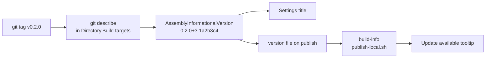

# Versions, builds and what a security review asks

The app is not distributed as a binary. Anyone who runs it clones the
repository, builds it, and publishes it to their own machine with
`tools/publish-local.sh`. Updating is `git pull` and publishing again; the
title bar's Update available already handles a publish made while the app is
open. That keeps the whole trust question to "do you trust this repository",
which is one a security team can answer by reading it. What follows is what
makes such a build worth trusting, and what the review will still ask.

## The version

The version is not a number in a file. `Directory.Build.targets` asks git for
the newest tag of the form `vMAJOR.MINOR.PATCH` and how far past it the
checkout is:

| Checkout | Version |
| --- | --- |
| on the tag `v0.2.0`, clean | `0.2.0` |
| three commits past it | `0.2.0+3.1a2b3c4` |
| with uncommitted changes | `0.2.0+3.1a2b3c4.dirty` |
| before any tag exists | `0.0.0+171.f386152` |
| no git at all (a source archive) | `0.0.0+unknown` |

So a release is `git tag v0.2.0` on main and nothing else. Three parts, always:
the app is still being built out, so tags start at `0.x`, and a patch tag is as
cheap as a major one. `App.csproj` writes the version to a `version` file on
publish, `publish-local.sh` copies it into `build-info`, `AppVersion` in Core
reads it at run time, and Settings shows it beside its title. The Update
available tooltip names the staged build's version, so the two are easy to
tell apart.

`AgentsDashboard.Extensions` keeps a fixed `AssemblyVersion` of `1.0.0.0`,
which is its API contract with extensions; only its informational version
follows git.

CI checks out with full history, because a shallow clone has no tags and every
CI build would be `0.0.0`.

## Reproducible builds

Two people building one commit should get the same app. What makes that true:

- Every Node package the build fetches is installed from a committed lockfile
  in `tools/vendor/<name>` with `npm ci` and install scripts off: the ACP
  bridge, the Node package that runs Claude for the app, and Monaco, Mermaid
  and the TextMate grammars, which are copied into `wwwroot`. Every transitive
  package is pinned by version and integrity hash, and a registry that serves
  anything else fails the build. Before the lockfiles, each machine resolved
  the dependencies on the day it built, and the bridge runs as you. To move a
  version, change it in that folder's `package.json`, run
  `npm install --package-lock-only --ignore-scripts` there, and commit both
  files. The vendored folder's `VERSION` marker is the lockfile's hash, so the
  next build re-vendors.
- The .NET SDK is pinned exactly in `global.json`, with no roll-forward. The
  web SDK adds packages of its own to the App project whose versions follow
  the SDK, and the lock files record them, so two machines on different SDK
  patches would restore different packages and CI's locked restore fails.
  Install that SDK to build; to move to a newer one, change `global.json`,
  run `dotnet restore`, and commit it with the lock files it changes.
- NuGet packages are pinned in `packages.lock.json` per project
  (`RestorePackagesWithLockFile`), and CI restores with `--locked-mode`, so a
  reference that would resolve to something else fails the build instead of
  changing it. `templates/extension` is left out: a lock file there would be
  copied into every new extension.
- CI builds set `ContinuousIntegrationBuild`, which makes the paths recorded
  in the PDBs the same on every runner. .NET builds are deterministic by
  default, so a rebuild of a commit can be compared byte for byte.
- Every GitHub Action in `ci.yml` is pinned to a commit, with the release in
  a comment. Dependabot proposes bumps for the actions, the NuGet lock files
  and the lockfiles in `tools/vendor`, weekly.
- Warnings are errors, so NuGet's audit warnings (NU1901 to NU1904) fail the
  build rather than scroll past.

## What the review will still ask

What is already true and worth saying up front:

- The web host listens on loopback only, and every page but `/_mcp` needs
  the cookie that only this start's `?ui-key=` address sets (`UiAccess`).
- Every agent session gets its own MCP key, sent in the session's
  environment and never on a command line. The key alone says which agent a
  call is from.
- Secrets live in the OS store, are brokered per extension and per build, and
  no agent tool, environment or MCP request can read one (`SecretBroker`).
- `mcp-link.json` is created user read and write only (`McpLink`).
- An extension is off until you enable it, and enabling pins the SHA-256 of
  its assembly. A changed file is not loaded until you accept it again.
- Nothing is written into `~/.claude` on the app's own initiative, and the
  app has no telemetry and no update endpoint. Outbound HTTP happens only in
  the secret broker, on an extension's behalf, with redirects off.

What it will ask about, and the honest answer:

- Extensions are unsandboxed code in the app's process, running as you, and
  an agent can ask to link one. The consent prompt is the boundary. See
  Trust in `docs/extensions.md`.
- The app runs `node`, `git`, `claude` and `dotnet` from the PATH, and the
  bundle's launcher puts `~/.local/bin` first. Normal for a per-user tool,
  and it will be noted.
- The terminal MCP key in `mcp-link.json` is readable by any process running
  as you, and it takes its folder from a header. That is the same trust level
  as `~/.claude` itself, and it is documented in `docs/extensions.md`.
- The macOS bundle is signed ad hoc, which is enough for Gatekeeper to run a
  locally built app and nothing more. There is no signing key, because there
  is no binary to sign: each person builds their own.

## Not done, on purpose

Signed and notarized installers, a GitHub release with checksums, a
Sigstore provenance attestation, and an in-app updater that downloads and
verifies a release were considered and set aside. They cost an Apple
Developer account, a Windows signing setup, a release environment with a
required reviewer, and a change to the bundle layout (the build would have to
live inside the bundle, with every native binary signed, for notarization to
mean anything). None of that buys anything while the install path is a clone.
If a workplace later wants an installer rather than a build, that is the
work, and the version and lock files here are its first half.
