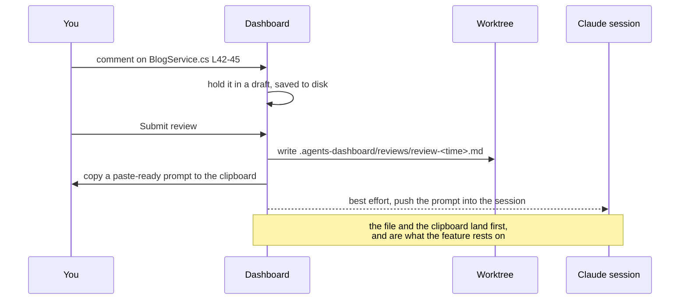

# Reviewing an agent's diff

The Changes tab is a pull request review over a worktree that has no pull
request: read the diff, comment on lines, submit the lot as one piece of
feedback the agent can act on.



## What you can diff against

| Base | What it shows |
| --- | --- |
| **Uncommitted** | Everything not committed: staged, unstaged and untracked. |
| **Whole branch** | The merge base with the repository's default branch, so it reads like the pull request this would become. Working-tree changes are included, because an agent's work is usually a mix of committed and not. |
| **Against a ref** | Any ref you name. |

Untracked files are folded in as all-additions. Git will not diff them, but a
file the agent just created is exactly the kind of change worth reviewing, and
leaving it out would hide the most interesting part of the work.

A repository with no commits yet diffs against the empty tree rather than
failing, so a fresh project is reviewable from the first file.

## Finding a file

The changed files are listed as a tree. A flat list is fine for a handful of
files and useless for a hundred: the paths all share a long prefix, so the part
that tells them apart is the part that gets clipped.

Directory chains with nothing to branch on are drawn as one row
(`src/AgentsDashboard.Core/Testing` rather than three rows each holding one
child), which is what keeps a deep .NET layout from spending most of its width on
indentation. Folders carry the number of changed files under them, files carry
their own additions and deletions and a badge for comments you have left.

Picking a file jumps to its diff and opens it, even if it was folded: a large
diff draws files until a line budget is spent and folds the rest, because in
Blazor Server every commentable line is a handler registered over the circuit,
and tens of thousands of them make the page stop answering clicks.

## Commenting

Click a line number to comment on that line, or drag down the gutter to cover a
range. The selection highlights as you drag, in either direction. Shift-clicking
another line number extends the range too, for when a drag is awkward. Escape
cancels.

The target is the whole line-number gutter rather than a small glyph, because
picking lines is the primary gesture on this screen and it should be where the
pointer already is.

### Why the drag is not on the server

A drag is a stream of mousemove events, and sending each one over the Blazor
circuit would make one gesture cost hundreds of round trips. So the drag is
followed entirely in `app.js`: it paints a preview with a class the server never
sets, and calls back into the component once, on release, with the range.

Two details keep the two sides from disagreeing about a row. The preview class is
`picking` and the server's is `in-range`, so neither can clear the other's; and
the preview is removed before the server is told, so the class it renders is the
only one left. A mouse click on the gutter is also stopped from reaching the
server's own click handler, since the drag has already dealt with it -- a keyboard
activation reports a click detail of zero and is let through, which is what keeps
the gutter usable without a mouse.

Comments collect into a draft that is saved as you go, so navigating away or
restarting does not lose it.

## Browsing the rest

The **Files** tab lists the whole worktree in the same tree, with a filter box,
and shows any file with line numbers. The listing comes from git rather than from
walking the directory, so `.gitignore` is honoured for free: a worktree's `bin`,
`obj` and `node_modules` are not files you want to browse, and no hand-written
skip list would keep up with a project's own ignore rules. Untracked files are
marked, and a file path from the UI is checked against the worktree root before
anything is read.

The draft is kept outside the worktree, in `~/.agents-dashboard/drafts`. An
unsubmitted review is not part of the work: in the worktree it would show up as
an untracked file in the very diff it is about.

## What gets written

```markdown
# Review 2026-09-05 14:22

Overall: the retry logic looks right, two things to fix.

## src/Soar.Web/Services/BlogService.cs

- **L42-45**: this swallows the cancellation. Let OperationCanceledException through.

  > +        catch (Exception)
  > +        {
  > +            return Array.Empty<Post>();
  > +        }

- **L88**: off by one, Take(count) should be Take(count + 1).
```

Grouped by file, ordered by line, each entry leading with its range, with the
lines it refers to quoted underneath. The agent reads a list of located changes
rather than a paragraph it has to map back onto the code.

## Getting it to the agent

Three attempts, in this order, and the order is the design:

1. **The markdown file** is written into the worktree, first and
   unconditionally. It is the artifact that survives everything else failing.
2. **The clipboard** gets a short prompt pointing at that file, so you can paste
   it into the agent's terminal yourself.
3. **The session** is handed the prompt directly, over the messaging socket its
   registry entry advertises.

Only the third can fail, and its failure changes nothing: the review is already
written and already on the clipboard. That matters because the socket protocol is
not documented and is free to change between Claude versions, so it is treated as
a convenience and never as the mechanism. Turn it off under **Repositories** if
you would rather it were not tried.
