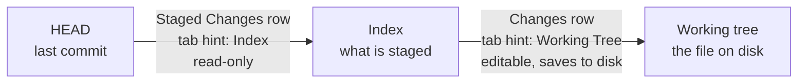

# Source control and diffs

Source control in the right panel is VS Code's Source Control view for the
agent in front: the files it has changed and not committed, split the way git
holds them, and where the branch stands against its upstream. Clicking a file
opens its changes in the editor as a diff tab, drawn by Monaco's own diff
editor. The panel and every open diff share one `ChangesModel` per worktree
(see [workbench.md](workbench.md)); staging itself is in
[staging.md](staging.md).

## What is listed

Everything not committed: staged, unstaged and untracked. There is no base to
pick. What an agent has just done is almost always uncommitted, and the
questions the panel answers (what changed, what goes into the next commit) are
both about the working tree and the index. A branch-wide view against the
default branch is a pull request's job, and a second notion of "changed" would
have to be threaded through the gutter marks, the diff tabs and staging, each
of which only makes sense against HEAD.

The list is read with `DiffBase.WorkingTree`, one diff against HEAD, and split
by `git status` into two sections, as VS Code does:

- **Staged Changes**, on top, shown only when something is staged: files whose
  index differs from HEAD.
- **Changes**: files whose working tree differs from the index, and untracked
  files. A partly staged file is in both, because it is in both places.

Each section is a tree. A flat list is fine for a handful of files and useless
for a hundred: the paths share a long prefix, so the part that tells them apart
is the part that gets clipped. Directory chains with nothing to branch on are
drawn as one row (`src/AgentsDashboard.Core/Git` rather than three rows each
holding one child). Folders start expanded, so every change is one click away,
and each section's header can fold or open them all. A file's row carries a
letter for its kind: A added, M modified, D deleted, R renamed, U untracked.

Untracked files are listed although git will not diff them: a file the agent
just created is exactly the kind of change worth reading. A repository with no
commits yet diffs against the empty tree rather than failing.

## What a diff tab compares

A file has up to three versions, and each section's click compares the two
that section is about. This is VS Code's pairing:

- **A row under Changes** opens `DocKind.Diff`: the index on the left, the file
  on disk on the right. The right side is the file itself, so it can be edited
  and saved like any file tab. Its tab reads "Working Tree".
- **A row under Staged Changes** opens `DocKind.StagedDiff`: HEAD on the left,
  the index on the right. Nothing on disk is the index, so there is nothing to
  save to, and the tab is read-only. Its tab reads "Index".

Comparing each section against its own neighbour, rather than both against
HEAD, is what makes a partly staged file make sense: the staged tab shows only
what staging will commit, the other only what is left to stage.

The edge cases fall out of the same pairing. An untracked file is not in the
index, so its left side is empty and every line reads as added. A deleted file
has no right side: it is empty, every line reads as removed, and the tab is
read-only. The right side is only read from disk when nothing is waiting to be
saved over it, so unsaved typing survives a re-read.

Both sides are read again when the model's staging state moves (a stage or
unstage from the panel) or when `.git` changes (the agent staged or
committed), since a stage moves the index, and the index is one side of both
tabs. The left side is swapped in as one edit to its model, so the diff keeps
its scroll. A diff lands on its first change once Monaco has computed it,
which is where VS Code opens one.

Source control's other clicks follow VS Code as well: a single click previews
the diff, a double click keeps it, and the context menu's Open file opens the
plain file instead.

## Side by side or inline

A button in the diff tab's toolbar toggles between the two sides next to each
other and one interleaved column, like VS Code's Toggle Inline View. The choice
is per machine, kept in `localStorage` under `agents.diffInline`, and applies to
every open diff at once, like word wrap: it depends on how wide the window is,
not on the file. `useInlineViewWhenSpaceIsLimited` is off, because Monaco would
otherwise switch a narrow diff to inline on its own and the button would say
one thing while the editor showed another.

## The model's URI

Every Monaco model is named after its file (see the note in `AGENTS.md`), and
two models cannot share a URI. A diff tab can be open beside the file's own tab,
so its right-hand model is the file URI plus a query naming the side: `?diff`
for the working tree tab, `?staged` for the index tab. Go to definition from a
diff still targets the plain file URI, which is a different model, so Monaco
hands it to the opener and the file opens in its own tab, as VS Code does.

## Reading a side from git

The left side (and the right of a staged diff) is read by
`WorktreeFiles.ReadTextAtRevisionAsync`, which runs `git cat-file blob
<rev>:<path>`, with an empty revision meaning the index. `cat-file` rather
than `show`, because `show` would run the path through a textconv filter or
print a tree for a directory. A path the revision does not have is empty text
rather than an error, since that is what the diff should show against it.

`GitCli` trims the line breaks off the end of what git prints, which is right
for every command but this one: for a blob they are part of the file, and
without them every diff would show its last line changed. So the blob's size is
asked for too (`cat-file -s`), and the difference between that and the text's
byte count is put back as line endings, `\r\n` if the file uses them.

## Push and pull

Source control's header shows where the branch stands against its upstream: an
up arrow with the commits not pushed yet and a down arrow with the commits on
the remote not pulled yet. Both come from the `git status` the monitor already
reads, so the pull count is only as fresh as the last fetch. Pressing it runs
`git fetch --prune` for that worktree, which moves the remote-tracking refs and
nothing else, and asks the monitor to re-read status on its next pass. A branch
with no upstream shows nothing.

## Gutter marks in a file tab

A plain file tab marks the lines that differ from HEAD, in the gutter and the
scrollbar, the same uncommitted changes Source control lists. See
[editor.md](editor.md).
