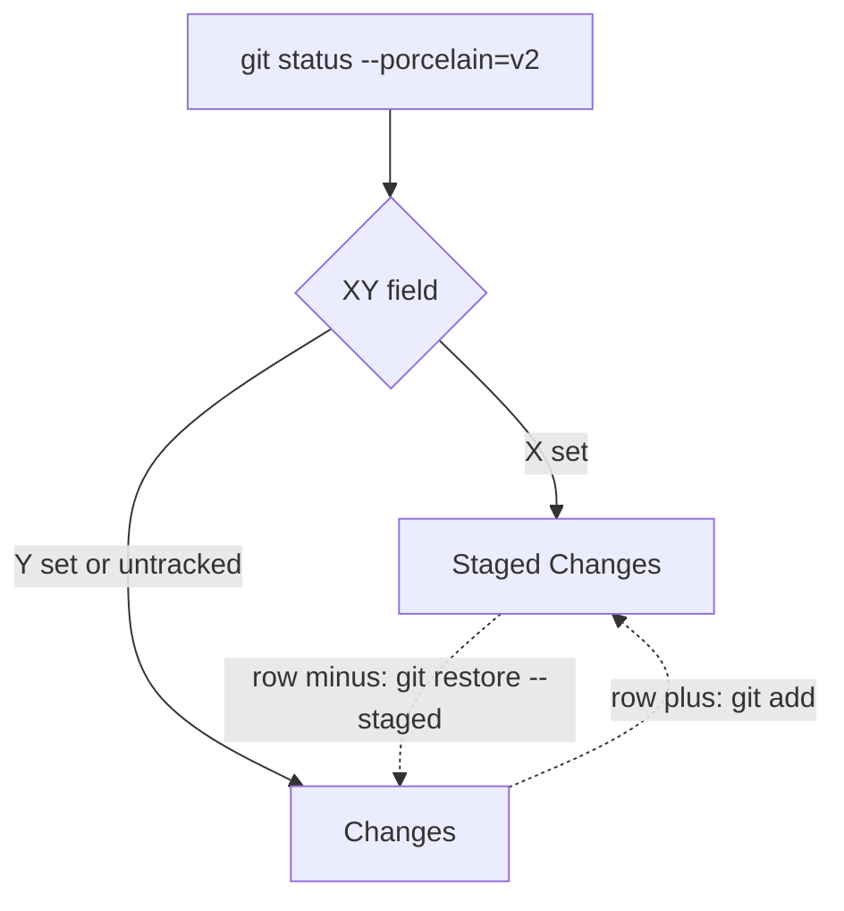

# Staging from the Changes tab

Reading a diff and deciding what to commit are the same sitting, so the Changes
tab does both. Each file's header says where its changes are and offers to move
them; the toolbar stages or unstages everything.

| Badge | Means |
| --- | --- |
| **staged** | The index has it and the working tree has nothing further |
| **partly staged** | Staged, and then changed again since |
| **unstaged** | Changed, and not staged |
| **new** | Not tracked yet |

In the Uncommitted view the file list is split the way VS Code's Source Control
view splits it: **Staged Changes** on top, **Changes** under it. Each header
stages or unstages its whole section, and each row has a button, shown on hover,
that moves that one file across. A partly staged file is listed in both
sections, because it is in both places.

Each section is its own tree with its own folds, since the same folder can be in
both. Folders start shut, as in VS Code, and each header has a button that opens
or folds them all. `PathTreeView` does this with `FoldedByDefault`, where the set
it is given holds the opened folders instead, so a folder that only appears
after a stage starts shut too. Every row, folder or file, carries a stage or unstage button, which is why
`PathTreeView` takes an `Actions` fragment: with it a row becomes a container
around its hit area, because a button cannot sit inside another. A folder's
button passes the section's files under it, not the folder path, so staging a
folder cannot sweep in files that are not in that section. The rows carry no
line counts. The diff is against HEAD, so a partly staged file would
show its whole-file numbers in both sections, which reads as if each held all of
it. The other diff bases keep the tree and the toolbar's Stage all and Unstage
all, since what is committed on a branch is not a staging question.

## Where the two states come from

`git status --porcelain=v2` reports a two-character field per file, and the two
characters answer two different questions: the first is the index against HEAD,
the second is the working tree against the index. A file can be both, which is
what **partly staged** means and why staging offers to "stage the rest".

## Unstaging without a HEAD

`git restore --staged` restores the index from HEAD, and a repository with no
commits does not have one. Taking the path out of the index reaches the same
state, so that is what happens there instead. A fresh project is worth handling:
it is exactly when everything is new and staging matters most.

## The diff does not move when you stage

The Uncommitted view is taken against HEAD, so it shows staged and unstaged work
together. Moving a file between them changes which badge it carries and not a
single line of its diff. Only the staging state is re-read after an action, which
is one `git status` rather than a whole diff.
