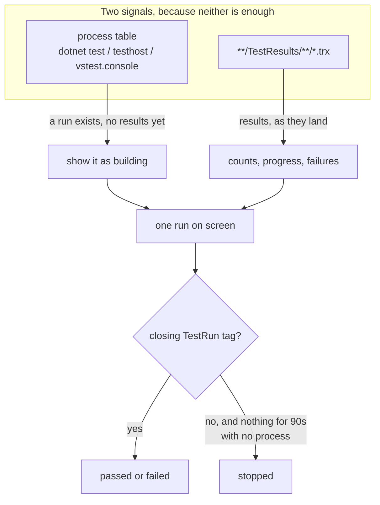
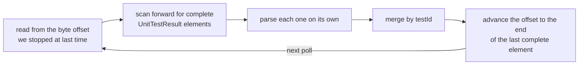

# Following a .NET test run

The problem this solves: an agent runs `dotnet test`, and for the next minute you
have no idea whether it is building, running, passing, or already finished and
scrolled away. The dashboard answers that continuously, for runs you start and
runs an agent starts.

## Where the live data comes from

Since **Microsoft.Testing.Platform 2.3.0** the TRX report is streamed to disk as
the run progresses rather than written at the end. That turns the report file
into a live feed, with no wrapper process and no terminal scraping.

It does not cover the beginning of a run, though. Restore and build happen before
a single result exists, and on a real solution that is most of the wall clock. So
there is a second signal: the process table.



The placeholder run created from the process is dropped the moment a report for
that worktree appears, so you see one run, not two.

## Reading a file that is being written

The report is not a document for most of a run: there is no `</TestRun>`, and the
last element is usually half typed. So it is never handed to an XML parser whole.



Three details that are easy to get wrong:

- **Nesting.** A data-driven test writes its cases as `UnitTestResult` elements
  inside an `InnerResults` block of another one. Matching the first closing tag
  truncates the outer element and produces unparseable XML, so the scanner tracks
  depth.
- **Sharing.** The file is opened with `FileShare.ReadWrite` because the writer
  still has it open.
- **Movement.** The offset stops just past the last complete element, so there
  are always a few bytes of trailing whitespace to re-read. Treating that as
  activity would keep a dead run looking alive forever, so only new results, a
  new total or the closing tag count.

The total comes from the run's own summary counters, which are written at the
end. Before that the total is unknown, and the UI shows a count rather than
inventing a denominator for a percentage.

## Two clocks

A run carries two independent notions of time and they must not be mixed.

| Question | Answered by |
| --- | --- |
| How long did the run take? | The report's `Times start` and the file's last write. A run that finished before the dashboard opened reports its real duration, not the time since. |
| Has this run stalled? | The dashboard's own clock. That is the one that says how long *we* have been waiting. |

## Making an agent's runs visible at all

Neither runner writes a report unless it is asked to, and an agent typing
`dotnet test` will not ask. Without that, agent-initiated runs are invisible.

The Tests tab detects this and offers to write one file at the repository root:

```xml
<!-- Directory.Build.targets -->
<Project>
  <PropertyGroup Condition="'$(IsTestProject)' == 'true'">
    <VSTestLogger Condition="'$(VSTestLogger)' == ''">trx%3BLogFileName=$(MSBuildProjectName).trx</VSTestLogger>
    <TestingPlatformCommandLineArguments>$(TestingPlatformCommandLineArguments) --report-trx</TestingPlatformCommandLineArguments>
  </PropertyGroup>
</Project>
```

`Directory.Build.targets`, not `.props`: `IsTestProject` is set by the test SDK
during its own import, which happens after props and before targets. A condition
on it in props is evaluated before anything has set it and silently matches
nothing.

This edits your repository, so it is always offered and never done on its own.
The tab shows exactly what would be written, and adds the block to an existing
file rather than replacing it.

## What each runner gives you

| Runner | Detected by | What you see |
| --- | --- | --- |
| Microsoft.Testing.Platform | `UseMicrosoftTestingPlatformRunner`, `EnableMSTestRunner`, `EnableNUnitRunner`, `MSTest.Sdk`, or a `Microsoft.Testing.*` package reference, in the project or in `Directory.Build.*` | Live counts, live failures, live progress |
| VSTest | `Microsoft.NET.Test.Sdk` with none of the above | The run appears as soon as it starts, and the results all arrive at the end |

The tab says which it is rather than leaving a still progress bar unexplained.

Detection reads project files as text rather than evaluating them with MSBuild.
Evaluation would be exact but costs a design-time build per project, which is far
too slow for something wanted on open, so the tab states this as an observation.

## Belt and braces

The file watcher is the fast path and usually the only one that fires, but it is
allowed to drop events: its buffer can overflow under a busy build, and on
network and container-mounted filesystems it may see nothing at all. A run the
dashboard silently failed to notice is the one failure mode that makes the whole
feature untrustworthy, so a cheap walk of the watched worktrees backs it up every
five seconds.
