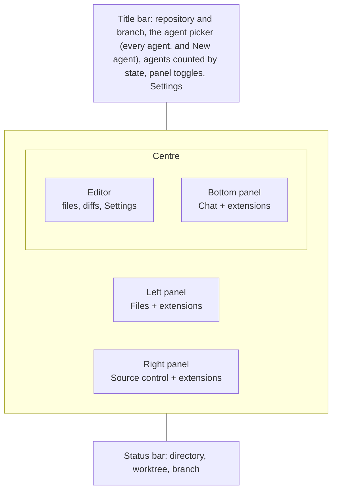
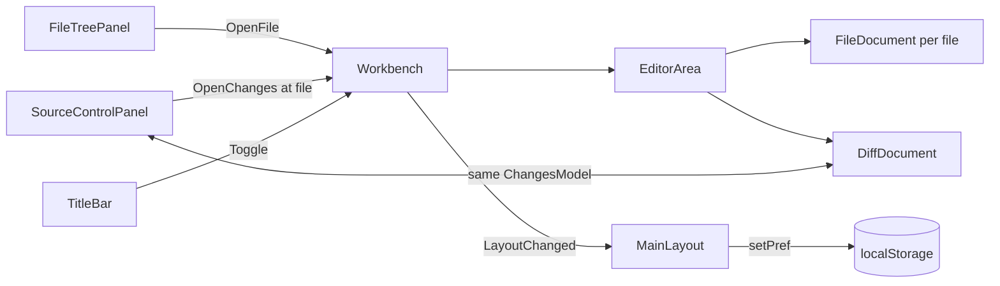

# The workbench

The window is laid out like VS Code. The agent's files are on the left, source
control is on the right, and the editor sits in the middle over a bottom panel.
The bottom panel holds the conversation, across its full width. The agents are
listed from the picker in the title bar, beside the counts. Each panel has tabs of its own. Extensions add tabs to whichever panel they
ask for, and to the right panel when they do not ask.

## Who owns what

`MainLayout` draws the frame, and the routed page is what the editor shows.
`ChatPage` (`/chat/<session>`) is the editor for one agent, and it is always
there, even with no agent picked, so a tab that belongs to no file has somewhere
to open:

- **Settings** is a tab, opened from the gear, closed like any other, and the
  agent stays selected under it. With no agent picked its tab is kept under the
  empty worktree.
- **The theme** is chosen under Settings, Appearance: System, which follows the
  OS between Dark and Light, or a named theme. The server writes the choice on
  `<html>` as `data-theme-choice`, and `theme.js`, a blocking script in the head
  so the first paint is already in the right colours, turns it into `data-theme`,
  which `app.css` keys each palette on. Monaco and Mermaid read the palette's
  `color-scheme` to pick their dark or light colours. A theme is a block of
  variables in `app.css` and a line in `Themes.cs`.
- **The agent picker** in the title bar shows the agent in view. A click lists
  every agent, waiting ones first, with New agent at the top and the offer to
  remove a merged, stopped agent's worktree under it. It was once a column down
  the right of the bottom panel; that cost the conversation a third of its width
  for a list you only look at when switching.
- **New agent** is a modal dialog over the window, opened from the agent picker. Escape, its close button or a click outside close it, and so does
  going to a page that is not an agent's.
- `/settings` and `/new` still work as addresses: each opens its tab or dialog
  over the agent that was on screen and goes back to `/chat/<session>`.

The panels do not pass parameters to each other. They talk through `Workbench`,
a scoped service (one per window) that holds:

- the agent every panel follows, set by `ChatPage` from its route
- the worktree in view (`WorktreeInView`), which the editor, Files and Source
  control show. It follows the agent until one is picked from the title bar,
  and a picked worktree stays while you switch agents, so you can keep reading
  in one place and answer agents elsewhere. "Follow the agent" in the same
  menu lets go of it, and so does a link into an agent's files or changes.
  While another worktree is picked, the chat's header offers "Change to worktree",
  which picks the agent's worktree in its place. When the agent's worktree is
  the one open, the header says so instead, and the agent picker marks every
  agent working there.
  With nothing picked and the agent closed or removed, the last worktree an
  agent was in stays. A worktree removed since is stood in for by its
  repository's main worktree
- each panel's open state and the tab in front
- the open documents, per worktree (`EditorGroup`)
- one `ChangesModel` per worktree

## The editor

Every open file is a `FileDocument` with a Monaco editor of its own. Every tab
stays built while another tab is in front, hidden with `visibility` rather than
`display`. That way each editor keeps its undo stack, its scroll and any unsaved
text. A `display: none` box would lose Monaco's size.

- **A single click opens a preview tab.** It is drawn in italics, and the next
  single click replaces it, so browsing the tree does not leave a tab behind for
  every file. Double-clicking the file or the tab keeps it. Editing it keeps it
  too, because replacing it would throw the edit away. So does following a link
  or a go-to-definition.
- **A pinned tab** moves to the front of the strip, behind a divider, and has no
  close button until it is unpinned. The pin leans over when a tab is not pinned
  and stands upright when it is.
- **Closing a tab with unsaved changes asks first.** The question appears inline,
  never as a JS `confirm()`, because a confirm dialog blocks the circuit for as
  long as it is up. Middle-click closes a tab.
- **Right-clicking a tab** offers Close, Close others, Close to the right,
  Close saved and Close all, as VS Code does, along with pin, keep, split and
  copying the path. The bulk closes pass over pinned tabs, since a pinned tab
  cannot be closed until it is unpinned. Saved tabs close at once and the
  unsaved ones wait on one question for all of them.
- **The editor splits left and right.** Dragging a tab onto the right half of
  the editor moves it to a second side with its own strip; split, dragging it
  onto the other side's documents or strip moves it across. The tab's menu does
  the same, for the keyboard. Files open on the side last clicked in. The
  border between the sides drags like a panel's, in `app.js`, and sets
  `--wb-split`: a share of the editor's width rather than pixels, so the sides
  keep their proportion as the panels around them move. It is kept per machine,
  and double-clicking evens it. The drop
  target is a layer drawn only during a drag, over the documents, since Monaco
  would otherwise take the drop as text, and so `dragover` never has a handler
  on the circuit. A document is only ever on one side, so the menu moves tabs rather than
  copying them: two editors on one file would want two Monaco models with one
  URI, which Monaco does not allow (see `editor.md`), and two sets of unsaved
  text. Both sides are drawn from one keyed list of documents, placed by a
  class, so a tab moved across keeps its editor, undo stack and unsaved work. A side whose last tab closes goes, and the other
  takes the width. Opening a file already open on the other side goes to it.
- **Tabs belong to a worktree.** Switching agents swaps the whole strip, and
  switching back finds it as it was. This lives in memory for the life of the
  window, like `WorktreeViews`. A new window starts empty.

## Following the agent's edits

The layout watches the files of the worktree in view (`WorktreeChanges` in
Core), so the diffs and the editor keep up with an agent as it works without a
refresh.

- **Gathered, then reported once.** An edit is several file events and a build
  is thousands. Changes are collected until the worktree has been quiet for
  400 ms, then reported as one set of paths.
- **What counts.** Build output and packages (`bin`, `obj`, `node_modules`) do
  not. Inside the git directory only the index and HEAD do, reported as `.git`,
  since those are what move when the agent stages or commits. A linked
  worktree's git directory is elsewhere, named in its `.git` file, so it is
  watched as well.
- **What follows.** `Workbench.NotifyFilesChanged` reads the diff again for
  Source control and every open diff. An open file with nothing unsaved rereads
  itself from disk; with unsaved work it is left alone, and saving reports the
  conflict as before. The Files tree lists again only when a file appears or
  goes.
- **The diff keeps its place.** A new diff is usually the old one with a file or
  two moved, so `DiffDocument` keeps everything about the files that did not
  change: which are drawn, their measured heights, their colours, and a comment
  being written. Resetting would blank the screen on every edit, and the browser
  would not report the files near it again, since the same elements are still
  where they were.

## Going back

The mouse's back and forward buttons walk the jumps go to definition has made,
into another file or down the same one, and rows picked in the references
panel, as they do in VS Code. Ctrl+- and Ctrl+Shift+- do the same from the
keyboard.

- **Where a jump left from** is recorded on the worktree's `EditorGroup`: the
  tab, and the caret line Monaco reports as it jumps. Going back adds the place
  you leave to the forward list, and a new jump clears that list, as a browser's
  history does. Fifty are kept.
- **A tab closed since** is reopened, because going back is to a place, not
  only to a tab.
- **The buttons' default is stopped** in `app.js`, on the press and the release
  both, since engines differ on which one navigates. Left alone they would go
  back in the browser's history, which here is the agent you were on before.
- **Going back to the same line** still moves the caret: `EditorDoc.Reveal` is
  bumped with the line, and `CodeEditor` reveals when either changes.

## Changes: a list on the right, diffs in the middle

The Changes tab used to be one component holding a file list and the diff. It is
now two components that share a `ChangesModel`:

- **`SourceControlPanel`** (right) chooses the base, lists the files the way git
  holds them (staged above pending), stages and unstages, and sends the review.
- **`DiffDocument`** (editor) draws a diff, where lines are picked and commented
  on.

Clicking a file in Source control opens a tab with that file's changes alone, as
VS Code does, previewed like a file until kept. That tab shows the whole file,
the way the editor does, with removed lines in red and added lines in green in
place, and opens scrolled to the first change. It is read apart from the
model's diff (`DiffReader.ReadWholeFileAsync`, the diff with the whole file as
context), again whenever the model's is. A file over 5000 lines falls back to
its hunks, since every row is a button on the circuit and one file is drawn
all at once. The toolbar's other button opens
every change in one document, which is where a jump to a file is held on the
model as `PendingScroll`: the document may not exist yet when the click lands.

Several diffs can be open at once, so the line-picking drag in `app.js` is not
wired to one component. Each `DiffDocument` registers its root element
(`data-diff-doc`) with its own reference, and a drag reports to the document it
started in and walks only that document's rows. See
[review.md](review.md) and [staging.md](staging.md) for what the two do.

## Rendering

The monitor publishes a snapshot every second, and every `StateComponent`
re-renders on it. That is right for the chat and the title bar.
It is wrong for anything heavy. `FileTreePanel`, `FileDocument`,
`SourceControlPanel` and `DiffDocument` override `ShouldRender` and redraw only
when they call `Touch()` or their model moves.

`WorkbenchPanel` keeps the tabs you have opened built, and rebuilds them all when
the panel moves to another agent. Components are keyed by worktree or session,
so nothing carries one agent's state into another.

## Layout, kept per machine

- **Sizes.** The borders are `.sash` elements dragged in `app.js`, for the same
  reason line selection is: a drag is a stream of moves. Each one sets a CSS
  variable on the root (`--wb-left`, `--wb-right`, `--wb-bottom`, `--wb-agents`)
  and saves it to `localStorage`. Double-clicking a border resets it, and the
  arrow keys move it.
- **Which panels show, on which tab.** `MainLayout` writes this through
  `agentsDashboard.setPref("layout")` on every change and reads it back on the
  first render.
- **Folding.** A folded panel keeps its grid column at zero width, so the rest of
  the grid does not shift and its contents survive. It also gets
  `visibility: hidden`, so nothing inside it can take keyboard focus.

## Reopening where it was left

The agent and the worktree in view are written to `last-view.json` in the
app's data folder (`LastViewStore`) whenever either moves, and a new window
starts on them: `Workbench` restores the worktree, picked by hand or not, as
it was, and `ChatPage`, opened on no agent, goes to the saved one if it is
still in the list. This is a file rather than `localStorage` because the
window is served from a port picked on every start, and the browser keeps its
storage per origin. The agent is kept after it is closed, so a restart from an
empty window still finds the last one. A link to another agent wins, and the
reopening is tried once per window.

## Deep links

`chat/<session>/<tab>?file=<rel>&line=N` still works. `ChatPage` carries it out
once: it brings up the named panel tab (`files`, `changes`, `chat` or an
extension view's key) and opens the file as a kept tab. Then it replaces the
address with the bare `chat/<session>`. Following the same link again is a real
navigation, so a closed tab can be reopened by it.

## Extensions

`ViewLocation` gained `LeftPanel`, `RightPanel` and `BottomPanel` in API 1.1.
`RightPanel` is the default. `AgentTab` is kept for extensions built against 1.0
and is drawn in the right panel. An extension that names one of the new panels
needs `"apiVersion": "1.1"` in its manifest. See [extensions.md](extensions.md).
