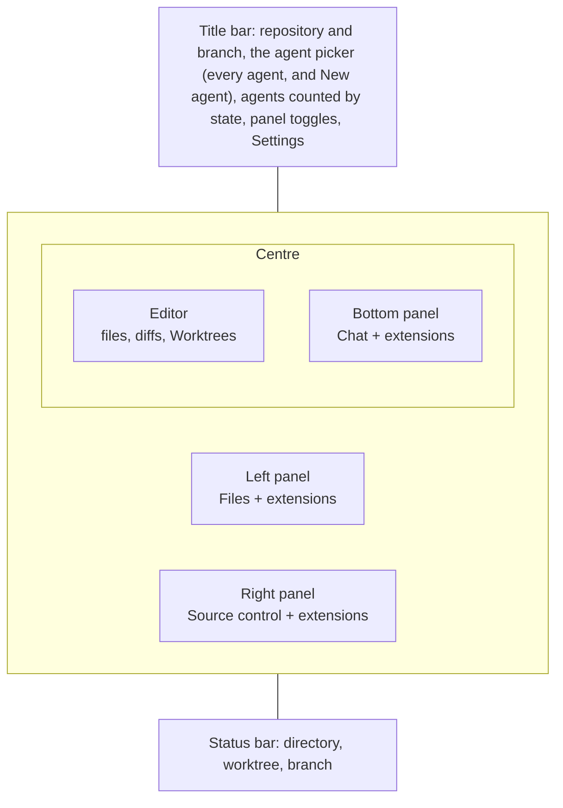
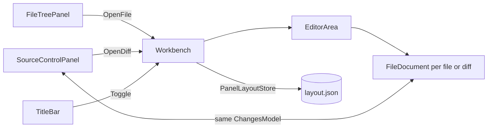
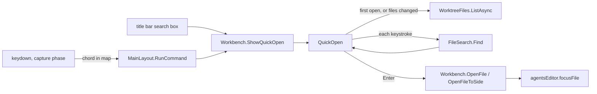
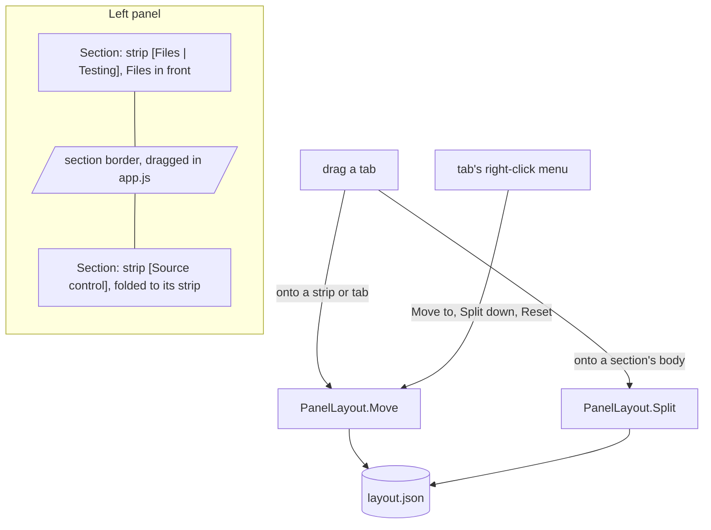

# The workbench

The window is laid out like VS Code. The agent's files are on the left, source
control is on the right, and the editor sits in the middle over a bottom panel.
The bottom panel holds the conversation, across its full width. The agents are
listed from the picker in the title bar, beside the counts. Each panel has tabs of its own. Extensions add tabs to whichever panel they
ask for, and to the right panel when they do not ask. Any tab can be dragged
somewhere else, as in VS Code: see Arranging the panels below.

## Who owns what

`MainLayout` draws the frame, and the routed page is what the editor shows.
`ChatPage` (`/chat/<session>`) is the editor for one agent, and it is always
there, even with no agent picked, so a tab that belongs to no file has somewhere
to open:

- **Settings** is a modal dialog over the window (`SettingsDialog`), opened
  from the gear or Cmd+, and closed with Escape, its close button or a click
  outside. It belongs to no worktree, so it is not a tab, and the agent and its
  files stay as they were under it.
- **The theme** is chosen under Settings, Appearance: System, which follows the
  OS between Dark and Light, or a named theme. The server writes the choice on
  `<html>` as `data-theme-choice`, and `theme.js`, a blocking script in the head
  so the first paint is already in the right colours, turns it into `data-theme`,
  which `app.css` keys each palette on. Monaco and Mermaid read the palette's
  `color-scheme` to pick their dark or light colours. A theme is a block of
  variables in `app.css` and a line in `Themes.cs`.
- **The agent picker** in the title bar shows the agent in view. A click lists
  every agent, waiting ones first, with New agent at the top and the offer to
  remove a merged, stopped agent's worktree under it. A row of filters above
  the list (All, Waiting, Working, Idle, Stopped, where Stopped takes failed
  agents too) narrows it, and Left and Right step through them; the filter is
  kept while the app is open. It was once a column down
  the right of the bottom panel; that cost the conversation a third of its width
  for a list you only look at when switching.
- **New agent** is a modal dialog over the window, opened from the agent picker. Escape, its close button or a click outside close it, and so does
  going to a page that is not an agent's.
- `/settings` and `/new` still work as addresses: each opens its dialog
  over the agent that was on screen and goes back to `/chat/<session>`.

The panels do not pass parameters to each other. They talk through `Workbench`,
a scoped service (one per window) that holds:

- the agent every panel follows, set by `ChatPage` from its route
- the worktree in view (`WorktreeInView`), which the editor, Files and Source
  control show. It follows the agent until one is picked from the title bar,
  and a picked worktree stays while you switch agents, so you can keep reading
  in one place and answer agents elsewhere. "Follow the agent" in the same
  menu lets go of it, and so does a link into an agent's files or changes.
  While another worktree is picked, the chat's header offers "Change to worktree",
  which picks the agent's worktree in its place. When the agent's worktree is
  the one open, the header says so instead, and the agent picker marks every
  agent working there.
  An agent started in a new worktree shows it straight away: the monitor
  only lists the worktree on its next pass, and until then the agent would
  look like one outside git and bring up the tabs opened with no worktree
  (Worktrees). `StartAgentForm` hands the path to
  `Workbench.StartedIn`, which stands in until the snapshot has it.
  With nothing picked and the agent closed or removed, the last worktree an
  agent was in stays. A worktree removed since is stood in for by its
  repository's main worktree
- the panels' layout (`PanelLayout` in Core): each panel's open state, its
  sections, and which views are in them
- the open documents, per worktree (`EditorGroup`)
- one `ChangesModel` per worktree

## The editor

Every open file is a `FileDocument` with a Monaco editor of its own. Every tab
stays built while another tab is in front, hidden with `visibility` rather than
`display`. That way each editor keeps its undo stack, its scroll and any unsaved
text. A `display: none` box would lose Monaco's size.

- **A single click opens a preview tab.** It is drawn in italics, and the next
  single click replaces it, so browsing the tree does not leave a tab behind for
  every file. Double-clicking the file or the tab keeps it. Editing it keeps it
  too, because replacing it would throw the edit away. So does following a link
  or a go-to-definition.
- **A pinned tab** moves to the front of the strip, behind a divider, and has no
  close button until it is unpinned. The pin leans over when a tab is not pinned
  and stands upright when it is.
- **Closing a tab with unsaved changes asks first.** The question appears inline,
  never as a JS `confirm()`, because a confirm dialog blocks the circuit for as
  long as it is up. Middle-click closes a tab.
- **Right-clicking a tab** offers Close, Close others, Close to the right,
  Close saved and Close all, as VS Code does, along with pin, keep, split and
  copying the path. The bulk closes pass over pinned tabs, since a pinned tab
  cannot be closed until it is unpinned. Saved tabs close at once and the
  unsaved ones wait on one question for all of them.
- **The editor splits left and right.** Dragging a tab onto the right half of
  the editor moves it to a second side with its own strip; split, dragging it
  onto the other side's documents or strip moves it across. The tab's menu does
  the same, for the keyboard. Files open on the side last clicked in. The
  border between the sides drags like a panel's, in `app.js`, and sets
  `--wb-split`: a share of the editor's width rather than pixels, so the sides
  keep their proportion as the panels around them move. It is kept per machine,
  and double-clicking evens it. The drop
  target is a layer drawn only during a drag, over the documents, since Monaco
  would otherwise take the drop as text, and so `dragover` never has a handler
  on the circuit. A document is only ever on one side, so the menu moves tabs rather than
  copying them: two editors on one file would want two Monaco models with one
  URI, which Monaco does not allow (see `editor.md`), and two sets of unsaved
  text. Both sides are drawn from one keyed list of documents, placed by a
  class, so a tab moved across keeps its editor, undo stack and unsaved work. A side whose last tab closes goes, and the other
  takes the width. Opening a file already open on the other side goes to it.
- **Tabs belong to a worktree.** Switching agents swaps the whole strip, and
  switching back finds it as it was. This lives in memory for the life of the
  window, like `WorktreeViews`. A new window starts empty.

## Following the agent's edits

The layout watches the files of the worktree in view (`WorktreeChanges` in
Core), so the diffs and the editor keep up with an agent as it works without a
refresh.

- **Gathered, then reported once.** An edit is several file events and a build
  is thousands. Changes are collected until the worktree has been quiet for
  400 ms, then reported as one set of paths.
- **What counts.** Build output and packages (`bin`, `obj`, `node_modules`) do
  not. Inside the git directory only the index and HEAD do, reported as `.git`,
  since those are what move when the agent stages or commits. A linked
  worktree's git directory is elsewhere, named in its `.git` file, so it is
  watched as well.
- **What follows.** `Workbench.NotifyFilesChanged` reads the diff again for
  Source control and every open diff. An open file with nothing unsaved rereads
  itself from disk; with unsaved work it is left alone, and saving reports the
  conflict as before. The Files tree lists again only when a file appears or
  goes.
- **A diff keeps its place.** An open diff tab rereads its sides and hands the
  left one to Monaco as one edit to the model it has, so the diff editor keeps
  its scroll rather than starting over on every edit.

## Going back

The mouse's back and forward buttons walk the jumps go to definition has made,
into another file or down the same one, and rows picked in the references
panel, as they do in VS Code. Ctrl+- and Ctrl+Shift+- do the same from the
keyboard, as bindings like any other (see Keyboard shortcuts below).

- **Where a jump left from** is recorded on the worktree's `EditorGroup`: the
  tab, and the caret line Monaco reports as it jumps. Going back adds the place
  you leave to the forward list, and a new jump clears that list, as a browser's
  history does. Fifty are kept.
- **A tab closed since** is reopened, because going back is to a place, not
  only to a tab.
- **The buttons' default is stopped** in `app.js`, on the press and the release
  both, since engines differ on which one navigates. Left alone they would go
  back in the browser's history, which here is the agent you were on before.
- **Going back to the same line** still moves the caret: `EditorDoc.Reveal` is
  bumped with the line, and `CodeEditor` reveals when either changes.

## Go to File

VS Code's quick open: Cmd+P (Ctrl+P elsewhere) or Ctrl+T, or the search box in
the middle of the title bar (VS Code's command center), opens a box over it that finds a file in the
worktree in view by a few letters of its name. Go to Line (Ctrl+G) is the same
box with `:` typed.

- **The list is git's**, tracked plus untracked-not-ignored, the same as the
  Files tab. `QuickOpen` keeps each worktree's list for the window's life and
  lists again only when the watcher has reported a change, so the second Cmd+P
  is instant and a file an agent just wrote is still found.
- **Matching is on the server**, in `FileSearch` in Core, capped at fifty, so
  only what is drawn crosses the circuit. It is a subsequence match scored for
  runs and word starts, with a match inside the file name always beating one
  spread over the directories. Spaces split the query into pieces that must all
  match, and a piece with a slash is matched against the whole path. A linear
  subsequence check runs first; the scoring (a small dynamic program, so `doc`
  lands on the word start of `FileDocument` rather than the first `d`) only
  runs on what survives. Past 5000 files it runs off the circuit, and a result
  that arrives after a newer keystroke is dropped.
- **`path:42` opens at a line**, `:42` goes to a line in the file in front.
  Both go through `EditorDoc.Line` and `Reveal`, like any link.
- **History** is `Workbench.RecentFiles`, the worktree's files in the order they
  were last brought to the front, memory only like the tabs. With nothing typed
  it is the list, and the selection starts on the second entry when the first is
  the file in front, so Cmd+P, Enter switches back. Typed, recent matches come
  first as their own group, as in VS Code.
- **The keys that move through the list** are caught in `app.js` on the input,
  not in Blazor, which cannot prevent a key's default per key. They are sent up
  with the input's text as it stands, so a fast Enter never opens what the
  previous keystroke matched. Cmd+Enter (Ctrl+Enter) opens to the side.
- **Focus** goes to the opened file's editor (`agentsEditor.focusFile`, which
  waits for Monaco to exist), back to where it was on Escape, and stays where
  it went when a click elsewhere closed the box.
- **Settings** (Go to File section): open as preview (off, as VS Code's
  `enablePreviewFromQuickOpen`), show recently opened files, close when focus
  moves away.

## Keyboard shortcuts

Every shortcut is a binding from a command to keys, listed in `Commands` in
Core with VS Code's ids and defaults per platform, and changed on the Settings
page's Keyboard shortcuts section, which works like VS Code's: Change replaces
a command's keys, Add adds one, Remove unbinds it, Reset goes back to the
defaults, and a key bound twice is marked.

- **Only changes are stored**, in `Settings.KeyBindings`, command id to its
  full list of keys. A command left alone follows the defaults, including when
  a later version changes them. `KeyMap` lays the two together.
- **Chords are written one way**, `ctrl+shift+alt+cmd+key`, from the physical
  key (`event.code`), so Shift+- stays `shift+-` and a layout's shifted
  characters do not move bindings. `KeyChord` in Core and `agentsKeys` in
  `app.js` must agree on the names.
- **One listener, on the document, in the capture phase**, so shortcuts work
  with focus in Monaco and Monaco never sees a key that ran a command. The map
  is sent from `Shortcuts` (a singleton) to every window, again whenever the
  Settings page changes it. The recorder is marked `data-keybinding-recorder`,
  which the listener skips, or recording Cmd+P would open Go to File.
- **Select Agent** (Shift+Cmd+A, Ctrl+Shift+A elsewhere) opens the title bar's
  agent list under its button, with focus on the agent in view. Up and down
  walk it and Enter picks: every `ContextMenu` takes the arrows, from
  `bindMenuKeys` in `app.js`, starting at its checked item. Delete (Backspace
  on a Mac) on an agent opens the remove dialog for its worktree over whatever
  is on screen, the same one the list's Remove offer and the Worktrees view's
  Remove button open (`RemoveWorktreeDialog`, asked for through
  `Workbench.AskRemoveWorktree`): sizes, what would be lost, the branch, and a
  confirmation. It does not switch the editor to the Worktrees view. A
  worktree not measured yet is measured then, and the dialog waits on it.
- **Focus Chat** (Shift+Cmd+C, Ctrl+Shift+C elsewhere) brings up the
  conversation, in whichever panel it was put, and puts the caret in its box,
  from anywhere, Settings included.
- **A new command** needs an entry in `Commands.All` and a case in
  `MainLayout.RunCommand`.

## Source control on the right, diffs in the middle

Source control is a panel, `SourceControlPanel`, and the diffs it opens are
editor tabs. The two share a `ChangesModel`, which holds the worktree's
uncommitted changes and what of them is staged:

- **`SourceControlPanel`** (right) lists the files the way git holds them
  (Staged Changes above Changes), stages and unstages, and shows the push and
  pull counts.
- **A diff tab** is a `FileDocument` whose kind is `DocKind.Diff` or
  `DocKind.StagedDiff`, drawn with Monaco's diff editor rather than its plain
  one. Everything else about a file tab (saving, go to definition, word wrap)
  works on the diff's right-hand side.

Clicking a file in Source control opens a tab with that file's changes alone, as
VS Code does, previewed like a file until kept. A row under Changes opens the
working tree against the index, one under Staged Changes the index against
HEAD, so the same file can have both open, and its own file tab beside them.
Their keys are `diff:`, `staged:` and `file:` plus the path. Each diff tab
listens to the model and reads its sides again when the staging state moves.
See [review.md](review.md) and [staging.md](staging.md) for what the two do.

## Rendering

The monitor publishes a snapshot every second, and every `StateComponent`
re-renders on it. That is right for the chat and the title bar.
It is wrong for anything heavy. `FileTreePanel`, `FileDocument`
and `SourceControlPanel` override `ShouldRender` and redraw only
when they call `Touch()` or their model moves.

`WorkbenchPanel` keeps the tabs you have opened built. When the panel moves to
another agent, the app's own tabs are rebuilt, so Files and Source control read
the worktree afresh. An extension's tabs are parked instead: kept built and
hidden, and taken back when you switch to that agent again, so an extension
that reads a lot when it starts does not pay it on every switch. A parked view
is drawn once to hear `IsVisible` is false, then not again until it is back.
Parked views are dropped when their agent leaves the list, their worktree goes,
or their extension is reloaded. A parked view is drawn in the section its view
is placed in, so it comes back among the same siblings and keeps its instance.
Components are keyed by worktree or session,
so nothing carries one agent's state into another.

## Arranging the panels

Every panel tab is a view with a key: `files`, `scm`, `chat`, and each
extension view's key. A panel is a column of sections, and each section is a
strip of views over the one in front. Nothing about a view says where it is
drawn, so any view can go in any panel, extensions included, without the
extension changing.

- **Dragging.** A panel tab is `draggable`. Starting a drag tells `Workbench`
  (`DraggingView`), and every panel then draws a drop target over each
  section's body: dropped there, the section keeps its place and the view gets
  a new section below it, the two sharing the height, as VS Code does. There
  is one target, not a choice of zones, so where it lands never depends on how
  far down the pointer was. Joining a strip is the strip's drop: on a tab it
  goes in before that tab, on a strip's empty end after the last. They are drawn only during a drag, like the editor's, so Monaco or
  a view never takes the drop and `dragover` never has a handler on the
  circuit. The zone under the pointer is tinted by `app.js` from `dragover`,
  not by the server.
- **The menu.** Right-clicking a panel tab offers Move to each other panel,
  Split down, and Reset panel layout, so none of it needs a mouse drag.
- **Folding a section.** With more than one section in a panel each strip gets
  a chevron that folds its section down to the strip. Clicking a folded
  section's tab unfolds it. A folded section keeps its views built, hidden and
  zero high, like a tab behind another.
- **Section heights** are flex-grow weights. Dragging the border between two
  sections (in `app.js`) rewrites every open section's weight as its height in
  pixels, so only the two sides of the border move, then sends them to the
  server, which renders the same numbers back. Double-click evens the two.
- **Placed or not.** A view never moved is not in the layout at all: it goes to
  the end of its default panel's first section, the app's own first. So an
  extension installed later turns up without anyone arranging it. The first
  move writes every view down where it is drawn, so nothing on screen shifts.
  A placed view that is not here now (Chat with no agent, an extension
  removed) keeps its place and comes back to it. A section left empty by a
  move goes, and its height passes to its neighbour; a panel keeps one, so
  there is somewhere to drop into.
- **Showing a view** (a deep link, `Workbench.Show`) finds it wherever it was
  put, opens its panel, unfolds its section and brings it to the front.

## Layout, kept per machine

Everything here is in `layout.json` in the app's data folder
(`PanelLayoutStore`), not `localStorage`: the window is served from a port
picked on every start, and the browser keeps its storage per origin, so
anything there was gone at the next launch.

- **Sizes.** The borders are `.sash` elements dragged in `app.js`, for the same
  reason line selection is: a drag is a stream of moves. Each one sets a CSS
  variable on the root (`--wb-left`, `--wb-right`, `--wb-bottom`, `--wb-split`)
  and saves it to `localStorage` and, through `agentsLayout.saved`, to the
  layout file. `MainLayout` hands the saved sizes back to `agentsLayout.watch`
  when a window opens; `localStorage` still answers first, so a reload paints
  the right sizes before the circuit is up. Double-clicking a border resets it,
  and the arrow keys move it.
- **The arrangement.** Which panels show, their sections, the views in them,
  the one in front of each, what is folded, and the sections' heights. Written
  by `Workbench` on every change.
- **Folding a panel.** A folded panel keeps its grid column at zero width, so the rest of
  the grid does not shift and its contents survive. It also gets
  `visibility: hidden`, so nothing inside it can take keyboard focus.
- **The window itself** reopens where it was and the size it was, from
  `window.json` (`WindowBoundsStore`, read in `DesktopWindow`). The bounds are
  followed as the window moves and resizes, and written once it has been still
  for half a second, since quitting from the menu can end the process without
  the window closing. A maximized window keeps the size it comes back down to
  and reopens maximized. A saved place no longer on any screen is dropped for
  the centre, or an unplugged monitor would leave the window out of reach.

## Reopening where it was left

The agent and the worktree in view are written to `last-view.json` in the
app's data folder (`LastViewStore`) whenever either moves, and a new window
starts on them: `Workbench` restores the worktree, picked by hand or not, as
it was, and `ChatPage`, opened on no agent, goes to the saved one if it is
still in the list. This is a file rather than `localStorage` because the
window is served from a port picked on every start, and the browser keeps its
storage per origin. The agent is kept after it is closed, so a restart from an
empty window still finds the last one. A link to another agent wins, and the
reopening is tried once per window.

Which finished turns you have read is kept beside it, in `seen-turns.json`
(`SeenTurnsStore`); see "Unread turns" in `docs/agents.md`.

## Deep links

`chat/<session>/<tab>?file=<rel>&line=N` still works. `ChatPage` carries it out
once: it brings up the named panel tab (`files`, `changes`, `chat` or an
extension view's key) and opens the file as a kept tab. Then it replaces the
address with the bare `chat/<session>`. Following the same link again is a real
navigation, so a closed tab can be reopened by it.

## Extensions

`ViewLocation` gained `LeftPanel`, `RightPanel` and `BottomPanel` in API 1.1.
`RightPanel` is the default. It is only where a view starts; see Arranging the
panels above. `AgentTab` is kept for extensions built against 1.0
and is drawn in the right panel. An extension that names one of the new panels
needs `"apiVersion": "1.1"` in its manifest. See [extensions.md](extensions.md).
