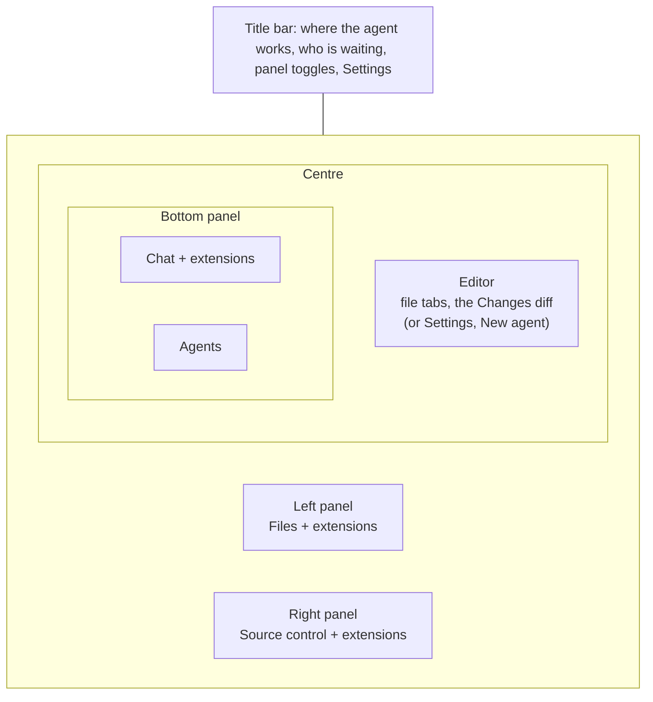
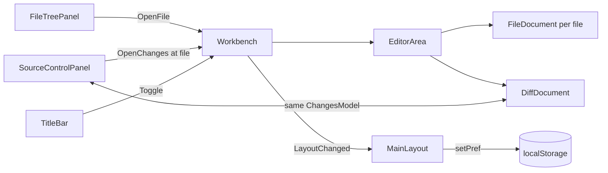

# The workbench

The window is laid out like VS Code. The agent's files are on the left, source
control is on the right, and the editor sits in the middle over a bottom panel.
The bottom panel holds the conversation, with the list of agents down its right
side. Each panel has tabs of its own. Extensions add tabs to whichever panel they
ask for, and to the right panel when they do not ask.

## Who owns what

`MainLayout` draws the frame, and the routed page is what the editor shows.
`ChatPage` (`/chat/<session>`) is the editor for one agent. Settings and New
agent take the editor's place, and the panels stay on the last agent while they
are open.

The panels do not pass parameters to each other. They talk through `Workbench`,
a scoped service (one per window) that holds:

- the agent every panel follows, set by `ChatPage` from its route
- each panel's open state and the tab in front
- the open documents, per worktree (`EditorGroup`)
- one `ChangesModel` per worktree

## The editor

Every open file is a `FileDocument` with a Monaco editor of its own. Every tab
stays built while another tab is in front, hidden with `visibility` rather than
`display`. That way each editor keeps its undo stack, its scroll and any unsaved
text. A `display: none` box would lose Monaco's size.

- **A single click opens a preview tab.** It is drawn in italics, and the next
  single click replaces it, so browsing the tree does not leave a tab behind for
  every file. Double-clicking the file or the tab keeps it. Editing it keeps it
  too, because replacing it would throw the edit away. So does following a link
  or a go-to-definition.
- **A pinned tab** moves to the front of the strip, behind a divider, and has no
  close button until it is unpinned. The pin leans over when a tab is not pinned
  and stands upright when it is.
- **Closing a tab with unsaved changes asks first.** The question appears inline,
  never as a JS `confirm()`, because a confirm dialog blocks the circuit for as
  long as it is up. Middle-click closes a tab.
- **Tabs belong to a worktree.** Switching agents swaps the whole strip, and
  switching back finds it as it was. This lives in memory for the life of the
  window, like `WorktreeViews`. A new window starts empty.

## Changes: a list on the right, the diff in the middle

The Changes tab used to be one component holding a file list and the diff. It is
now two components that share a `ChangesModel`:

- **`SourceControlPanel`** (right) chooses the base, lists the files the way git
  holds them (staged above pending), stages and unstages, and sends the review.
- **`DiffDocument`** (editor) draws the whole diff, where lines are picked and
  commented on.

Clicking a file in Source control opens the Changes document and scrolls it to
that file. The request is held on the model as `PendingScroll` rather than raised
as an event, because the document may not exist yet when the click lands. It
takes the request once the diff that contains the file has been drawn. See
[review.md](review.md) and [staging.md](staging.md) for what the two do.

## Rendering

The monitor publishes a snapshot every second, and every `StateComponent`
re-renders on it. That is right for the chat, the agent list and the title bar.
It is wrong for anything heavy. `FileTreePanel`, `FileDocument`,
`SourceControlPanel` and `DiffDocument` override `ShouldRender` and redraw only
when they call `Touch()` or their model moves.

`WorkbenchPanel` keeps the tabs you have opened built, and rebuilds them all when
the panel moves to another agent. Components are keyed by worktree or session,
so nothing carries one agent's state into another.

## Layout, kept per machine

- **Sizes.** The borders are `.sash` elements dragged in `app.js`, for the same
  reason line selection is: a drag is a stream of moves. Each one sets a CSS
  variable on the root (`--wb-left`, `--wb-right`, `--wb-bottom`, `--wb-agents`)
  and saves it to `localStorage`. Double-clicking a border resets it, and the
  arrow keys move it.
- **Which panels show, on which tab.** `MainLayout` writes this through
  `agentsDashboard.setPref("layout")` on every change and reads it back on the
  first render.
- **Folding.** A folded panel keeps its grid column at zero width, so the rest of
  the grid does not shift and its contents survive. It also gets
  `visibility: hidden`, so nothing inside it can take keyboard focus.

## Deep links

`chat/<session>/<tab>?file=<rel>&line=N` still works. `ChatPage` carries it out
once: it brings up the named panel tab (`files`, `changes`, `chat` or an
extension view's key) and opens the file as a kept tab. Then it replaces the
address with the bare `chat/<session>`. Following the same link again is a real
navigation, so a closed tab can be reopened by it.

## Extensions

`ViewLocation` gained `LeftPanel`, `RightPanel` and `BottomPanel` in API 1.1.
`RightPanel` is the default. `AgentTab` is kept for extensions built against 1.0
and is drawn in the right panel. An extension that names one of the new panels
needs `"apiVersion": "1.1"` in its manifest. See [extensions.md](extensions.md).
