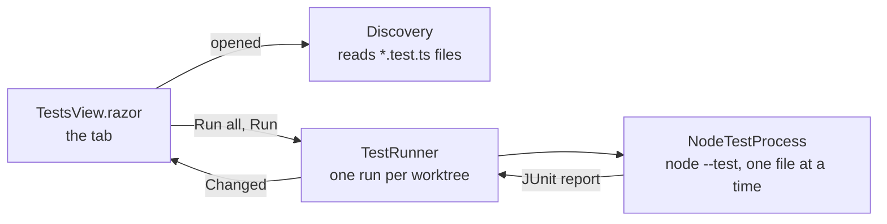

# Node tests, an example extension

A Tests tab for any worktree with `node:test` tests: it lists them by file and
runs them with `node --test` when you press Run. It is the extension the README's
GIF shows an agent writing, and it is small on purpose, so it can be read in one
sitting as a model for your own.



| File | What it is |
| --- | --- |
| `extension.json` | The manifest: id, API version 1.4 (worktree views), entry assembly |
| `NodeTestsExtension.cs` | The entry point: one service, one worktree view |
| `TestsView.razor` | The tab |
| `Testing/Discovery.cs` | Finds test files and names by reading them |
| `Testing/NodeTestProcess.cs` | Runs one file and reads its report |
| `Testing/TestRunner.cs` | Holds each worktree's tests and its run |
| `assets/extension.css` | Its styles, on the app's colour variables |

## What it does and does not do

Worth knowing before you load any extension, and easy to check here:

- **Nothing runs until you press a button.** Opening the tab reads the test
  files as text to list them. Running a test executes the repository's code,
  which is the same as running `npm test` in a terminal there, so it waits for
  Run all or a file's Run.
- **It starts one program, `node`**, directly with an argument list, never
  through a shell, in the worktree folder. A file name cannot become a command.
- **Every run is bounded.** Five minutes per file, output capped at 4 MB, and
  the whole process tree is killed on Stop, on timeout, or when the extension
  unloads.
- **No network, no secrets, no agent tools.** It declares no secrets in its
  manifest, so Tog would refuse it any, and it adds nothing agents can call.
- **It writes nothing.** Not to the repository, not to its data folder.

An extension runs inside Tog with your permissions, like any program you run.
Tog loads one only when you add it yourself or accept an agent's request to,
and that request shows its name and folder; see
[docs/extensions.md](../../docs/extensions.md) for what it checks.

## Build and load it

```bash
dotnet build examples/NodeTests
```

The project compiles against the API Tog publishes to `~/.tog/sdk/<version>`
every time it starts, so start Tog once first. Then in Tog, Settings,
Extensions, Extension folders, Choose folder..., and pick `examples/NodeTests`.
Or start Tog with `--extension examples/NodeTests`. Each later build reloads it.

To build against the API in this repository instead, as CI does:

```bash
dotnet build examples/NodeTests -p:TogSdk=$PWD/src/Tog.Extensions/bin/Debug/net10.0
```

## How the GIF is made

`tools/screenshots/take.mjs` records it against a made-up sample project. The
app is the real build. The agent is `tools/screenshots/replay-agent.mjs`, which
stands in for Claude and plays one fixed turn over ACP: it writes these files
into a folder of the sample, really builds them, and really calls
`tog_extension_add`. The prompt to add it is Tog's own, and the tests really
run. No model is called, so the picture is the same on every run.
