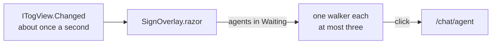

# Waiting sign, an example extension

When an agent is waiting on you, for a permission or an answer to a question,
a small Tog walks out at the bottom right of the window holding a wooden sign:
"I need an answer", and the agent's name. It shows whichever agent you are
looking at, so you notice one that stopped while you were elsewhere. Click the
sign to go to that agent. Once you have answered, it walks back off.

It is one component, about a hundred lines, and a stylesheet.



| File | What it is |
| --- | --- |
| `extension.json` | The manifest: API 1.10, for overlays and every agent's state |
| `WaitingSignExtension.cs` | The entry point: one overlay |
| `SignOverlay.razor` | The walkers, and who is waiting |
| `assets/extension.css` | The walk, the sway, and the sign |

## How it works

- **An overlay, not a view.** `AddOverlay` draws a component once per window,
  over the whole layout, so it is on screen whatever panel or agent you are
  looking at. The layer lets clicks through; only the walkers take them.
- **Every agent's state** comes from `ITogView.Current.Agents`. The overlay
  renders itself only when the set of waiting agents changes, not on every
  tick.
- **The walk is CSS.** The drawing is an inline SVG of Tog's own icon on two
  legs; walking in and out, the step and the sign's sway are keyframes. With
  reduced motion asked for in the OS, it appears and goes without moving.

## What it does and does not do

It reads the agents' names and states, draws, and links to an agent's chat.
It starts no process, touches no file, uses the network for nothing, and asks
for no secrets.

## Build and load it

```bash
dotnet build examples/WaitingSign
```

Then in Tog, Settings, Extensions, Extension folders, Choose folder..., and
pick `examples/WaitingSign`, or start Tog with
`--extension examples/WaitingSign`. See [NodeTests](../NodeTests#build-and-load-it)
for building against the API in this repository instead.

The README's GIF of it is recorded by `tools/screenshots/take.mjs`, with a
scripted agent that asks permission to edit a file; see
[NodeTests](../NodeTests#how-the-gif-is-made).
